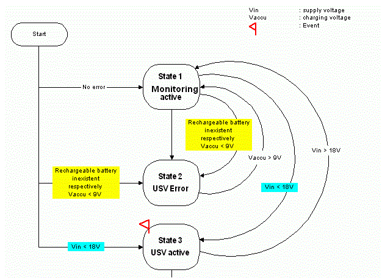
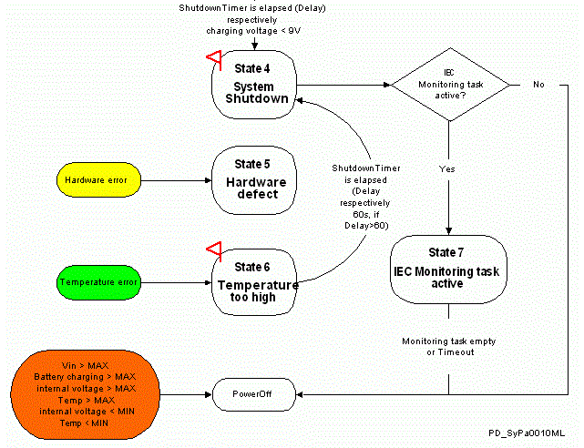

# State

## General

|  |  |
| --- | --- |
| Type | AD |
| Devices supporting the parameter | Uninterruptible power supply |
| Traceable | Yes |

## Functional Description

Displays the status of the UPS monitoring. The possible changes of state are shown in the following figure. The table describes the individual states.

NOTE: All changes of state require an output in the message logger (see the table).

Changing state of the UPS

| Value | Data type | Meaning |
| --- | --- | --- |
| Watching active / 1 | DINT | There are no errors. The UPS monitors the relevant limits.  Diagnostic message: 8031 "UPS Power Supply OK"  Ext. diagnostic: State = 1 |
| UPS failure / 2 | DINT | There is a battery error. Either there is no battery at all or the battery output voltage is too low to protect against a possible supply voltage outage.  Diag. Code: 8338 "UPS Battery not charged"  Ext. diagnostic: State = 2  Diag. Code: 8324 "UPS error detected"  Ext. Diagnostic: battery error |
| UPS active / 3 | DINT | The UPS is active, meaning that the external supply voltage is not present or has fallen below the 18 V limit. Therefore, the controller is being temporarily powered by the battery. The duration of the supply voltage outage is still in the permitted range (t < Delay).  When the supply voltage again reaches a value above 18 V in this state, there will be a change in state to "Watching active / 1". If the battery voltage falls below the 9 V limit, there is an immediate change to state system "Shutdown / 4".  Diag. Code: 8030 "UPS active - no power"  Ext. diagnostic: State = 3  When changing to the State, an event for the ControlTask is triggered. |
| System shutdown / 4 | DINT | There may be multiple causes for this change of state:   * The duration of the supply voltage outage is longer than the time configured in the UPS.Delay parameter (t > Delay). * The battery voltage and the supply voltage are below their permitted limits. * The 60 s after detection of the temperature error have elapsed.   The system is stopped and shut down. The following activities are performed:   * All tasks are stopped.  Diag. Code: 8034 "UPS Program tasks terminated"  Ext. diagnostic: * Delete profile data * Reset the field buses * Close all open files * Release the file system * Shut down Windows or switch off controller  Diag. Code: 8035 "UPS active - system shutdown started"  Ext. diagnostic: State = 4   NOTE: There is no reason for the application to query the State parameter in "System shutdown / 4" since the tasks are the first to be terminated when the shutdown sequence starts. Instead, the Monitoring Task Concept (Control Task) is expanded to include the UPS shutdown.When changing to the State, an event for the ControlTask is triggered. |
| hardware defect / 5 | DINT | There is an error. The read monitoring values are invalid. The functioning of the UPS can no longer be determined to operate correctly.  Diag.Code: 8324 “UPS error detected”  Ext.diagnostic: State = 5 (“PIC fail”) |
| temperature too high / 6 | DINT | The system has detected a temperature that is too high and will change the state to “System Shutdown/4” after the [response time](D-SE-0077306.html#D-SE-0077306) has expired.  Diag. Code: 8339 “UPS active system temperature too high”  Ext.diagnostic: State = 6  When changing to the State, an event for the ControlTask is triggered |
| IEC-control task active / 7 | DINT | UPS switches into this state when UPS shutdown is delayed by the control task. |

EIO0000002335.11