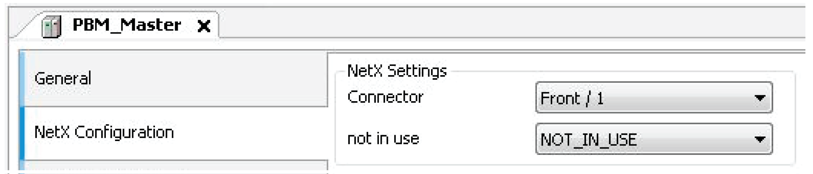
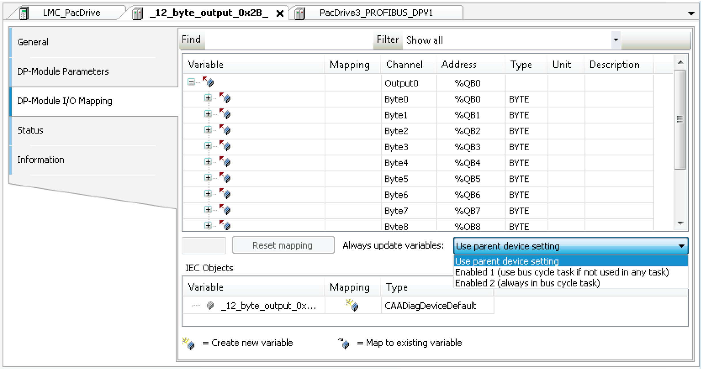
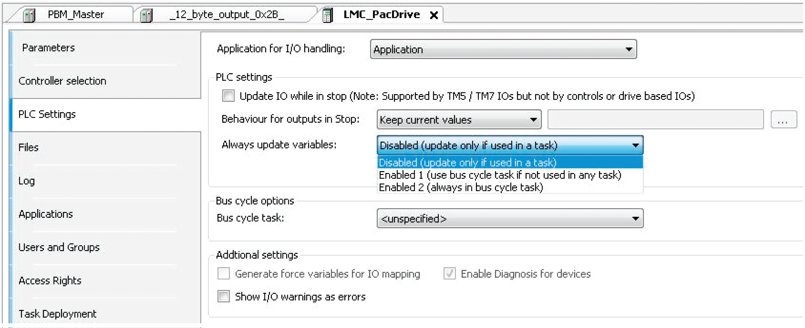

# Configuration of The Fieldbus

## Insert Fieldbus Module into the PLC Configuration

To be able to use the fieldbus module, it must be entered into the PLC configuration of the PacDrive controller.

Project is opened in Logic Builder

| Step | Action |
| --- | --- |
| 1 | Select the PacDrive controller. |
| 2 | Right-click > Add device.  Result: The dialog box Add device appears. |
| 3 | Select device name (for example, PROFIBUS DPV1 master). |
| 4 | Add device button.  Result: The fieldbus module is entered into the PLC configuration. |

## Configuration of The Fieldbus Module

The inserted fieldbus module has to be configured.

| Step | Action |
| --- | --- |
| 1 | Select the fieldbus module in the PLC configuration. |
| 2 | Double-click on the selected fieldbus module or right-click and select Edit object.  Result: The device dialog box of the fieldbus module with the General register is displayed.  NOTE: The designation of the tab varies depending on the selected fieldbus module. For a PROFIBUS DPV1 slave, the designation of the tab is "PROFIBUS configuration", for example. |

## NetX Configuration

In a netX fieldbus, the dialog box NetX Configuration is provided as a tab in the device editor of the netX fieldbus, to select the netX component (slot of the board) and the communication channel on this component. The name of the setting in the dialog box and the possible settings available in the selection lists are defined by the device description.

See also:

* PROFIBUS DPV1 slave: Initial parameter Connector
* EtherNet/IP Adapter: Initial parameter Connector

## Optimizing Performance

In order to achieve the optimum performance, the complete input / output area has to be within one memory block, i.e. individual I/O parts must not be mapped onto variables. Furthermore, all I/O variables have to be used in the program.

As an alternative to using all the I/O variables, it is also possible to enable the option Always update variables in the I/O Mapping dialog box or the option Always update variables in the LMC\_PacDrive3 > PLC Settings dialog box.

Option Always update variables in the I/O Mapping dialog box

Option Always update variables in the PLC Settings dialog box

## Always Update Variables

Global definition if the I/O variables are updated in the bus cycle task. This setting takes effect for the I/O variables of the slaves and modules only if their update setting is defined as Disabled.

* Disabled (update only if used in a task): The I/O variables are only updated if they are used in a task.
* Enabled 1 (use bus cycle task if not used in any task): The I/O variables are updated in the bus cycle task if not used in any other task.
* Enabled 2 (always in bus cycle task): All variables are updated in every cycle of the bus cycle task, regardless if they are being used or if they are mapped to an input or to an output channel. You can set this option separately for each device in the I/O Mapping dialog box.

## Bus Cycle Task

The selection list offers the tasks that are defined in the Task Configuration of the active application.

| Step | Action |
| --- | --- |
| 1 | Select a task for your fieldbus and process your data in this task. |
| 2 | For other tasks, copy your data to global variables. |
| 3 | To verify the processing of your data, use the Task deployment tab of the device editor. Refer to the chapter "Task deployment" in the EcoStruxure Machine Expert Programming Guide. |

NOTE: For asynchronous transmission, the bus cycle options are not taken into account.

NOTE: Setting the bus cycle task to <unspecified> means that the task is selected according to controller-internal settings, which are therefore controller dependent. Setting the bus cycle task to <unspecified> may cause unintended behavior of your application.

| WARNING | |
| --- | --- |
|  | UNINTENDED EQUIPMENT OPERATION  Do not set the Bus cycle task to <unspecified>.  Failure to follow these instructions can result in death, serious injury, or equipment damage. |

## Using Tasks

The chapter "Task deployment" in the EcoStruxure Machine Expert Programming Guide provides an overview of used I/O channels, the set bus cycle task, and the usage of channels.

NOTE: Using the same inputs and outputs in several tasks can lead to unexpected reactions in some cases.

If an output is written in various tasks, then the status is undefined, as this can be overwritten in each case. When the same inputs are used in various tasks, the input could change when a task is processed. This happens if the task is interrupted by a task with a higher priority and causes the process map to be read again.

| WARNING | |
| --- | --- |
|  | UNINTENDED EQUIPMENT OPERATION  Copy the inputs to variables and work only with those local variables in the rest of the code.  Failure to follow these instructions can result in death, serious injury, or equipment damage. |

## Additional Settings

| Element | Description |
| --- | --- |
| **Generate force variables for IO Mapping** | This setting is only available if it is supported by the device. Consult the Programming Guide of your controller for further information. If the option is activated for each I/O channel that is assigned to a variable in the I/O Mapping dialog box, then 2 global variables will be created as soon as the application is built. These variables can be used in a HMI visualization to force the I/O value. |
| **Enable diagnostic for device** | The library CAA Device Diagnostic is added to the project automatically. For each device a function block is generated in the Applications tree. If the function block already exists, an extended FB is used (for example, EtherCAT) or an additional function block instance is added. This function block contains the general implementation for the device diagnostics. When using these function block instances, the status of all devices can be called up in the application. Furthermore, detected errors can be evaluated. The library also provides functions for the programming evaluation of the devices tree (for example, searching in child devices or jumping to the parent devices). For detailed information, see the PDF document CAA Device Diagnostic which is part of the library. |
| **Show I/O warnings as errors** | Alerts concerning the I/O configuration are displayed as detected errors. |

EIO0000002335.11