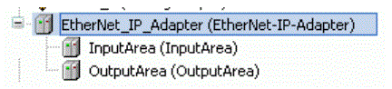

# I/0 module of the EtherNet/IP Adapter

## General

When you insert an EtherNet/IP adapter into the PLC configuration, 2 fixed I/O modules (InputArea, OutputArea) are automatically inserted as well.

The data length of the 2 inserted I/O modules corresponds to the maximum data length for cyclical communication, i.e. 504 bytes.

By means of the [initial parameters](D-SE-0081825.html#D-SE-0081825) InputLength and OutputLength you define that only the first InputLength or OutputLength bytes are exchanged.

If for example InputLength is set to 50 and OutputLength is set to 20, the first 50 bytes in the I/O module InputArea and the first 20 bytes in the I/O module OutputArea are cyclically exchanged with the scanner.

The remaining 454 (504-50) input bytes and 484 (504-20) output bytes in the I/O modules will not be used.

EIO0000002335.11