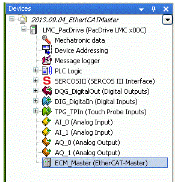

# Configuration of the EtherCAT Master

## Insert EtherCAT Master Into PLC Configuration

Proceed as follows to add an EtherCAT Master to the Device tree:

| Step | Action |
| --- | --- |
| 1 | Right-click on LMC\_PacDrive on the Device tree. |
| 2 | In the context menu, select "Add device..."  Result: The dialog box Add device opens. |
| 3 | Select the entry <All manufacturers> under Device. |
| 4 | Select the EtherCAT Master under Field busses > EtherCAT > Master. |
| 5 | Confirm with [Add device].  Result: The device is displayed under LMC\_PacDrive in the device tree.]. |

## Master

Having [added](#D-SE-0082623) an EtherCAT Master to the Device tree, you can edit its general settings.

| Step | Action |
| --- | --- |
| 1 | Double-click on EtherCAT Master on the Device tree.  Result: The dialog box Master of the EtherCAT Master opens. |

|  |  |
| --- | --- |
| Designation | Description |
| **Autoconfig Master/Slave** | If this option is enabled, the majority of the Master and Slave configuration is executed automatically, based on the device description files and implicit calculations.  If this option is disabled, further input fields are displayed in the bottom section of the dialog box. See **Master Settings** below. |
| **Distributed clocks** | |
| **Cycle time** | The cycle time defines the period after which a new data telegram is sent on the bus.  If the Distributed Clocks functionality is enabled in the Slave, the Master cycle time indicated here is transferred to the Slave clocks. Thus, an accurate synchronization can be achieved, which is especially important if spatially separated processes require simultaneous actions (e.g. in applications in which several axes simultaneously have to perform coordinated motions). In this way, a precise and network-wide time basis with one jitter of significantly less than one microsecond can be achieved. |
| **Options** | |
| **Use LRW instead of LWR/LRD** | If this option is enabled, direct Slave to Slave communication is possible.  Instead of separate read (LRD) and write commands (LWR), combined read/write commands (LRW) are used. |
| **Sending/receiving per task** | If this option is enabled, read and write commands i.e. the handling of the input and output messages can be controlled with different tasks. |
| **Automatic slave reboot** | If this option is enabled, the Master tries to reboot the Slave immediately in case of a communication rupture. |
| **Master Settings** | |
| The **Master settings** can only be edited if the mode A**utomatic configuration Master/Slave** is disabled (see above). Otherwise, the slave settings are made automatically and are not visible in the dialog box. | |
| **Display input address** | Defines the first logical address of the first slave for the input data |
| **Display output address** | Defines the first logical address of the first slave for the output data |

NOTE: The mode **Automatic configuration Master/Slave** is enabled by default and is sufficient for many applications. If the mode is disabled, all configuration settings for Master and Slave(s) have to be conducted manually and expert knowledge is required. However, for the configuration of the Slave to Slave communication, the mode **Automatic configuration Master/Slave** must be disabled.

NOTE: The EtherCAT Master active port is the field bus or Ethernet option module port 1.

## NetX Configuration

For a description of the **NetX configuration** register card, refer to [Configuration of the field bus](D-SE-0079547.html#D-SE-0079547).

## EtherCAT Configuration

This register card contains the Master parameters which are defined in the device description file.

If the **Automatic configuration Master/Slave**  is enabled, the parameters are adjusted automatically according to the information in the description file and the network topology.

Usually, for standard applications it is not necessary to edit them.

The parameters are displayed with the **parameter** name, the data **type**, the current set **value**, the **default value**, the **unit** and a brief **description**.

NOTE: The field **Value** is editable. The edited value is, however, only effective if the **Automatic configuration Master/Slave** mode is disabled.

## EtherCAT I/O Display

This register card allows the display of project variables on the EtherCAT Master outputs and inputs.

Hence, the controller device on the EtherCAT Master can be controlled by the application program.

For information on how the mapping (I/O display) is performed, refer to the description of the general I/O display dialog box (Device editors > Generic device editor > I/O display).

## State

This register card displays status information (e.g. "running", "stopped") and specific diagnostic messages for the device and also for the used card and the internal bus system.

## Information

This register card displays the following general information on the device insofar as they are available in the device description file.

Name, manufacturer, version number, categories, order number, description, figure.

## Limitation

The size of the bus configuration file is limited by the size of the netX component (1 megabyte).

EIO0000002335.11