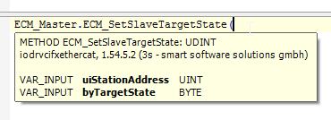

# Using the EtherCAT Master

## Setting the EtherCAT State of an EtherCAT Slave

The communication between the EtherCAT master and the EtherCAT slave is terminated after a warm start of the EtherCAT slave.

The method ECM\_SetSlaveTargetState is used to set the state of the EtherCAT slave to Operational.

## Method ECM\_SetSlaveTargetState

Overview of the method ECM\_SetSlaveTargetState:



## Example

Example of the method ECM\_SetSlaveTargetState:

```
//METHOD ECM_SetSlaveTargetState
//0x01 ECM_IF_STATE_INIT - Slave is requested to be in state INIT
//0x02 ECM_IF_STATE_PREOP - Slave is requested to be in state PREOP
//0x03 ECM_IF_STATE_BOOT - Slave is requested to be in state BOOT
//0x04 ECM_IF_STATE_SAFEOP - Slave is requested to be in state SAFEOP
//0x08 ECM_IF_STATE_OP - Slave is requested TO be in state OP

IF xSetSlaveBackToOp THEN
    ECM_Master.ECM_SetSlaveTargetState(uiStationAddress:=1001,byTargetState:=8);
    xSetSlaveBackToOp:=FALSE;
END_IF
```

EIO0000002335.11