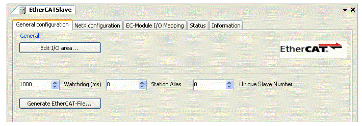

# General Settings

## General

Having [added](D-SE-0082640.html#D-SE-0082640) an EtherCAT-Slave to the device tree, you can edit its General settings.

| Step | Action |
| --- | --- |
| 1 | Double-click on EtherCAT-Slave on the Device tree.  -> The dialog box General settings of the EtherCAT-Slave opens. |

|  |  |
| --- | --- |
| Designation | Description |
| [Edit I/O] | Opens the [Dialog box](D-SE-0082642.html#D-SE-0082642) EditI/O range. |
| Watchdog (ms) | Determines after which time a slave is considered inoperable by the watchdog. The time is given in ms. |
| Station Alias | Directly determines an alias address in order to determine the address of the slave independent of its position. |
| Unique Slave Number | Determines the position of the slave within Station Alias.  Determines a unique product code for the EtherCAT-Slave in order to be able to distinguish between several EtherCAT-Slaves in a system. |
| Create EtherCAT File | Opens the dialog box Save as.  Here, you can save the EtherCAT-Slave configuration file in XML format and later import it into another project. |

EIO0000002335.11