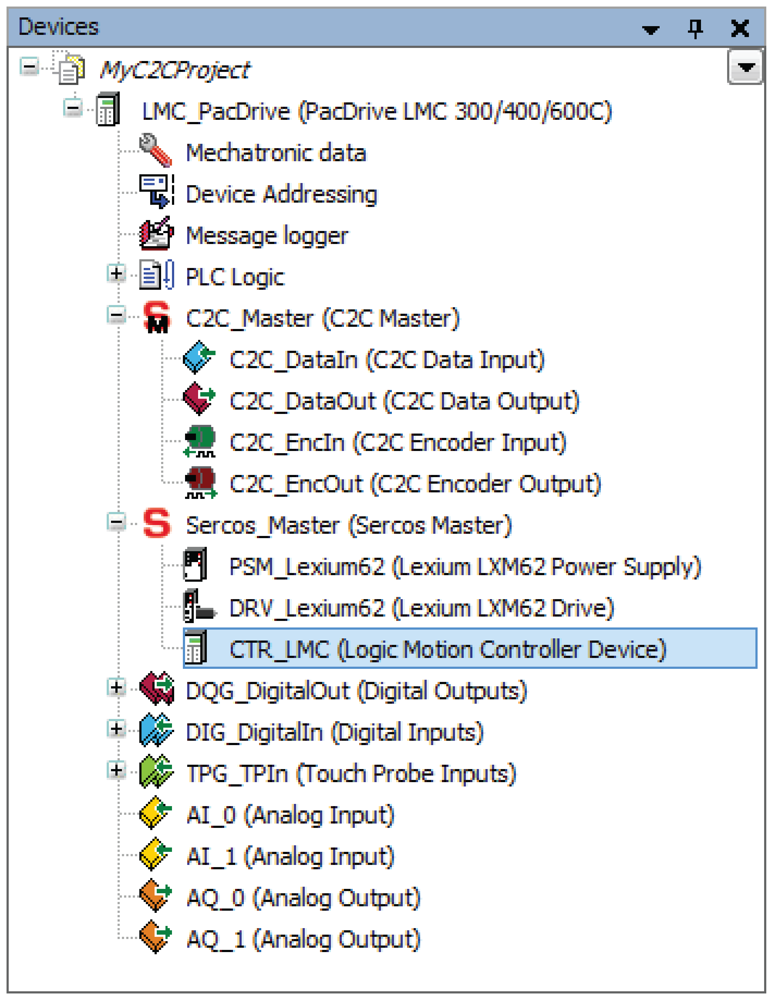
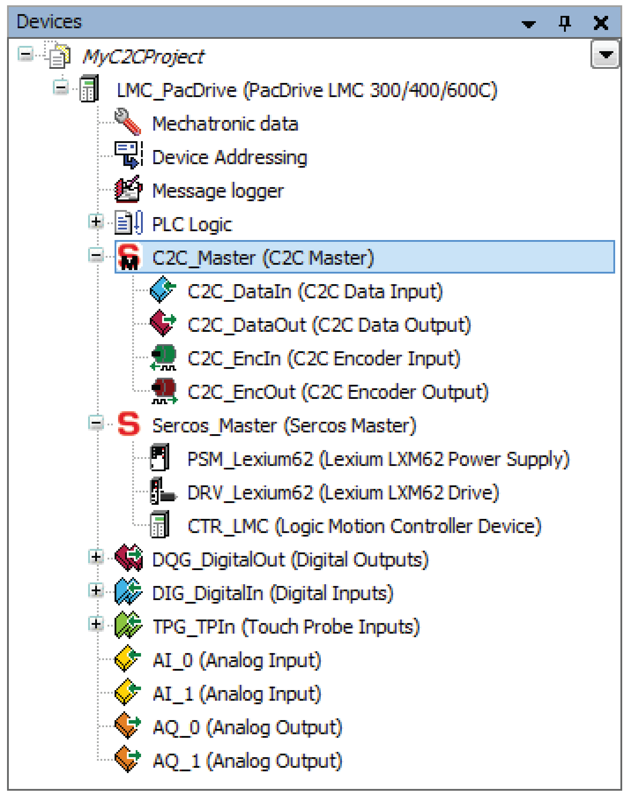
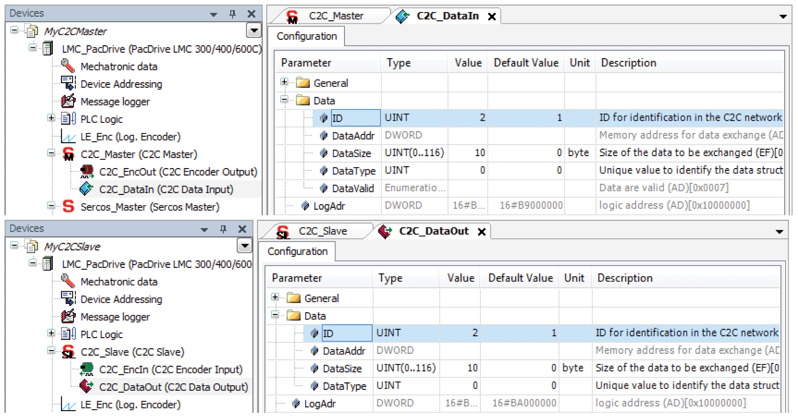

# Object Structure

## Description

The objects used in the C2C network can be divided into two groups:

* Objects responsible for synchronization of the C2C network (**C2C Master, C2C Slave, Logic Motion Controller Device**)
* Objects responsible for real-time data exchange inside the C2C network (**C2C Data Input, C2C Data Output, C2C Encoder Input, C2C Encoder Output**)

Each object exists as a device object in the **Devices** tree in the EcoStruxure Machine Expert project.

## Synchronization

The synchronization is executed between C2C Master and C2C Slaves via Sercos.

**C2C Slave**

C2C slave object in the EcoStruxure Machine Expert Devices tree

Each C2C Slave acts as Sercos Slave device in the superordinated network.

Each C2C Slave synchronizes the subordinate Sercos Slave devices (Sercos network) of the C2C Slave. The **C2C Slave** object is the parent of the C2C data objects (**C2C Encoder Output/C2C Encoder Input** and **C2C Data Output/C2C Data Input**) that belong to the C2C Slave (**C2C Data Input, C2C Data Output**, etc.).

**Logic Motion Controller Device**

Logic Motion Device object in the EcoStruxure Machine Expert Devices tree

As representation of the C2C Slaves on C2C Master side, there exist **Logic Motion Controller Device** objects that must be added as children of the Sercos object in the project of the PacDrive LMC acting as C2C Master.

The assignment is done via the default Sercos identification mechanism. For further information, refer to the parameter IdentificationMode of the **Logic Motion Controller Device**.

**C2C Master device**

C2C Master object in the EcoStruxure Machine Expert Devices tree

The task of the C2C Master device object is to:

* provide an overview of the C2C network, and
* manage the configuration of the objects that belong to the C2C network.

The **C2C Master** object is the parent of the C2C Data objects that belong to the C2C Master.

## Real-time Data Exchange

The real-time data exchange in the C2C network follows the following producer-consumer concept:

* There is always one producer and 1...n consumers in the network.
* These producers and consumers are represented by C2C data objects (producer:

  **C2C Data Output, C2C Encoder Output**; consumer: **C2C Data Input, C2C Encoder Input**.
* For each kind of C2C data object, there always exists a corresponding type:

  If there exists, for example, a **C2C Encoder Output** object (producer), there is also a **C2C Encoder Input** object (consumer).

There can be several C2C data objects of the same type inside one C2C network. The assignment of the related objects is realized by setting the parameter ID to the same value.

Example - assignment of related objects using parameter ID

EIO0000002335.11