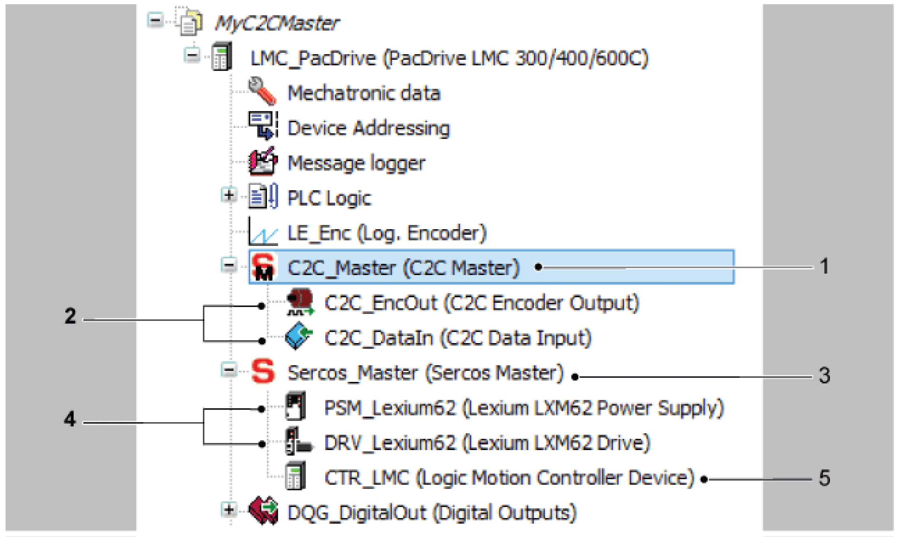
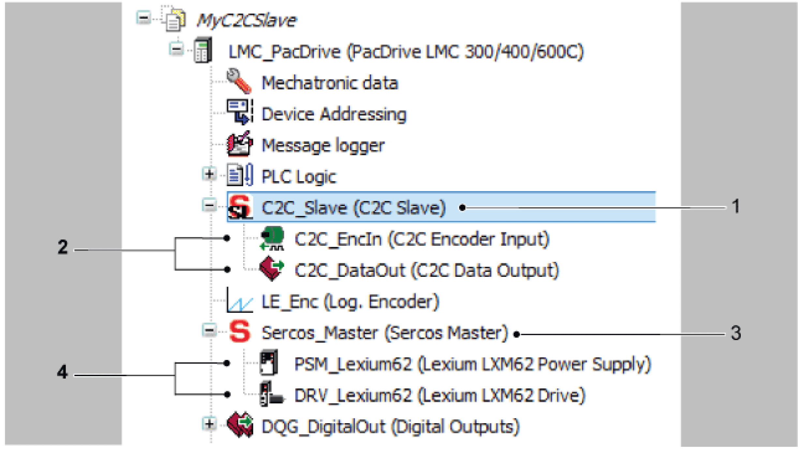
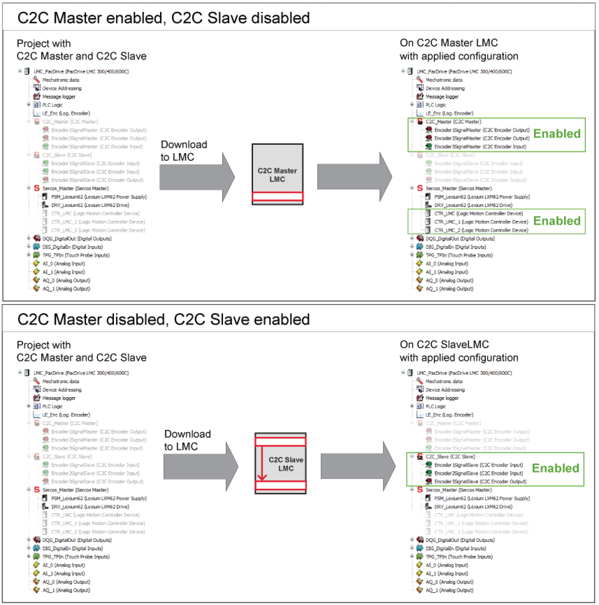

# Configuration of the Data Exchange Inside of the C2C Network

## Description

To configure the C2C network, the following device objects are available:

* **C2C Data Input**
* **C2C Data Output**
* **C2C Encoder Input**
* **C2C Encoder Output**

These device objects must be added to the **Devices** tree in EcoStruxure Machine Expert and must be configured by changing the parameters in the **Configuration** tab of the device object.

The configuration can be performed by one of the following strategies:

* [Static configuration](#D-SE-0088162__D-SE-0088162.3):

  + Done during machine application development time, before Sercos phase run-up.
  + Master and slave configuration must be consistent.
* [Dynamic configuration](#D-SE-0088162__D-SE-0088162.4):

  + The device objects (**C2C Slave, C2C Encoder Input**, etc.) must be added and configured during machine application development time.

    This configuration (including enabling/disabling devices) can be modified by the application during application execution time.
  + The device objects (**C2C Slaves, C2C Encoder Input**, etc.) must be consistently enabled/disabled in the EcoStruxure Machine Expert project of the C2C Master and in the project of the C2C Slave before the Sercos phase up has been completed in the C2C network layer.

    In this context, consistently enabled/disabled means that for example, all corresponding C2C Encoder Inputs have to be disabled if one C2C Encoder Output has been disabled.

## Example for Static Configuration

In this example the configuration is realized in two separate EcoStruxure Machine Expert projects:

* one EcoStruxure Machine Expert project of the C2C Master
* one EcoStruxure Machine Expert project of the C2C Slave

The following pictures represent the added devices and data objects and their designation:

Devices tree - project of the C2C Master

**1** **C2C Master** object

**2** C2C data objects

**3** **Sercos Master** object

**4** Sercos devices of this PacDrive LMC

**5** **Logic Motion Controller Device** object

In this example, the following objects have been added in the project of the C2C Master:

* **C2C Master** (1) has been added under the **PacDrive LMC 300/400/600C** object
* C2C data objects (**C2C Encoder Output, C2C Data Input**) (2) have been added under the **C2C Master** object
* Sercos devices of this PacDrive LMC (**Lexium LXM62 Power Supply, Lexium LXM62 Drive**) (4) have been added under the **Sercos Master** object
* one **Logic Motion Controller Device** object (5) has been added under the **Sercos Master** object (4)

Device tree-project of the C2C Slave

**1** **C2C Slave** object

**2** C2C data objects

**3** **Sercos Master** object

**4** Sercos devices of this PacDrive LMC

The following objects have been added in the project of the C2C Slave:

* **C2C Slave** (1) has been added under the **PacDrive LMC 300/400/600C** object
* C2C data objects (**C2C Encoder Output, C2C Data Input**) (2) have been added under the **C2C Slave** object
* Sercos devices (**Lexium LXM62 Power Supply, Lexium LXM62 Drive**) (4) have been added under the **Sercos Master** object

**Configuration of the C2C objects**

NOTE: The C2C objects are configured offline and they are not changed by the application.

The configuration is done in EcoStruxure Machine Expert during machine application development time.

Misconfigurations are reported, for example via C2C Online View, Message logger, and the diagnostic message [8520](D-SE-0064010.html#D-SE-0064010) "Sercos C2C misconfiguration detected”.

## Example for Dynamic Configuration

In this example, the configuration is realized in one EcoStruxure Machine Expert project.

The same C2C objects are added as described in the example for [static configuration](#D-SE-0088162__D-SE-0088162.3).

The following figure represents an example with a dynamic and “maximum project” configuration:

Example - device objects in the project of the C2C Master and C2C Slave

**Configuration of the C2C Objects**

Before Sercos phase up, the C2C objects must be enabled or disabled by the application.

During machine application development time, an initial configuration is done in EcoStruxure Machine Expert. The main C2C configuration is applied by the application at run time.

Misconfigurations are reported, for example via [C2C Online View](D-SE-0082682.html#D-SE-0082682), message logger, and the diagnostic message [8520](D-SE-0064010.html#D-SE-0064010) “Sercos C2C misconfiguration detected”.

EIO0000002335.11