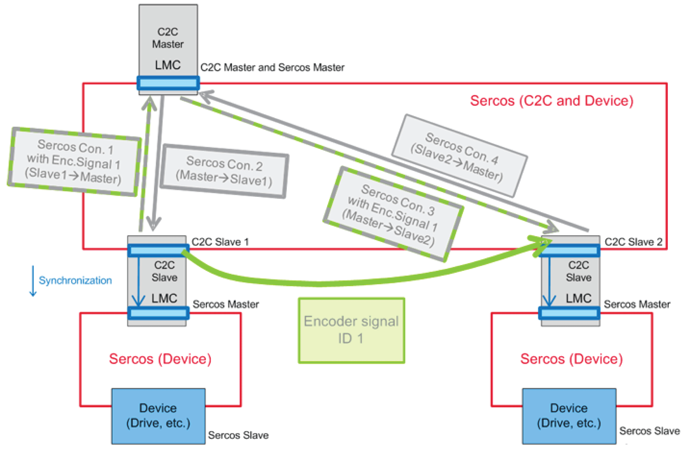

# C2C Connection

## Channel Configuration

During Sercos phase up (in communication phase 2), the C2C Slave device configurations of the Sercos Slave devices are read by the master, according to the C2C network configuration.

With the C2C data object types and IDs, it is possible for the C2C Master PacDrive LMC to match consumers and producers and to verify constraints (count of channels, maximum amount of user data, etc.). After this verification, the Sercos connection configuration is done automatically by the C2C Master.

No direct cross communication between C2C Slaves exists. The data transmitted between two C2C Slaves are sent through the C2C Master. The delay consists of the transmission time from the C2C Slave to the C2C Master and from the C2C Master to the other C2C Slave.

See the following figure:

Encoder signal runtime in a synchronized C2C network

EIO0000002335.11