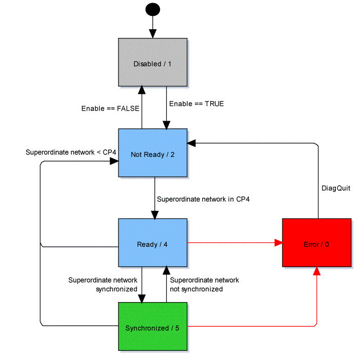

# EncoderState

## General

|  |  |
| --- | --- |
| Type | AD |
| Devices supporting the parameter | C2C Encoder input, C2C Encoder Output |
| Traceable | Yes |

## Functional Description

The parameter indicates the status of the **C2C Encoder Output** and **C2C Encoder Input** object.

| Value | Data type | Description |
| --- | --- | --- |
| error / 0 | UINT | An error has been detected.  Details are displayed with diagnostic parameters and entries in the message logger.  If the parameter ErrorDeceleration is set to a value greater than 0, the C2C Encoder Input is ramping down its velocity with this given deceleration.  If it is set to 0, the last valid [velocity](D-SE-0082773.html#D-SE-0082773) stays active and the diagnostic message [8522](D-SE-0064013_1.html#D-SE-0064013) is triggered. |
| disabled / 1 | UINT | The **C2C Encoder Input** object is disabled. The encoder functionality is not active. |
| not ready / 2 | UINT | Waiting until the superordinate network is operational ([communication phase](D-SE-0073356.html#D-SE-0073356) 4) and the encoder data is exchanged. |
| reserved / 3 | UINT | reserved |
| ready / 4 | UINT | The encoder receives or produces cyclic encoder data, but the superordinate network has not been synchronized yet.  In this state only the parameter EncoderPosition is constantly updated. |
| synchronized / 5 | UINT | The local Sercos is synchronized to the C2C network. The encoder is operational and valid [velocity](D-SE-0082773.html#D-SE-0082773) and [encoder position](D-SE-0092763.html#D-SE-0092763) are provided. |

Flow chart of parameter EncoderState

EIO0000002335.11