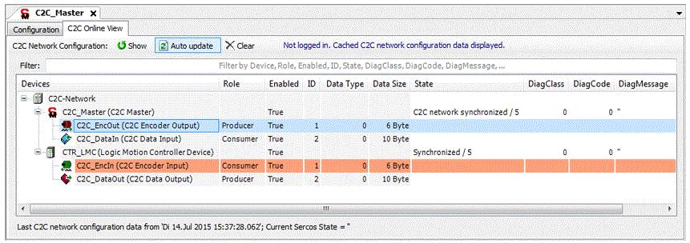

# Using the C2C Online View

## General

To display the C2C Online View:

| Step | Action |
| --- | --- |
| 1 | Add a **C2C Master** device to the **Devices** tree. |
| 2 | Double-click the **C2C Master** device.  Result: The **C2C Master** device editor is displayed. |
| 3 | Select the **C2C Online View** tab. |

The **C2C Online View** displays the C2C network configuration retrieved from the PacDrive LMC.

## C2C Online View

The C2C Online View displays the following information for each device:

| Information | Description |
| --- | --- |
| Device | Name and type of device, and information to which PacDrive LMC in the C2C network the device is attached. |
| Role | C2C role of the data object (producer or consumer). |
| Enabled | State of the device if enabled or disabled in the C2C network configuration. |
| ID | Group of data objects with the same ID. |
| Data Type | Unique value to identify the data structure.  NOTE: Data type information is only available for C2C Data Input and C2C Data Output devices. |
| Data Size | Size of data to be exchanged. |
| State | The sync group state / sync state / state parameter of the device (depending on device type).  Only displayed if logged in (**Online -> Login**). |
| DiagClass | Diagnostic class parameter of the device.  Only displayed if logged in (**Online -> Login**). |
| DiagCode | Diagnostic code parameter of the device.  Only displayed if logged in (**Online -> Login**). |
| DiagMessage | Diagnostic message of the device.  Only displayed if logged in (**Online -> Login**). |

Information displayed with a gray background is retrieved from C2C network configuration, the cells with a white background display monitoring values while logged in.

If you selected a row, it is highlighted in blue. Device objects with the same ID as the selected one are highlighted in red.

The displayed information can be filtered. See "Filtering displayed information".

The **C2C Online View** provides the following additional buttons / information:

| Button/Information | Description |
| --- | --- |
| C2C Network Configuration:  **[Show]**button | Starts an online service to retrieve the C2C network configuration from the PacDrive LMC. |
| **[Auto update]** button | Behavior when a new C2C network configuration is detected:  Button On: Automatically refreshes the **C2C Online View** with the new C2C network configuration  Button Off: Displays the information **New C2C network configuration data available** |
| **[Clear]** button | Removes the C2C network configuration cached in the device editor. |
| Information text  (next to the **[Clear]** button) | Displays a short notification, for example:   * **Not logged in.**  If EcoStruxure Machine Expert is not logged in / connected to a PacDrive LMC. * **Cached C2C network configuration data displayed**  If the last C2C network configuration data stored in project cache is displayed. * **No C2C network configuration data in cache**  If there is no C2C network configuration data stored in project cache. * **New C2C network configuration data available**  If new C2C network configuration data is available on the PacDrive LMC according to increased Sercos phase up counter. |
| Detailed information text  (at the bottom of the **C2C Online View**) | Detailed information, for example:   * Last time stamp if C2C network configuration data are used and displayed from project cache * Sercos state if logged in * Information that new C2C network configuration data are available in the PacDrive LMC |

## Filtering Displayed Information

Using the **Filter**: text box at the top of the **C2C Online View**, the displayed information can be filtered.

| Step | Action |
| --- | --- |
| 1 | Enter text to the **Filter**: text box.  Result: The results are marked with yellow background.  NOTE: The parent nodes of the results are also displayed. |
| 2 | Click **[ESC]** (with focus on **Filter**: text box) to remove the filter. |

## Behavior on Retrieving C2C Network Configuration

You can click the **[Show]** button independent from logged in state, Sercos phase, or running application.

Depending on the respective state, EcoStruxure Machine Expert reacts in a different way.

| State | Behavior |
| --- | --- |
| Logged in state | |
| * Not logged in | A login is performed, the Sercos state and running application (see below) are considered, and the C2C network configuration is retrieved from the PacDrive LMC. After that, a logout is performed. |
| * Logged in | The Sercos state and running application (see below) are considered, and the C2C network configuration is retrieved from the PacDrive LMC. |
| Sercos state | |
| * Sercos is in phase 0 | A message is displayed that informs you that a Sercos scan (phase up) has to be performed to retrieve the C2C network configuration. |
| * Sercos is in phase 2-4 or 11 | C2C network configuration is retrieved from the PacDrive LMC. |
| Application state | |
| * An application is running | A message is displayed that informs you that the application has to be stopped to scan the Sercos. |

## Last C2C Network Configuration In Cache

After closing and reopening the device editor or closing and reopening the project, the last C2C network configuration is displayed.

## Printing C2C Network Configuration

You can print the (cached) C2C network configuration.

The printed page provides the following information:

* A headline (C2C Online View – C2C Network Configuration)
* A table with the following columns:

  + Device (icon, name and type)
  + Role (producer or consumer)
  + Enabled (TRUE or FALSE)
  + ID
  + Data Type
  + Data Size
* The time stamp of the C2C network configuration data.

NOTE: The printed table provides the static C2C network configuration, but no monitoring values like DiagCode, DiagClass, DiagMessage or SyncGroupState.

EIO0000002335.11