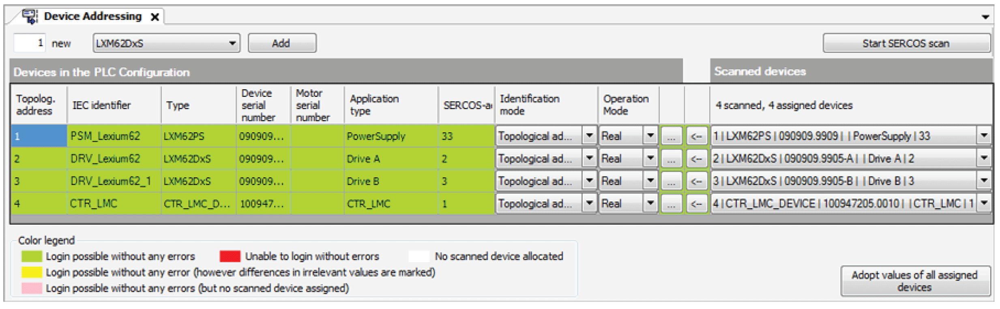

# Configuration and Identification

## Adjusting Object Parameters

The assignment of related objects in the C2C network (C2C Encoder Input/C2C Encoder Output and C2C Data Output/C2C Data Input) is realized by setting the parameter ID to the same value.

For this reason, the parameters of the C2C data and encoder objects have to be adjusted in the **Configuration** tab of the respective object according to the following table:

| Object | Parameters to be adjusted |
| --- | --- |
| C2C Master | No parameters have to be adjusted. |
| C2C Encoder Output | Set parameter ID to **15** (default value = 1) to assign the object to the **C2C Encoder Input** object of the C2C Slave (15 = value for this example). |
| C2C Data Input | Set the parameter ID to **2** to assign the object to the **C2C Data Output** object of the C2C Slave (2 = value for this example).  Set the parameter DataSize to **10**. |

## Identification of Sercos Devices

The Sercos devices (Lexium 62 Double Drive and PacDrive LMC600) have to be addressed and parameterized, so that the PacDrive LMC can use them.

For this reason, use the Sercos scan functionality of the [Device Addressing](D-SE-0088037.html#D-SE-0088037) to identify the power supply and the axes that are connected to the C2C Master LMC (TTS1).

Adapt the values of the assigned devices and add the scanned devices and their values to your project.

Result of Sercos scan of TTS1

| Scanned object | Topological address | Description |
| --- | --- | --- |
| PSM\_Lexium62 | 1 | PacDrive LMC600 of TTS1 |
| DRV\_Lexium62, DRV\_Lexium62\_1 | 2, 3 | Lexium 62 Double Drive of TTS1  The Lexium 62 Double Drive is identified as two DRV\_Lexium62 objects. These two objects will be added to your project.  NOTE: In the programming example, only the first drive object is used. |
| CTR\_LMC | 4 | **Logic Motion Controller Device** object which represents the LMC of TTS2 (C2C Slave). |

EIO0000002335.11