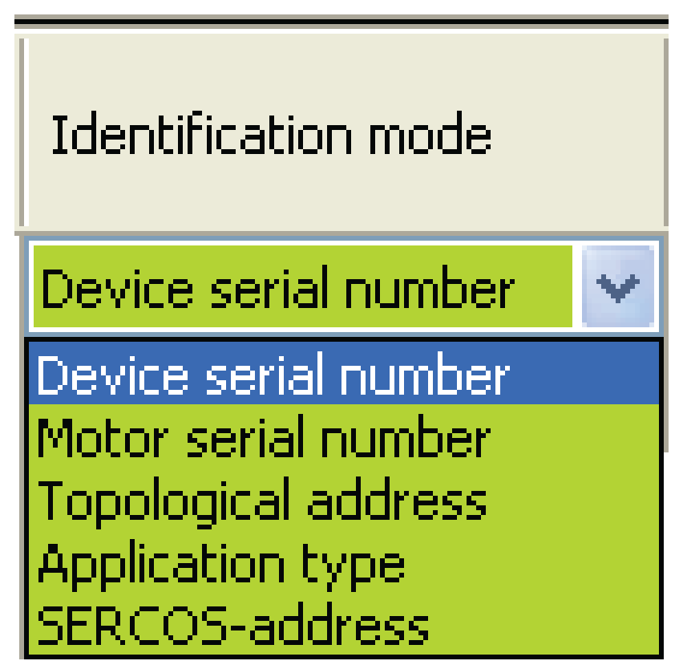

# Identification Mode

## Description

In Identification mode you specify which criterion to use to automatically assign a Sercos device to an object in the PLC Configuration.

* Select the desired identification mode in the selective list in the **Identification mode** column.

Logic Builder, **Identification mode**

NOTE: To change the identification mode in all lines of this column at the same time, hold the shift key in the selection pressed.

Changing the identification mode after performing a Sercos scan (**[Start]** Sercos scan) will directly impact the automatic assignment of axes and the [color coding](D-SE-0088131.html#D-SE-0088131) of the respective row.

EPAS provides the following identification modes:

| Identification mode | Parameter value | Description |
| --- | --- | --- |
| **Device serial number** | SerialNumberController | The device will be assigned using the controller's serial number.  The parameter value SerialNumber is part of the parameter IdentificationMode. |
| **Motor serial number1** | SerialNumberMotor | The device will be assigned using the motor's serial number.  The SerialNumberMotor parameter value is part of the IdentificationMode parameter. |
| **Topological address** | TopologyAddress | The device will be assigned using the motor's topological address.  The TopologyAddress parameter value is part of the IdentificationMode parameter. |
| **application type** | Application Type | The device will be assigned using the application type.  The ApplicationType parameter value is part of the IdentificationMode parameter. |
| **Sercos address** | SercosAddress | The device is assigned using the Sercos address.  The Sercos address parameter value is part of the parameter IdentificationMode. |
| 1**NOTE:** The identification mode **Motor serial number** is currently not supported. | | |

Automatic assignment of axes is always performed using **Identification mode**.

Only if a value that matches the value specified in **Identification mode** is found, a scanned Sercos device will be assigned to a Sercos object in the PLC Configuration.

For instance, if the **Identification mode** is set to **Topological address**, the topological address of the scanned Sercos device must be identical to the topological address of a Sercos object in the PLC Configuration for an automatic assignment to be performed.

EIO0000002335.11