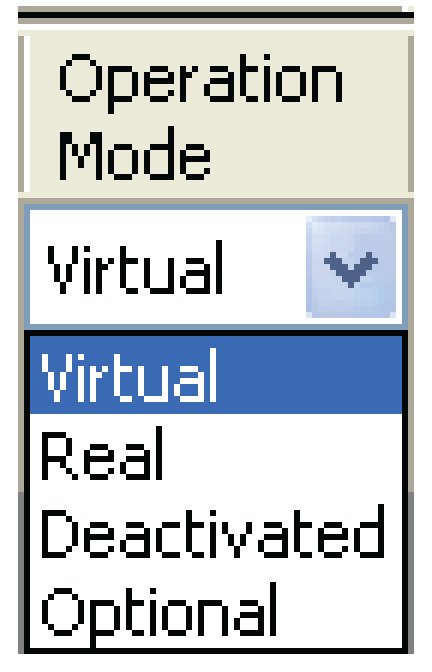

# Operation Mode

## Description

The **Operation Mode** is used to determine the way a Sercos device is to be operated.

* Select the desired operating mode from the drop-down list in the **Operation Mode** column.

NOTE: To change the operating mode in all lines of this column at the same time, hold the shift key in the selection pressed.

Changing the operating mode after performing a Sercos [scan](D-SE-0088133.html#D-SE-0088133) (**[Start]** Sercos scan) will directly impact the automatic assignment of axes and the [color coding](D-SE-0088131.html#D-SE-0088131) of the respective row.

Logic Builder provides the following operation modes:

| Operating | Description | Drive | Power Supply |
| --- | --- | --- | --- |
| Virtual | The Sercos device does not have to exist physically. The device only exists as a logical device in the PLC Configuration.  Even if the device exists, it is not connected to the logical device of the PLC Configuration. (2)  The functionality of the device is always partly simulated. (3) | The drive cannot go in closed-loop control, but it is always partly simulated. | The Power Supply is always partly simulated. The ready contact is not closed and therefore the DC bus is not charged. |
| Real | The Sercos device must exist physically and is a device in the Sercos communication. The real device is connected to the logical device in the PLC Configuration.  If the Sercos device does not exist physically, then a diagnostic message is triggered. | The drive can go in closed-loop control (1). | The Power Supply can charge the DC bus. The ready contact is closed as soon as the Sercos is in phase 4 and no diagnostic message occurred in the Power Supply, that would prevent connecting to the ready contact. |
| Deactivated | The Sercos device is not being used. It may exist physically. (2)  A simulation of the device functionality does not take place. | The drive is not being used. Therefore it cannot go in closed-loop control. | The Power Supply is not being used. The ready contact is not closed and therefore the DC bus is not charged |
| Optional | The Sercos device can - but does not have to - exist physically.  As soon as the device exists physically during the phase run-up, it becomes a node of the Sercos communication and it is connected to the logical device in the PLC Configuration (behavior is equivalent to “Real”).  If the device does not exist physically, then it is not connected to the logical device of the PLC Configuration.  The functionality of the device is partly simulated. (Behavior is equivalent to “Virtual”). | The drive can go in closed-loop control when the drive exists physically.  The drive is partly simulated when the drive does not exist physically. | The Power Supply can charge the DC bus if it exists physically. The ready contact is closed as soon as the Sercos is in phase 4 and no diagnostic message occurred in the Power Supply, that would prevent connecting the ready contact.  The Power Supply is simulated when it does not exist physically. The DC bus is not charged. |

1) Additional conditions must be fulfilled, so that the drive can go in closed-loop control (Sercos in phase 4, no severe diagnostic message, release, etc.). The drive can also be operated “controlled” (without a closed control loop).

2) In general this applies for the PacDrive System: The devices that the LMC finds on the Sercos during a scan are run up in phase 4. Devices that are not connected with a logical device of the PLC Configuration are herewith configured with a minimum real-time channel. In this real-time channel the service channel and a control- and status word are available. This interface is used by the Sercos Master, to ensure the complete control at all positions of the Sercos network by a loop interruption and redundancy. This also means that devices that are not configured, require a real-time bandwidth (8 bytes in the MDT and 8 bytes in the AT). There is also some real-time computing power necessary, to perform the cyclic monitoring and control of these devices.

3) The simulation of devices consumes computing time because the devices are simulated with the Sercos cycle time. The only incorrect configuration is a real configured device that physically does not exist. Real devices that are not integrated in the PLC Configuration are not used, require no computing time and do not trigger a diagnostic message. They are ignored.

EIO0000002335.11