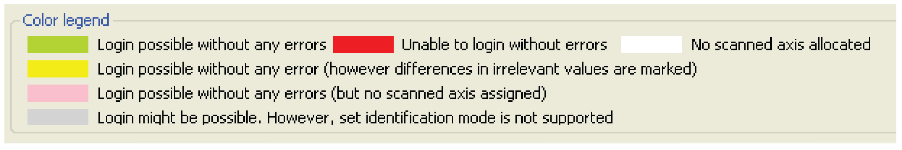

# Colors and Their Meaning

## Description

The color coding of a row indicates whether a login can performed for the specific Sercos object in the PLC Configuration and, if so, whether a login is possible without errors.

The colors have the following meanings:

| Color | Description |
| --- | --- |
| Green | Login can be performed without error with this object. |
| Red | Login **cannot** be performed without error with this object. |
| White | No Sercos device is assigned to this object. |
| Yellow | Login **might possibly** be performed without error with this object.  The criterion set in the **Identification mode** is identical, but there are deviations in other values of the assigned Sercos device. The mismatched values are highlighted in **bold**. |
| Pink | Login **might possibly** be performed without error with this object.  However, no Sercos device was assigned after performing the Sercos scan (**[Start]** Sercos scan) even though the **Operating mode** is set to **Real** |
| Gray | Login **might possibly** be performed without error with this object.  But, the **Identification mode** set in the object's editor is not supported. |

See the **Color legend** area at the lower left of the editor window.

EIO0000002335.11