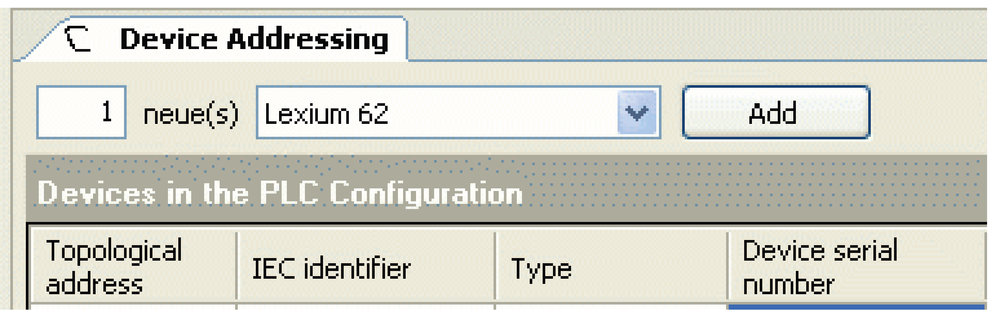

# Manually Add Devices

## Description

In the editor **Device addressing** you can add a certain number of new devices to the PLC Configuration.

* For this purpose, enter the desired number.

* Select the desired device from the list using the button **[v]**.

* Then click **[Add]**.

Logic Builder, Add devices

You can choose the following devices from the list:

| Displayed name (IEC identifier) | Description |
| --- | --- |
| Lexium 62 | Axis LXM62DxS |
| Lexium 62 Power Supply | Power supply LXM62PS |
| ILM 62 | Axis Lexium ILM62 drive module |
| TM5NS31 | Bus Interface TM5NS31 |
| TM5CSLC100FS | Safety Logic Controller TM5CSLC100FS |
| TM5CSLC200FS | Safety Logic Controller TM5CSLC200FS |

If an error occurs when adding a device, the devices that could not be added are listed with a respective explanation in the message window.

In addition, a dialog box is displayed that indicates the error and the entry in the message window.

Also refer to [Automatically add devices](D-SE-0088133.html#D-SE-0088133).

EIO0000002335.11