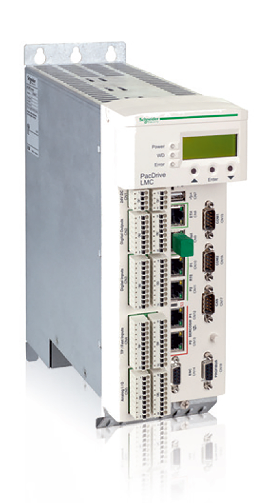

# Nameplate Descriptions

## Overview

The Logic Motion Controller (LMC) nameplate is located on the side of the housing:

Explanation of the technical nameplate entries:

| Label | Description |
| --- | --- |
| **LMC400Cxxxxxx** | Device type and Unicode |
| **Input d.c** | Digital inputs / input voltage and input current (per input) |
| **Output d.c.** | Digital outputs / output voltage and rated current (per input) |
| **IP20** | Degree of protection |
| **CE** (symbol) | CE mark |

The logistical nameplate of the LMC is located on top of the housing.

| Label | Description |
| --- | --- |
| **LMC400CCABA00** | Device type and Unicode |
| **907156.0010** | Serial number |
| **RS:02** | Hardware revision (1) |
| **DOM** | Date of manufacture |
| (1) When [replacing the controller](D-SE-0049352.html#D-SE-0049352), the hardware revision for the previous and the new device should be identical to help avoid potential compatibility issues with the equipment. The hardware revision can also be read from the [hardware code in the device](D-SE-0049396.html#D-SE-0049396__D-SE-0049396.5). For more information on the compatibility of different hardware revisions, contact your local Schneider Electric representative. | |

EIO0000001503.10