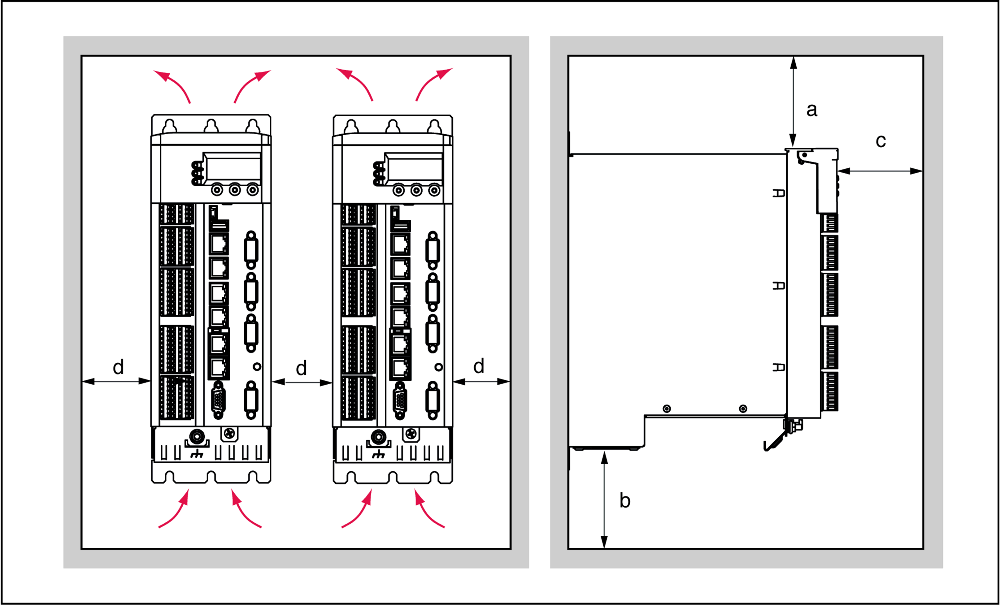
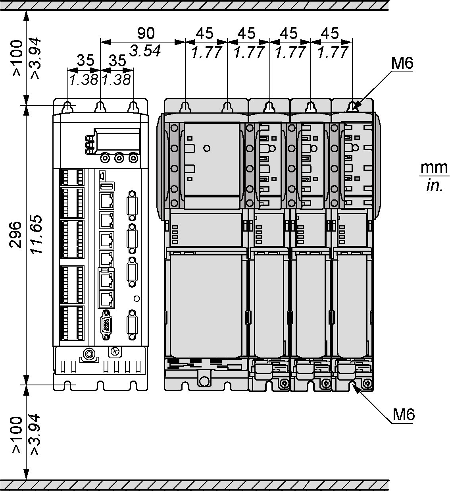

# Preparing the Control Cabinet

## Overview

| DANGER | |
| --- | --- |
|  | INCORRECT OR UNAVAILABLE GROUNDING  Remove paint across a large surface at the installation points before installing the devices (bare metal connection).  Failure to follow these instructions will result in death or serious injury. |

| Step | Action |
| --- | --- |
| 1 | If necessary to maintain and respect the maximum ambient operating temperature, install additional fan in the control cabinet. |
| 2 | Do not block the fan air inlet of the product. |
| 3 | Drill mounting holes in the control cabinet according to the mounting-grid pattern. |
| 4 | Keep a distance of at least 100 mm (3.94 in) above and below the products. |

## Assembly Distances, Ventilation

Assembly distances and air circulation:

| Distance | Air circulation |
| --- | --- |
| a ≥ 100 mm (3.94 in) | Clearance above the device. |
| b ≥ 100 mm (3.94 in) | Clearance below the device. |
| c ≥ 60 mm (2.36 in) | Clearance in front of the device. |
| d ≥ 0 mm (0 in) | Clearance between the devices, or between the device and the side of the enclosure, for ambient temperature during operation:  +5...+55 °C (41...131 °F) without UPS  +5...+40 °C (41...104 °F) with UPS |

## Required Distances

Required distances in the control cabinet for the PacDrive LMC Pro/Pro2, Lexium 62 Power Supply, Lexium 62 Servo Drive:

NOTE: For the shield plates (external shield connections), additional holes are required.

EIO0000001503.10