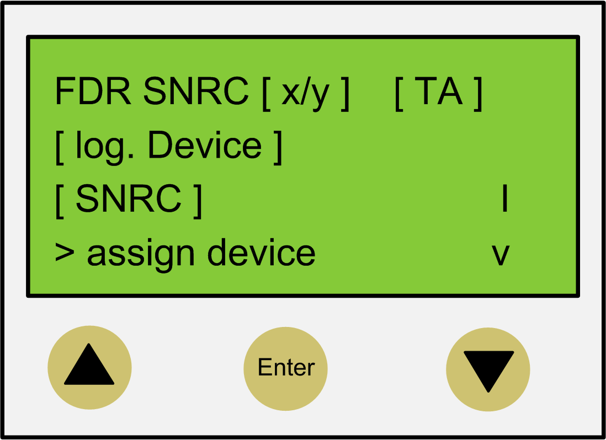

# Fast Device Replacement - Controller Display

## Overview

When the controller interface for FDR is active, the controller display shows the corresponding menu.

The following describes the menu in general. For more information, refer to the section [*Application*](D-SE-0049393.html#D-SE-0049393).

## General Menu Description

| Arrow / Key | | Description |
| --- | --- | --- |
|  |  | If up/down arrows are displayed at the right menu edge, you can scroll up and down using these arrow keys.  Scrolling starts only after the right arrow is displayed at the lower or upper menu edge. If the right arrow is displayed in a line in between, you can move it using the up/down arrow keys |
|  |  |
|  | – | The command that is in the line that is marked with the arrow pointing right can be confirmed/executed with the Enter key. |
|  | – |

In the following example, `FDR SNRC` stands for addressing a device via the device serial number. Instead of `FDR SNRC`, the `FDR ATYP` (for application type) or `FDR SADR` (for Sercos address) can also be used.

| Placeholders | Description |
| --- | --- |
| [`x/y`] | Number of the logic device (x) which currently has to be processed and the total number of the assigned devices (y). If, for example, 20 devices cannot be assigned by default addressing and you have already assigned 11 devices via the controller interface for FDR, then `12/20` is displayed.  If this line (for example, `FDR SNRC[x/y] [TA]`) contains more than 18 characters, then the first 16 characters are displayed, followed by `...`.  Via the menu item Details, you can switch to a display mode that displays the complete line (see below). |
| [`TA`] | Topological address of the physical device that is currently displayed. |
| [`log.`device] | Name of the logical device in the controller configuration (EcoStruxure Machine Expert Logic Builder) that shall be assigned to the physical device at the topological address [`TA`].  If the device name consists of more than 18 characters, the first 16 characters of the device name are displayed, followed by `...`  Via the menu item Details, you can switch to a display mode that displays the complete logical device name (see below). |
| `[SNRC]` | Serial number of the currently displayed physical device on the topological address [`TA`]  If the serial number has more than 18 characters, then the first 16 characters of the serial number are displayed, followed by `...`  Via the menu item Details, you can switch to a display mode that displays the complete serial number (see below). |

NOTE: Devices that were assigned via the menu item/command Assign device (see below) cannot be removed again via a menu item/command.

| Menu item/Command | Description |
| --- | --- |
| Assign device | With this command, you confirm the assignment between the logical device `[log.device]` and the physical device at the topological address `[TA]`.   * In the case of Identification mode  > Device serial number , the serial number of the physical device is copied to the parameter `ConfiguredSerialNumber` of the logical device. * In the case of Identification mode > Application type, the application type is written to the respective device via the Sercos bus * By Identification mode > sercos address, the Sercos address is written to the respective device via the Sercos bus.   After assigning a device, the `x` (see placeholder `[x/y]`) is increased. If no other devices without an assignment are existent, then the mechanism is completed and the Sercos phase start-up continues. |
| next phys. | With this command, the next physical device to the logical device (`x`) that currently has to be processed is displayed. |
| Details | With this command, it is possible to switch to a display mode that displays the complete lines (multi-line).  This is helpful if in the standard view lines cannot be displayed completely (see above).  For a logical device, a maximum of 40 characters can be displayed |
| back | With this command, it is possible to switch back to the standard view (maximum 16 characters followed by `...` are displayed). |
| Exit FDR | With this command, the controller interface for FDR is canceled.  The cancelation has to be confirmed once again (Really exit? > Exit FDR). |

Further information on the parameters can be found under *Fast Device Replacement* in the online help of EcoStruxure Machine Expert.

EIO0000001503.10