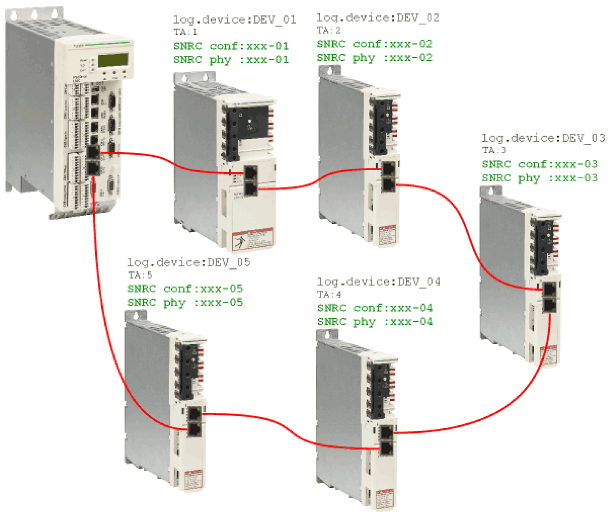
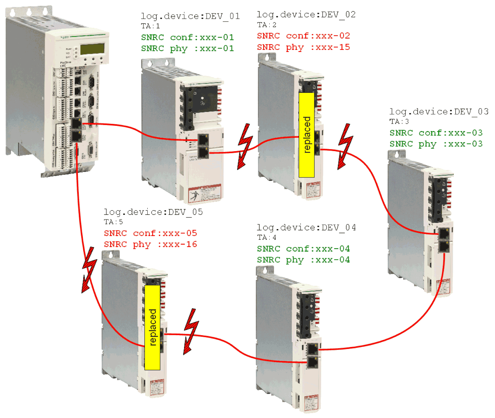
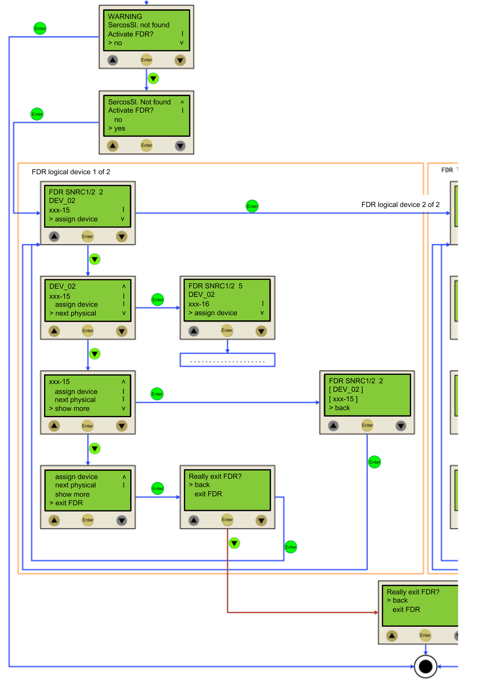
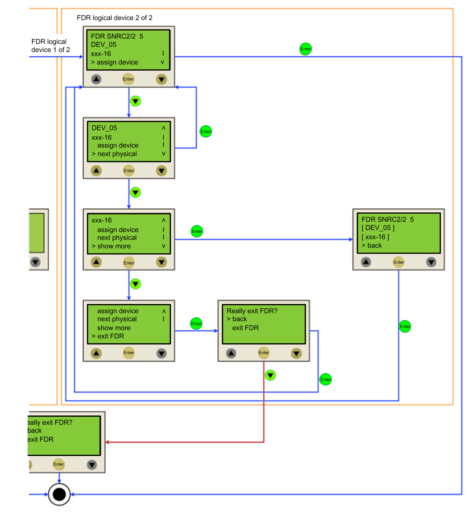

# Fast Device Replacement - Application

## Starting Conditions

The following example shows a typical application for the controller interface for FDR. For the displayed example, the following applies:

* All the devices are operational.
* The Sercos bus is started up.
* For all the devices, the **Device addressing** via the Identification mode > Device serial number was made (parameter `SerialNumberController / 0)`.
* The parameter `FDRConfirmationMode` of the controller was set to the value `by Display / 0`.

Further information on the parameters can be found under *Fast Device Replacement* in the online help of EcoStruxure Machine Expert.

## Device Replacement

The following devices have to be replaced because of maintenance:

* The device at the topology address 2 (`TA:2`) with the logical device name `DEV_02` and the serial number `SNRC phy: xxx-02` has to be replaced by the new device that has the serial number `SNRC phy: xxx-15`.
* The device at the topology address 5 (`TA:5`) with the logical device name `DEV_05` and the serial number `SNRC phy xxx-05` has to be replaced by the new device that has the serial number `SNRC phy xxx-16.`

## After the Device Replacement

After the physical replacement of the devices the machine has to be restarted again. In order for the controller interface for FDR to be started, the parameter `FDRStartMode` has to be set to `Start/1` or `Phase start-up/2` and the parameter `FDRConfirmationMode` to `by display / 0.`

Now the controller interface for FDR has to find the correct assignment of the two logical devices `DEV_02` and `DEV_05` to the new physically connected devices at topology address 2 and 5.

Further information on the parameters can be found under *Fast Device Replacement* in the online help of EcoStruxure Machine Expert.

## Process

The controller interface for FDR verifies all the logical devices one after another which would trigger the diagnostic message 8501 `Sercos slave not found` during the Sercos phase start-up. Afterwards, to the respective logical device all the physical devices are checked until one device is acknowledged.

Due to space constraints, the sequence for device 1 and device 2 is displayed one beneath the other.

EIO0000001503.10