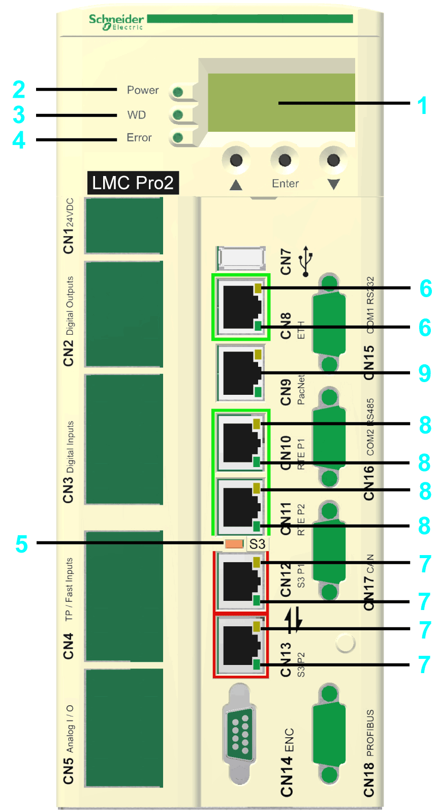
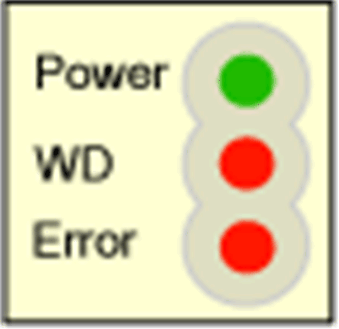
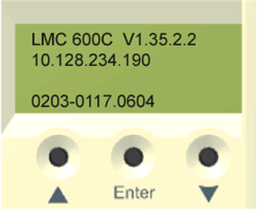

# Indicators of the Controller

## Overview

|  |  |
| --- | --- |
| 1 | 4-line [Liquid Crystal Display (LCD)](#D-SE-0049395__D-SE-0049395.3) |
| 2 | [**Power** LED indicator](#D-SE-0049395__D-SE-0049395.11) |
| 3 | [**WD** LED indicator](#D-SE-0049395__D-SE-0049395.12) |
| 4 | [**Error** LED indicator](#D-SE-0049395__D-SE-0049395.13) |
| 5 | [**S3** (Sercos III) LED indicator](#D-SE-0049395__D-SE-0049395.6) |
| 6 | [Ethernet status LED indicators](#D-SE-0049395__D-SE-0049395.14) |
| 7 | [Sercos status LED indicators](#D-SE-0049395__D-SE-0049395.10) |
| 8 | [*Protocol-specific status LED indicators*](#D-SE-0049395__D-SE-0049395.15) |
| 9 | **PacNet** LED indicators (not used) |

If the cover of the controller is closed, you see 3 vertically arranged LED indicators, which signify various operating states or detected errors:

* **Power**
* **WD** (watchdog indicator)
* **Error** (error display)

## Liquid Crystal Display (LCD)

In addition to the LED indicators, further information about the operating status of the controller is given on the 4-line Liquid Crystal Display (LCD).

|  |  |
| --- | --- |
| Line 1 | Controller type and firmware version |
| Line 2 | Current IP address of the controller |
| Line 3 | – |
| Line 4 | PFPGA version/PIC version |

## **Power** LED Indicator

The **Power** LED indicator indicates the state of the control voltage in the UPS status.

| LED indicator status | Meaning |
| --- | --- |
| Off | The control voltage (24 Vdc) is absent or under-voltage. |
| On | Normal operation; control voltage in the normal range. |
| Flashes | UPS active. |

## Watchdog LED Indicator

The **WD** (watchdog) LED indicator of the watchdog hardware module is used to monitor the controller.

| LED indicator status | Meaning |
| --- | --- |
| Off | Normal operation. |
| On | An unrecoverable error was detected or the controller is in initialization phase.  Press the reset button to reset and reboot the controller. |

An unrecoverable error is a hardware or software issue that requires intervention.

When this error is detected, the following actions are performed:

* The controller is stopped.
* The optional modules are reset.
* The digital and analog outputs are reset.
* The wd (watchdog) relay output is opened.

## **Error** LED Indicator

The **Error** LED indicator indicates detected errors. The table lists the possible display conditions and their accompanying error descriptions.

| LED indicator status | Meaning |
| --- | --- |
| Off | Normal operation. |
| Flashes slowly (1.7 Hz) | Error of class 3 and 4 active.  Refer to the *EcoStruxure Machine ExpertOnline Help\Diagnostics User Guide\System Diagnostic\Diagnostic Classes*. |
| Flashes quickly (10 Hz) | Controller boot completed, last boot was not successful. See diagnostic message 209 last boot failed. Controller performed a minimal boot. |
| Flashes fast and slowly alternately | Firmware download via Sercos is active or controller is in initialization phase |
| On | An error was detected during the boot. |

The **Error** LED indicator is flashing after BIOS is started. Once the operating system, user configuration, user parameters, and the IEC program have been loaded and the IEC program has been started successfully, the **Error** LED indicator is switched off again. The boot procedure is now complete.

## **S3** (Sercos III) LED Indicator

The **S3** LED indicator indicates the state and the phases of the Sercos communication.

| LED indicator color / status | Meaning | Instructions/information for the user | Notes |
| --- | --- | --- | --- |
| Off | No Sercos communication | – | – |
| Orange | The device is in a communication phase CP0 up to and including CP3. | – | SERC3.State = 0..3 |
| Green | Sercos communication in communication phase CP4 without error detected. | – | SERC3.State = 4 |
| Red | Detected communication error. | Reset condition: `DiagQuit` | SERC3.State = 11 |

## Ethernet Status LED Indicators

The Ethernet connector of PacDrive LMC Pro has two LED indicators. One LED indicator is green, the other is yellow.

| LED indicator | State | Meaning |
| --- | --- | --- |
| Green | On | Connection established |
| Green | Flashing | Data traffic |
| Green | Off | No connection, for example, no cable connected, or connected device has no power |
| Yellow | On | 100 MBit/s connection |
| Yellow | Off | 10 MBit/s connection |

The Ethernet connector of PacDrive LMC Pro2 has two LED indicators. One LED indicator is green (above), the other is yellow/green (below).

| LED indicator | State | Meaning |
| --- | --- | --- |
| Green (above) | On | Connection established |
| Green (above) | Off | No connection, for example, no cable connected, or connected device has no power |
| Green (below) | Flashing | 1000 MBit/s (1 GBit/s) connection with data traffic |
| Yellow (below) | Flashing | 10/100 MBit/s connection with data traffic |
| Yellow/Green (below) | Off | No data traffic |

## Sercos Status LED indicators

Each Sercos connector has two LED indicators. One LED indicator is green, the other is yellow.

| LED indicator | State | Meaning |
| --- | --- | --- |
| Yellow | On | Connection established |
| Off | No cable connected or connected device has no power. |
| Green | On | Active network traffic |
| Off | No active network traffic |

## Protocol-specific Status LED Indicators

LED indicators EtherCAT master

| LED indicator | Color | State | Meaning |
| --- | --- | --- | --- |
| **LINK**/RJ45 Ch0 & Ch1 | **green LED indicator** | | |
| Green | On | A connection to Ethernet exists. |
| Off | Off | The device has no connection to Ethernet. |
| RJ45 Ch0 & Ch1 | **yellow LED indicator** | | |
| Yellow | Flashing cyclic with 2.5 Hz | The device sends/receives Ethernet frames. |

LED indicators EtherCAT slave

| LED indicator | Color | State | Meaning |
| --- | --- | --- | --- |
| **LINK**/RJ45 Ch0 & Ch1 | **green LED indicator** | | |
| Green | On | A connection to Ethernet exists. |
| Green | Flashing cyclic with 2.5 Hz | The device sends/receives Ethernet frames. |
| Off | Off | The device has no connection to Ethernet. |
| RJ45 Ch0 & Ch1 | **yellow LED indicator** | | |
| – | – | The LED indicator is not used. |

LED indicators EtherNet/IP scanner (master)

| LED indicator | Color | State | Meaning |
| --- | --- | --- | --- |
| **LINK**/RJ45 Ch0 & Ch1 | **green LED indicator** | | |
| Green | On | A connection to Ethernet exists. |
| Off | Off | The device has no connection to Ethernet. |
| **ACT**/RJ45 Ch0 & Ch1 | **yellow LED indicator** | | |
| Yellow | Flashes | The device sends/receives Ethernet frames. |

LED indicators EtherNet/IP adapter (slave)

| LED indicator | Color | State | Meaning |
| --- | --- | --- | --- |
| **LINK**/RJ45 Ch0 & Ch1 | **green LED indicator** | | |
| Green | On | A connection to Ethernet exists. |
| Off | Off | The device has no connection to Ethernet. |
| **ACT**/RJ45 Ch0 & Ch1 | **yellow LED indicator** | | |
| Yellow | Flashes | The device sends/receives Ethernet frames. |

LED indicators PROFINET controller

| LED indicator | Color | State | Meaning |
| --- | --- | --- | --- |
| **LINK**/RJ45 Ch0 & Ch1 | **green LED indicator** | | |
| Green | On | A connection to Ethernet exists. |
| Off | Off | The device has no connection to Ethernet. |
| **RX/TX**/RJ45 Ch0 & Ch1 | **yellow LED indicator** | | |
| Yellow | Flashes | The device sends/receives Ethernet frames. |

LED indicators PROFINET device

| LED indicator | Color | State | Meaning |
| --- | --- | --- | --- |
| **LINK**/RJ45 Ch0 & Ch1 | **green LED indicator** | | |
| Green | On | A connection to Ethernet exists. |
| Off | Off | The device has no connection to Ethernet. |
| **RX/TX**/RJ45 Ch0 & Ch1 | **yellow LED indicator** | | |
| Yellow | Flashes | The device sends/receives Ethernet frames. |

## C2C Slave LED Indicators

| LED indicator | Color | State | Meaning |
| --- | --- | --- | --- |
| **LINK**/RJ45 Ch0 & Ch1 | **green LED indicator** | | |
| Green | On | A connection to Ethernet exists. |
| Green | Flashing cyclic | The device sends / receives Ethernet frames. |
| Off | Off | The device has no connection to Ethernet. |
| RJ45 Ch0 & Ch1 | **yellow LED indicator** | | |
| – | – | The LED is not used. |

## LED Description Additional Ethernet

| LED indicator | Color | State | Meaning |
| --- | --- | --- | --- |
| **LINK**/RJ45 Ch0 & Ch1 | **green LED indicator** | | |
| Green | On | A connection to Ethernet exists. |
| Off | Off | The device has no connection to Ethernet. |
| RX/TX/RJ45 Ch0 & Ch1 | **yellow LED indicator** | | |
| Yellow | Flashes | The device send/receives Ethernet frames. |

EIO0000001503.10