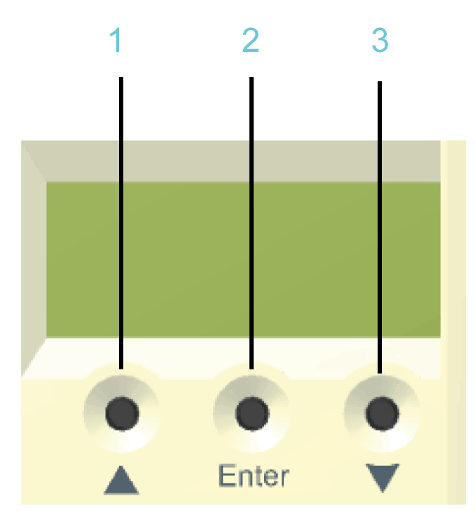
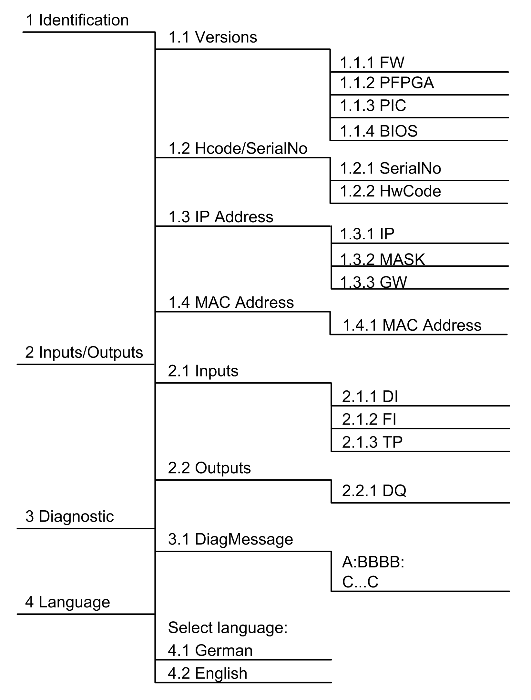
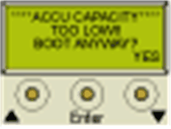

# Menu Navigation

## Menu Buttons

Three menu buttons are located on the front side of the controller. With these menu buttons, the user can open and navigate through the menu.

**1** Up arrow button

**2** **Enter** button

**3** Down arrow button

## Functions of the Menu Buttons

Under the Liquid Crystal Display (LCD), three menu buttons are located through which the user can open and navigate in the menu. The menu buttons feature the following functions:

| Buttons | Function |
| --- | --- |
| First  and then simultaneously | Access of the menu |
|  | Cursor up |
|  | Cursor down |
|  | Open menu item |
| First  and then simultaneously | One level up in the menu |

If an up or down arrow is displayed on the right display edge, this indicates that the current menu has more lines than can be shown on the display. In this case, you can use the arrow buttons  and  to scroll up or down.

## Menu Navigation

## Description of the Menu Navigation

The submenu Versions provides an overview of all the software and hardware versions installed on the controller.

| Item | Description |
| --- | --- |
| FW | Firmware version |
| PFPGA | Version of the PacDrive FPGA software |
| PIC | Version of PIC firmware |
| BIOS | BIOS version |

In the submenu HCode/SerialNo. a serial number and the hardware code are displayed. The serial number is a unique number which is used to identify the controller. The hardware code indicates the hardware revision.

| Item | Description |
| --- | --- |
| Serial number | Controller serial number |
| Hardware code | Hardware code of the controller(1) |
| (1) The first two digits of the hardware code indicate the hardware revision (for example, 02). The hardware revision is also indicated on the [logistical nameplate](D-SE-0049330.html#D-SE-0049330) (for example, **RS:02**). In order to maintain compatibility with your application and machine, replace the existing controller with that of the same hardware code. | |

In the submenu IP address, the IP address, the subnet mask, and the gateway are displayed.

| Item | Description |
| --- | --- |
| IP | IP address of the controller |
| MASK | Subnet mask |
| GW | Gateway |

The MAC address is specified in the submenu MAC address. The MAC address is a clear address of the device to identify the device in the network.

| Item | Description |
| --- | --- |
| MAC address | MAC address |

In the submenu Inputs, the user can prompt the logic state of each input. The digital inputs correspond to the standard IEC61131-2 type 1. Touchprobes and fast inputs have a resolution of 10 µs. Fast inputs can be used to trigger an interrupt.

| Item | Description |
| --- | --- |
| DI | Digital input |
| FI | Fast input |
| TP | Touchprobe |

In the submenu Outputs, the user can prompt the logic state of each output.

| Item | Description |
| --- | --- |
| DQ | Outputs |

In the submenu DiagMessage, the diagnostic class, the diagnostic code, and the diagnostic text are displayed. The system assigns each diagnostic message a specific diagnostic class when enabled. The diagnostic code is a code that encrypts a certain diagnostic. In the diagnostic text, a diagnostic is described in detail.

| Item | Description |
| --- | --- |
| A: | A: Diagnostic class |
| BBB: | BBBB: Diagnostic code |
| C...C | C...C: Diagnostic text |

In the submenu Select language, the user can choose the display language.

| Item | Description |
| --- | --- |
| Select language: | |
| German | Display language is German. |
| English | Display language is English. |

Display during the boot with empty battery pack (UPS).

Press the right button below the display to continue the boot and to start charging the battery pack (UPS).

For more information, refer to the chapter [*Device Replacement*](D-SE-0049352.html#D-SE-0049352).

EIO0000001503.10