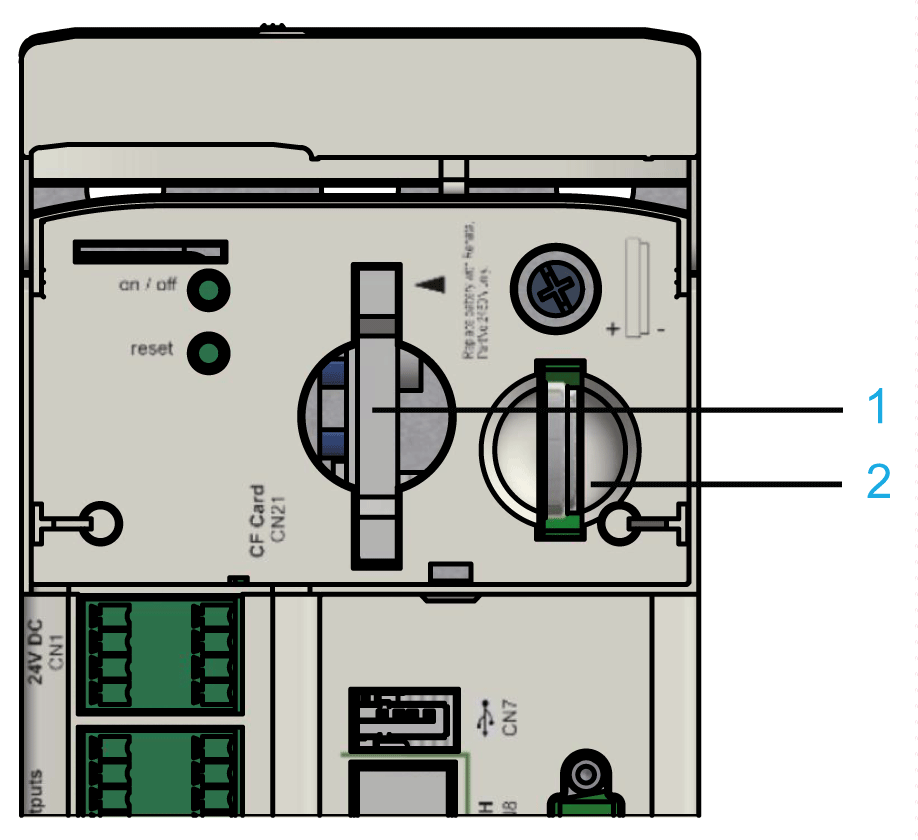

# CF Card (CompactFlash Card) Slot

## Overview

**1** CF card slot

**2** Battery compartment

The CF card slot is located on the operating cover of the controller.

The CF card slot is the receptacle for the non-volatile data storage (**C**ompact**F**lash Card) of the controller.

NOTE: Use only CF cards supplied by Schneider Electric dated 2012 or later.

## General Information on the CF Card

When handling the CF card, follow the instructions below to help prevent internal data on the CF card from being corrupted or lost or a CF card error from occurring:

| NOTICE | |
| --- | --- |
|  | LOSS OF APPLICATION DATA  * Do not store the CF card where there is static electricity or probable electromagnetic fields. * Do not store the CF card in direct sunlight, near a heater, or other locations where high temperatures can occur. * Do not bend the CF card. * Do not drop or strike the CF card against another object. * Keep the CF card dry. * Do not touch the CF card connectors. * Do not disassemble or modify the CF card. * Use only CF card formatted using FAT or FAT32.  Failure to follow these instructions can result in equipment damage. |

| NOTICE | |
| --- | --- |
|  | LOSS OF APPLICATION DATA  * Backup CF card data regularly. * Do not remove power or reset the controller, and do not insert or remove the CF card while it is being accessed.  Failure to follow these instructions can result in equipment damage. |

NOTE: To bridge power outages, use an uninterruptible power supply (UPS) if the data being written to the CF card is critical to your application.

| NOTICE | |
| --- | --- |
|  | LOSS OF DATA  Use an external UPS to avoid data loss in case of a power outage.  Failure to follow these instructions can result in equipment damage. |

## How to Replace the CF Card in Case of Servicing

| Step | Action |
| --- | --- |
| 1 | Set main switch to OFF position, or otherwise disconnect all power to the system. |
| 2 | Prevent main switch from being switched back on. |
| 3 | Hold the CF card with your thumb and forefinger and pull it out of the slot. |
| 4 | To insert, carefully place the CF card on the guide rail and push it into the device. |
| 5 | Push lightly until the CF card clicks in. |

## Remove CF Card

| NOTICE | |
| --- | --- |
|  | INCORRECTLY REMOVED CF card  Do not remove the CF card when the controller is under power.  Failure to follow these instructions can result in equipment damage. |

EIO0000001503.10