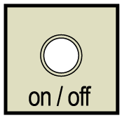
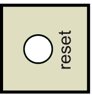

# Buttons

## **on / off** Button

The **on / off** buttons are located under the operating cover of the controller.

**Precondition:** Put your machine in a secure state before switching the controller off.

| Step | Action |
| --- | --- |
| 1 | Press this button to energize the controller when the controller is completely wired and connected to the power supply system. |
| 2 | Press this button to de-energize the controller after putting the machine in a secure state. |

## **reset** Button

The **reset** button is located under the operating cover of the controller.

**Precondition:** Put your machine in a secure state before resetting.

| Step | Action |
| --- | --- |
| 1 | Press the button to reset and reboot the controller. |

EIO0000001503.10