# Connection Details Controller

## **CN1** - Control Voltage And Watchdog

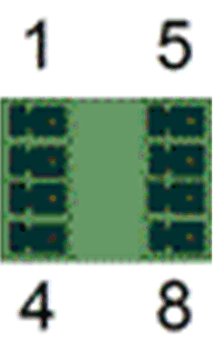

Connection **CN1**

| Pin | Designation | Meaning | Range |
| --- | --- | --- | --- |
| 1 | DC +24 V | Supply voltage | -15 % / +25 % |
| 2 | DC 0 V | Supply voltage | – |
| 3 | +UL | For digital outputs | DC +24 V  -15 % / +25 % |
| 4 | L0 | For digital inputs / outputs | – |
| 5 | DC +24 V | Supply voltage (bridged with pin 1, maximum ampacity 4 A) | – |
| 6 | DC 0 V | Supply voltage (bridged with pin 2, maximum ampacity 4 A) | – |
| 7 | WD | Watchdog relay | – |
| 8 | WD | Watchdog relay | – |

Input connection

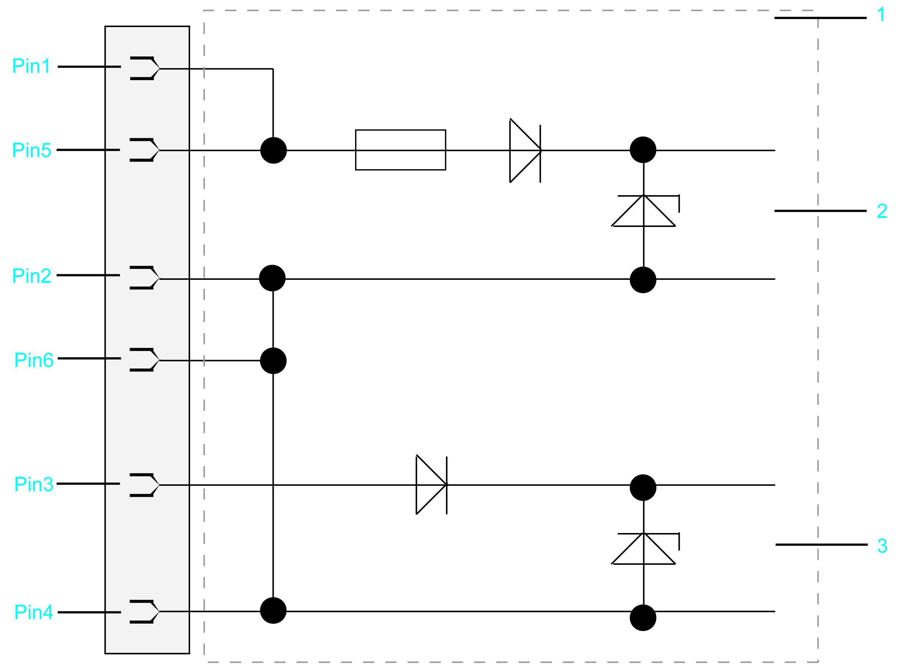

**1** Internal wiring diagram - input connection of power supply (simplified)

**2** Internal supply voltage

**3** Supply voltage for digital outputs/inputs

## **CN2** - Digital Outputs

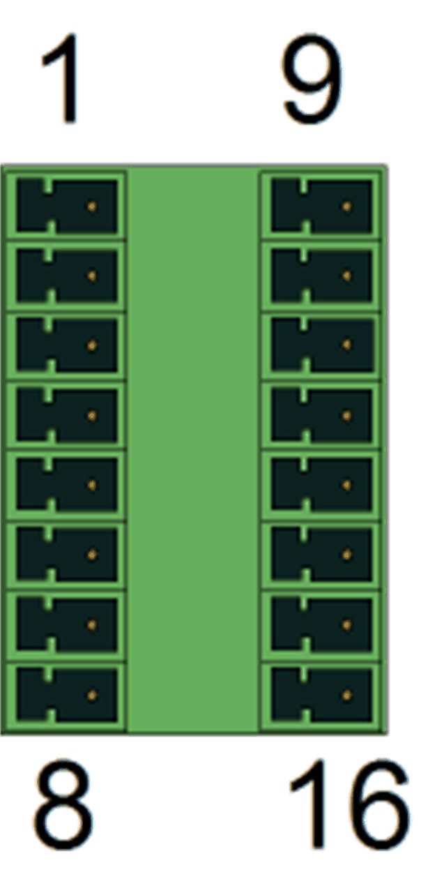

Connection **CN2**

| Pin | Designation | Meaning |
| --- | --- | --- |
| 1 | DQ\_0 | Digital output 0 |
| 2 | DQ\_1 | Digital output 1 |
| 3 | DQ\_2 | Digital output 2 |
| 4 | DQ\_3 | Digital output 3 |
| 5 | DQ\_4 | Digital output 4 |
| 6 | DQ\_5 | Digital output 5 |
| 7 | DQ\_6 | Digital output 6 |
| 8 | DQ\_7 | Digital output 7 |
| 9 | DQ\_8 | Digital output 8 |
| 10 | DQ\_9 | Digital output 9 |
| 11 | DQ\_10 | Digital output 10 |
| 12 | DQ\_11 | Digital output 11 |
| 13 | DQ\_12 | Digital output 12 |
| 14 | DQ\_13 | Digital output 13 |
| 15 | DQ\_14 | Digital output 14 |
| 16 | DQ\_15 | Digital output 15 |

NOTE: When nothing is connected (or the connected device has a high impedance) to an LMC digital output, it measures ~9V for FALSE. If this causes an issue for the connected device, use an external pull-down resistor.

## **CN3** - Digital Inputs

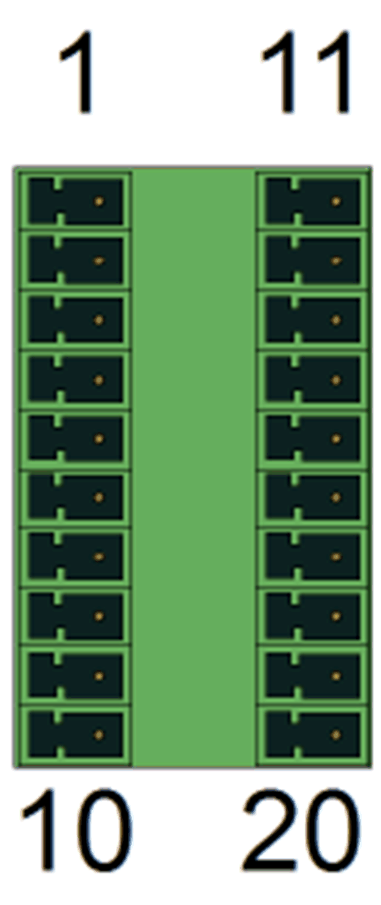

Connection **CN3**

| Pin | Designation | Meaning |
| --- | --- | --- |
| 1 | DI\_0 | Digital input 0 |
| 2 | DI\_1 | Digital input 1 |
| 3 | DI\_2 | Digital input 2 |
| 4 | DI\_3 | Digital input 3 |
| 5 | DI\_4 | Digital input 4 |
| 6 | DI\_5 | Digital input 5 |
| 7 | DI\_6 | Digital input 6 |
| 8 | DI\_7 | Digital input 7 |
| 9 | DI\_8 | Digital input 8 |
| 10 | DI\_9 | Digital input 9 |
| 11 | DI\_10 | Digital input 10 |
| 12 | DI\_11 | Digital input 11 |
| 13 | DI\_12 | Digital input 12 |
| 14 | DI\_13 | Digital input 13 |
| 15 | DI\_14 | Digital input 14 |
| 16 | DI\_15 | Digital input 15 |
| 17 | DI\_16 | Digital input 16 |
| 18 | DI\_17 | Digital input 17 |
| 19 | DI\_18 | Digital input 18 |
| 20 | DI\_19 | Digital input 19 |

## **CN4** - Touchprobe And Fast Digital Inputs

Connection **CN4**

| Pin | Designation | Meaning |
| --- | --- | --- |
| 1 | T.0 | Touchprobe input 0 |
| 2 | T.1 | Touchprobe input 1 |
| 3 | T.2 | Touchprobe input 2 |
| 4 | T.3 | Touchprobe input 3 |
| 5 | T.4 | Touchprobe input 4 |
| 6 | T.5 | Touchprobe input 5 |
| 7 | T.6 | Touchprobe input 6 |
| 8 | T.7 | Touchprobe input 7 |
| 9 | T.8 | Touchprobe input 8 |
| 10 | T.9 | Touchprobe input 9 |
| 11 | T.10 | Touchprobe input 10 |
| 12 | T.11 | Touchprobe input 11 |
| 13 | T.12 | Touchprobe input 12 |
| 14 | T.13 | Touchprobe input 13 |
| 15 | T.14 | Touchprobe input 14 |
| 16 | T.15 | Touchprobe input 15 |
| 17 | F.0 | Fast input 1 |
| 18 | F.1 | Fast input 2 |
| 19 | F.2 | Fast input 3 |
| 20 | F.3 | Fast input 4 |

## **CN5** - Analog Inputs / Outputs

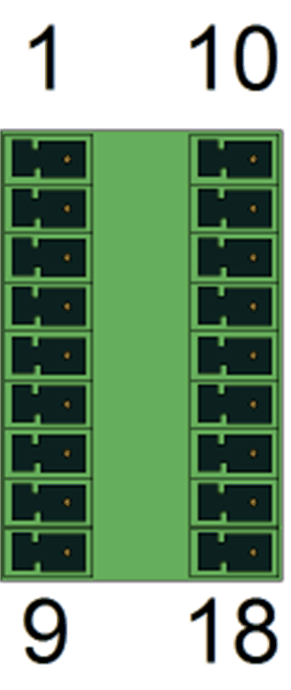

Connection **CN5**

| Pin | Designation | Meaning | Range |
| --- | --- | --- | --- |
| 1 | AI\_0 + | Analog input 0+ | -10...+10 V (\*) 0...20 mA (\*\*) |
| 2 | J\_0 + | Br. current input 0 + | – |
| 3 | AI\_0 - | Analog input 0- | – |
| 4 | A\_GND 0 | Analog ground 0 | – |
| 5 | 12 V Out 0 | Output voltage 0 | 12 V |
| 6 | FE (functional earth) | Shield | – |
| 7 | AO\_0 | Analog output 0 | -10...+10 V |
| 8 | A\_GND AO\_0 | Analog ground 0 | – |
| 9 | FE (functional earth) | Shield | – |
| 10 | AI\_1 + | Analog input 1+ | -10...+10 V (\*) 0...20 mA (\*\*) |
| 11 | J\_1 + | Br. current input 1 + | – |
| 12 | AI\_1 - | Analog input 1- | – |
| 13 | A\_GND 1 | Analog ground | – |
| 14 | 12 V Out 1 | Output voltage 1 | 12 V |
| 15 | FE (functional earth) | Shield | – |
| 16 | AO\_1 | Analog output 1 | -10...+10 V |
| 17 | A\_GND AO\_1 | Analog ground | – |
| 18 | FE (functional earth) | Shield | – |
| (\*) Voltage measurement and (\*\*) current measurement on AI\_0+ / AI\_0- (pin 1 / pin 3) and AI\_1+ / AI\_1- (pin 10 / pin 12)  (\*\*) Current measurement needs in addition bridge at J\_0+ (bridge between pin 2 and pin 1) or J\_1+ (bridge between pin 11 and pin 10.) | | | |

Input / Output connection

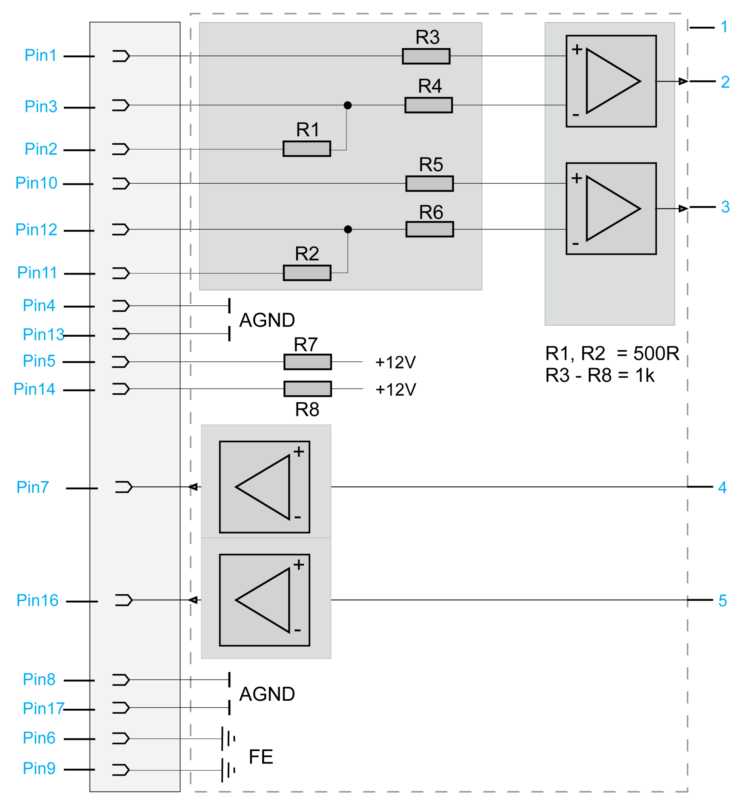

**1** Internal wiring diagram (simplified)

**2** Analog input 1

**3** Analog input 2

**4** Analog output 1

**5** Analog output 2

## **CN7** - USB Host

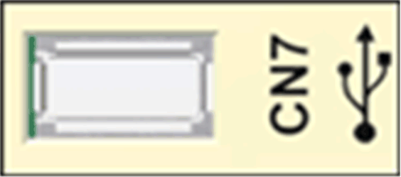

Connection **CN7**

| Pin | Designation | Meaning | Range |
| --- | --- | --- | --- |
| 1 | VBUS / +5V | – | – |
| 2 | D- / Data- | – | – |
| 3 | D+ / Data+ | – | – |
| 4 | GND / Ground | – | – |

## **CN8** - Ethernet

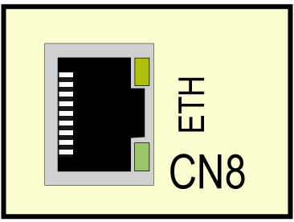

Connection **CN8** of PacDrive LMC Pro

| Pin | Designation | Meaning | Function |
| --- | --- | --- | --- |
| 1 | Tx+ | Output transmit data + | – |
| 2 | Tx- | Output transmit data - | – |
| 3 | Rx+ | Input receive data + | – |
| 4 | – | Reserved | – |
| 5 | – | Reserved | – |
| 6 | Rx- | Input receive data - | – |
| 7 | – | Reserved | – |
| 8 | – | Reserved | – |

Connection **CN8** of PacDrive LMC Pro2

| Pin | Designation | Meaning | Function |
| --- | --- | --- | --- |
| 1 | MDI 0+ | Transmit line 0 | – |
| 2 | MDI 0- | Transmit line 0 | – |
| 3 | MDI 1+ | Transmit line 1 | – |
| 4 | MDI 2+ | Transmit line 2 | – |
| 5 | MDI 2- | Transmit line 2 | – |
| 6 | MDI 1- | Transmit line 1 | – |
| 7 | MDI 3+ | Transmit line 3 | – |
| 8 | MDI 3- | Transmit line 3 | – |

There are two LED indicators affixed to the Ethernet connection.

For further information on the functions of the LED indicators, refer to the description of the Ethernet status LED indicator .

## **CN9** - PacNet

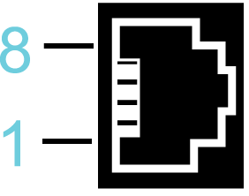

Connection **CN9**

| Pin | Designation | Meaning | Function |
| --- | --- | --- | --- |
| 1 | TxD+ | Output transmit data + | – |
| 2 | TxD- | Output transmit data - | – |
| 3 | RxD+ | Input receive data + | – |
| 4 | TxC- | Output transmit clock - | – |
| 5 | TxC+ | Output transmit clock + | – |
| 6 | RxD- | Input receive data - | – |
| 7 | RxC+ | Input receive clock + | – |
| 8 | RxC- | Input receive clock - | – |

## **CN10/CN11** - RT Ethernet

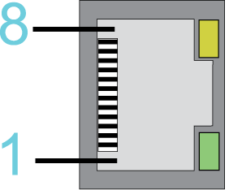

Connection **CN10/11**

| Pin | Designation | Meaning | Function |
| --- | --- | --- | --- |
| 1 | Tx+ | Output transmit data + | – |
| 2 | Tx- | Output transmit data - | – |
| 3 | Rx+ | Input receive data + | – |
| 4 | – | Reserved | – |
| 5 | – | Reserved | – |
| 6 | Rx- | Input receive data - | – |
| 7 | – | Reserved | – |
| 8 | – | Reserved | – |

NOTE:

* When using the PacDrive LMC Pro/Pro2 as EtherCAT slave, the connection **CN10** represents the input port and the connection **CN11** the output port. The input port and output port are predetermined by the firmware and cannot be configured.
* When using the PacDrive LMC Pro/Pro2 as EtherCAT Master, only the connection **CN10** can be used.

## LED Description for **CN10/CN11** - RT Ethernet

For further information on the functions of the LED indicators, refer to the description of the  [Indicators and Control elements](D-SE-0049394.html#D-SE-0049394).

**LED states valid for SoMachine Motion V4.1(firmware version V1.51.10.6) and earlier (EtherCAT master stack version V3):**

LEDs EtherCAT master

| LED indicator | Color | State | Meaning |
| --- | --- | --- | --- |
| **LINK**/RJ45 Ch0 & Ch1 | **green LED indicator** | | |
| Green | On | A connection to Ethernet exists. |
| Green | Flashing | The device sends/receives Ethernet frames. |
| Off | Off | The device has no connection to Ethernet. |
| RJ45 Ch0 & Ch1 | **yellow LED indicator** | | |
| – | – | The LED indicator is not used. |

LEDs EtherCAT slave

| LED indicator | Color | State | Meaning |
| --- | --- | --- | --- |
| **LINK**/RJ45 Ch0 & Ch1 | **green LED indicator** | | |
| Green | On | A connection to Ethernet exists. |
| Green | Flashing | The device sends/receives Ethernet frames. |
| Off | Off | The device has no connection to Ethernet. |
| RJ45 Ch0 & Ch1 | **yellow LED indicator** | | |
| – | – | The LED indicator is not used. |

**LED states valid for EcoStruxure Machine Expert V1.0 and later (EtherCAT master stack version V4) and SoMachine Motion V4.2 (firmware version V1.53.9.0) and later (EtherCAT master stack version V4):**

LED indicators EtherCAT master

| LED indicator | Color | State | Meaning |
| --- | --- | --- | --- |
| **LINK**/RJ45 Ch0 | **green LED indicator** | | |
| Green | On | A connection to Ethernet exists. |
| Green | Flashes | The device sends / receives Ethernet frames. |
| Off | Off | The device has no connection to Ethernet. |
| ACT RJ45 Ch0 | **yellow LED indicator** | | |
| off | – | – |

LED indicators EtherCAT slave

| LED indicator | Color | State | Meaning |
| --- | --- | --- | --- |
| **LINK**/RJ45 Ch0 & CH1 | **green LED indicator** | | |
| Green | On | A connection to Ethernet exists. |
| Green | Flashes | The device sends / receives Ethernet frames. |
| Off | Off | The device has no connection to Ethernet. |
| RJ45 Ch0 & CH1 | **yellow LED indicator** | | |
| – | – | – |

## **CN12/CN13** - Sercos

Connection **CN12/CN13**

| Pin | Designation | Meaning | Range |
| --- | --- | --- | --- |
| 1 | Tx+ | Output transmit data + | – |
| 2 | Tx- | Output transmit data - | – |
| 3 | Rx+ | Input receive data + | – |
| 4 | – | Reserved | – |
| 5 | – | Reserved | – |
| 6 | Rx- | Input receive data - | – |
| 7 | – | Reserved | – |
| 8 | – | Reserved | – |

NOTE: If Sercos devices are assigned via the topological addresses (IdentificationMode = TopologyAddress) to the PacDrive LMC Pro/Pro2, then respect the following:

* Connect your Sercos device to the PacDrive LMC Pro/Pro2 either completely via Sercos port 1 (**CN12**) in line topology or in ring topology using Sercos port 1 and 2 (**CN12**/**CN13**).
* Do not connect the Sercos devices to the PacDrive LMC Pro/Pro2 via double line topology (**CN12**/**CN13**).
* Do not connect the Sercos devices to the PacDrive LMC Pro/Pro2 only via Sercos port 2 (**CN13**).

## **CN14** - Master Encoder (Hiperface)

The Hiperface connection consists of a standard, differential, digital connection (RS-485 = 2 wires), a differential, analog connection (sine- and cosine signal = 4 wires), and a mains connection to supply the encoder (+9 V, GND = 2 wires).

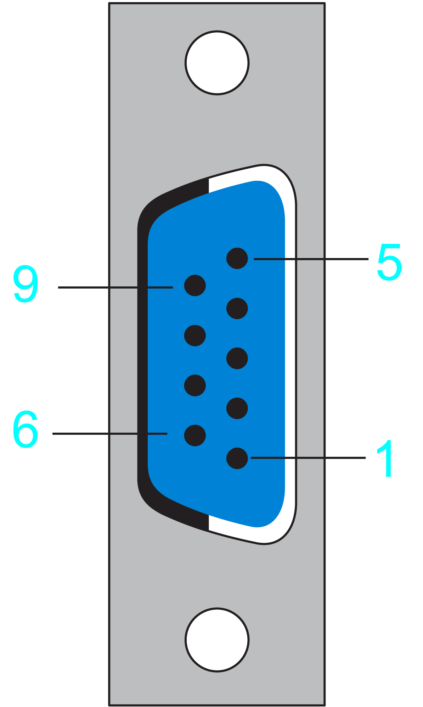

Connection **CN14** - Master encoder (Hiperface)

| Pin | Designation | Meaning | Range |
| --- | --- | --- | --- |
| 1 | REFSIN | Reference signal sine | – |
| 2 | SIN | Sinusoidal trace | – |
| 3 | REFCOS | Reference signal cosinus | – |
| 4 | COS | Cosinus trace | – |
| 5 | +9 V | Supply voltage | – |
| 6 | RS485- | Parameter channel - | – |
| 7 | RS485+ | Parameter channel + | – |
| 8 | SC\_SEL | Master encoder plugged in (bridge to GND) | – |
| 9 | GND | Supply voltage | – |

## **CN14** - Master Encoder (Incremental)

Connection **CN14** - Master encoder (incremental)

| Pin | Designation | Meaning | Range |
| --- | --- | --- | --- |
| 1 | \_UA | Track A | – |
| 2 | UA | Track A | – |
| 3 | \_UB | Track B | – |
| 4 | UB | Track B | – |
| 5 | +5 V | Supply voltage | – |
| 6 | \_UO | Track O | – |
| 7 | UO | Track O | – |
| 8 | – | Reserved | – |
| 9 | GND | Ground | – |

## **CN15** - COM 1 (RS-232)

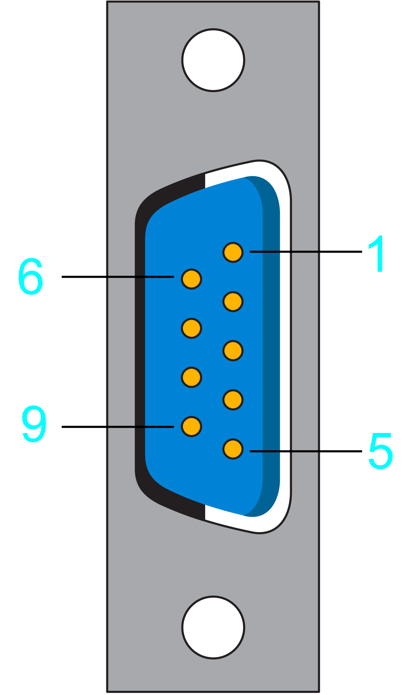

Connection **CN15**

| Pin | Designation | Meaning | Range |
| --- | --- | --- | --- |
| 1 | DCD | Data carrier detect | – |
| 2 | RxD | Receive data | – |
| 3 | TxD | Transmit data | – |
| 4 | DTR | Data terminal ready | – |
| 5 | GND | Signal ground | – |
| 6 | DSR | Data set ready clear to send | – |
| 7 | RTS | Request to send | – |
| 8 | CTS | Clear to send | – |
| 9 | RI | Ring indicator | – |

## **CN16** - COM 2 (RS-485)

Connection **CN16**

| Pin | Designation | Meaning | Range |
| --- | --- | --- | --- |
| 1 | +5 VM | Supply voltage | – |
| 2 | TxD- | RS-485 transmit- | – |
| 3 | TxD+ | RS-485 transmit+ | – |
| 4 | RxD+ | RS-485 receive+ | – |
| 5 | RxD- | RS-485 receive- | – |
| 6 | GNDR | GND via resistor (100 Ohm) | – |
| 7 | – | Reserved | – |
| 8 | GNDM | Supply voltage | – |
| 9 | GNDR | GND via resistor (100 Ohm) | – |

## **CN17** - CAN

Connection **CN17**

| Pin | Designation | Meaning | Range |
| --- | --- | --- | --- |
| 1 | – | Reserved | – |
| 2 | CAN\_L | Bus line (low) | – |
| 3 | GND | Ground | – |
| 4 | – | Reserved | – |
| 5 | – | Reserved | – |
| 6 | – | Reserved | – |
| 7 | CAN\_H | Bus line (high) | – |
| 8 | – | Reserved | – |
| 9 | – | Reserved | – |

NOTE: A connection of TM5 System via CAN bus and a CANopen interface module is not supported.

## **CN18** - PROFIBUS

Connection **CN18**

| Pin | Designation | Meaning | Range |
| --- | --- | --- | --- |
| 1 | FE (functional earth) | Shield | – |
| 2 | – | Reserved | – |
| 3 | RxD / TxD -P | Data -P | – |
| 4 | CNTR-P | Control signal P | – |
| 5 | DGND | Signal ground | – |
| 6 | VP | Supply voltage | – |
| 7 | – | Reserved | – |
| 8 | RxD / TxD -N | Data -N | – |
| 9 | – | Reserved | – |

## Connectors

NOTE: For the connection plugs, use a PROFIBUS connector to connect to the 9 pole PROFIBUS outlet because the bus terminal resistors are in this connector.

Note for the bus terminal resistors:

| Step | Action |
| --- | --- |
| 1 | Verify for the first and last bus nodes if the terminal resistors are switched on. Otherwise data transmission will not function properly. |
| 2 | Verify if the shielding is applied extensively and on both sides. |

EIO0000001503.10