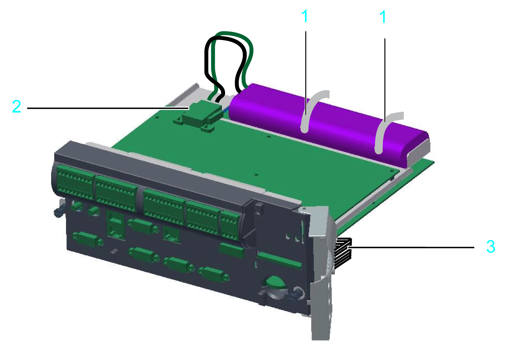

# Retrofitting Installation of UPS

## Overview

The controllers PacDrive LMC Pro and PacDrive LMC Pro2 can be equipped with an internal battery pack (UPS) for an uninterruptible power supply. The internal battery pack (UPS) is continually being charged via the power supply of the controller while in operation.

The function of the battery pack (UPS) is to maintain the power supply to the controller in the event of a power outage long enough to shut down the controller properly without losing any data. The preset time of shutdown can be up to 5 minutes.

If necessary, the battery pack (UPS) can also be installed or replaced afterwards, as described below.

## How to Open the Controller

| Step | Action |
| --- | --- |
| 1 | Set main switch to OFF position, or otherwise disconnect all power to the system. |
| 2 | Prevent the main switch from being switched back on. |
| 3 | Open the operating cover of the PacDrive controller. |
| 4 | Loosen the two fastening screws on the front of the controller (1). |
| 5 | Remove the electronic module from the housing. |

| NOTICE | |
| --- | --- |
|  | ELECTROSTATIC DISCHARGE  * Do not touch any of the electrical connections or components. * Prevent electrostatic charges, for example, by wearing appropriate clothing. * If you must touch circuit boards, do so only on the edges. * Remove existing static charge by touching a grounded, metallic surface.  Failure to follow these instructions can result in equipment damage. |

## How to Connect the Battery Pack (UPS)

| Step | Action |
| --- | --- |
| 1 | Adjust the battery pack (UPS) and attach with two cable ties (1). |
| 2 | Connect the battery cable (2). |

Improperly secured equipment and accessories can cause mechanical damage of PacDrive controller.

| CAUTION | |
| --- | --- |
|  | BATTERY PACK (UPS) NOT PROPERLY SECURED  * Use only the supplied cable ties to secure the battery pack (item number VW3E6006). * Verify that the battery pack (UPS) is properly secured.  Failure to follow these instructions can result in injury or equipment damage. |

The estimated maintenance interval for replacing the battery pack (UPS) is 3 years.

| CAUTION | |
| --- | --- |
|  | POSSIBLE DATA LOSS BY POWER OUTAGE  Replace the battery pack (UPS) at regular maintenance intervals not to exceed 3 years.  Failure to follow these instructions can result in injury or equipment damage. |

| CAUTION | |
| --- | --- |
|  | DAMAGE TO DISPLAY SUPPLY CABLE POSSIBLE  * Do not force the electronic module into the housing. * Ensure that during installation of the electronic module, the display supply cable does not get damaged.  Failure to follow these instructions can result in injury or equipment damage. |

**1** Cable ties

**2** Battery cable

**3** Display supply cable

## How to Connect the Controller

| Step | Action |
| --- | --- |
| 1 | Carefully push the electronic module of the controller back into the housing. |
| 2 | Tighten the two fastening screws on the front of the controller. |
| 3 | Close the operating cover. |

EIO0000001503.10