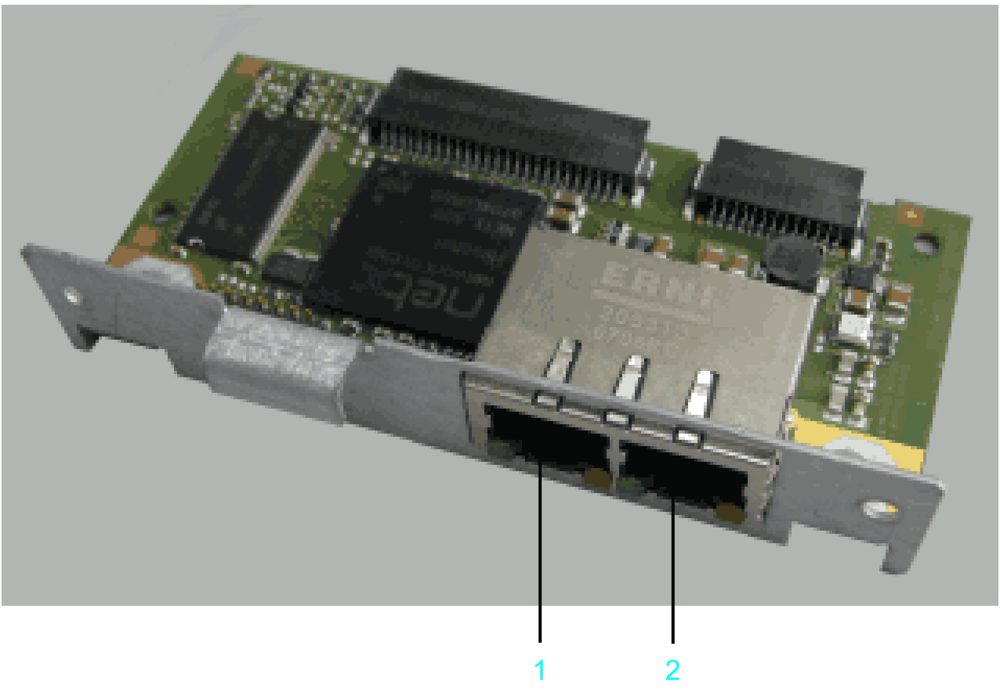

# Overview

## Initial Installation

Initial installation of the optional module should only be done by Schneider Electric personnel.

## General Information

The OM-NE module is a general communication module which features two Ethernet connectors to realize Ethernet based field bus protocols.

OM-NE module (reference VW3E701400000) with slot assignment

**1** Ethernet connection **CN30** (**RT Eth P1**)

**2** Ethernet connection **CN31** (**RT Eth P2**)

After installing the optional module, the controller will automatically detect the module. Then configure it by using the controller configuration in EcoStruxure Machine Expert Logic Builder.

NOTE: Only use OM-NE modules from hardware code 0008 for PacDrive LMC Pro/Pro2 controllers.

EIO0000001503.10