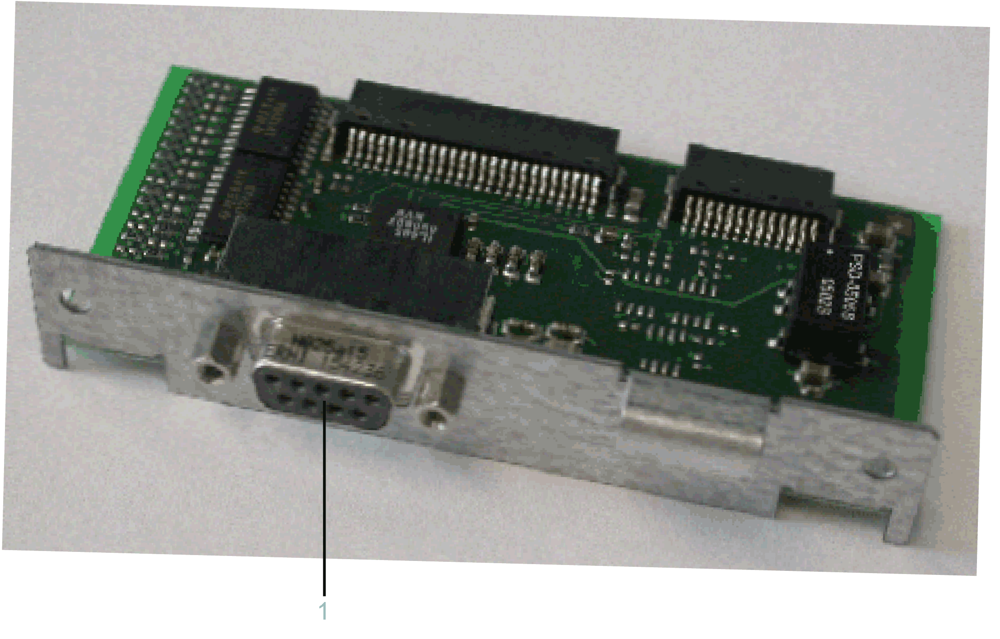

# Overview

## Initial Installation

Initial installation of the optional module should only be done by Schneider Electric personnel.

## General Information

Another PROFIBUS interface is made available via the OM-P module (reference VW3E701200000).

After installing the optional module, the controller will automatically detect the module. Then configure it by using the controller configuration in EcoStruxure Machine Expert Logic Builder.

EIO0000001503.10