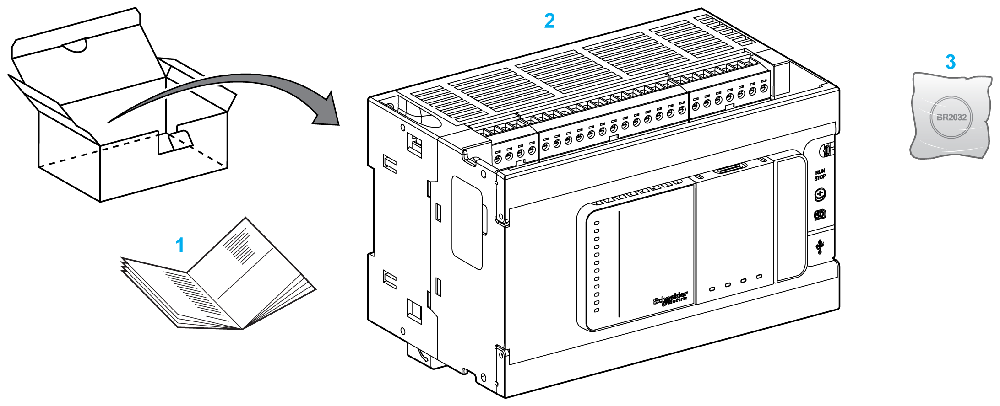

# M241 Logic Controller Description

## Overview

The M241 Logic Controller has various powerful features and can service a wide range of applications.

## Programming Languages

The M241 Logic Controller is configured and programmed with the EcoStruxure Machine Expert software which supports the following IEC 61131-3 programming languages:

* IL: Instruction List
* ST: Structured Text
* FBD: Function Block Diagram
* SFC: Sequential Function Chart
* LD: Ladder Diagram

The EcoStruxure Machine Expert software can also be used to program the M241 Logic Controller using CFC (Continuous Function Chart) language.

## Power Supply

The power supply of the M241 Logic Controller is [24 Vdc](../../../../../api/crossBook?lang=en-US&virtualBookName=m241hw&topicID=D_SE_0034419) or [100...240 Vac](../../../../../api/crossBook?lang=en-US&virtualBookName=m241hw&topicID=D_SE_0025320).

## Real Time Clock

The M241 Logic Controller includes a [Real Time Clock (RTC) system](../../../../../api/crossBook?lang=en-US&virtualBookName=m241hw&topicID=D_SE_0025710).

## Run/Stop

The M241 Logic Controller can be operated externally by the following:

* A hardware [Run/Stop switch](../../../../../api/crossBook?lang=en-US&virtualBookName=m241hw&topicID=D_SE_0034418)
* A [Run/Stop](../../../../../api/crossBook?lang=en-US&virtualBookName=m241hw&topicID=D_SE_0034335) operation by a dedicated digital input, defined in the software configuration. For more information, refer to [Configuration of Digital Inputs](D-RU-0004567.html#D-RU-0004567__D-RU-0004567.4).
* A software command
* The system variable PLC\_W in a Relocation Table
* The Web server [Maintenance: Run/Stop Controller Submenu](MaintenanceMenu-0B91FC4E.html#MaintenanceMenu-0B91FC4E__MaintenanceRunStopControllerSubmenu-1D1D91B2)

## Memory

This table describes the different types of memory:

| Memory Type | Size | Use |
| --- | --- | --- |
| RAM | Refer to the table below | For the execution of the application and the firmware. |
| Non-volatile (flash) | 128 Mbytes | For the retention of the program and data in case of a power interruption. |

The RAM size depends on the PV value, which can be found in the [Services tab](D-SE-0006802.html) and the Web server [Diagnostics: Controller Submenu](DiagnosticMenu-0B91E60C.html#DiagnosticMenu-0B91E60C__DiagnosticsControllerSubmenu-1D17C27A):

| Reference | PV Value | RAM Size |
| --- | --- | --- |
| TM241•••• | < 20 | 64 Mbytes, of which 10 Mbytes are available for the application |
| ≥ 20 | 128 Mbytes, of which 20 Mbytes are available for the application |

## Embedded Inputs/Outputs

The following embedded I/O types are available, depending on the controller reference:

* Regular inputs
* Fast inputs associated with counters
* Regular sink/source transistor outputs
* Fast sink/source transistor outputs associated with pulse generators
* Relay outputs

## Removable Storage

The M241 Logic Controller includes an [embedded SD card slot](../../../../../api/crossBook?lang=en-US&virtualBookName=m241hw&topicID=D_SE_0027501).

The main uses of the SD card are:

* Initializing the controller with a new application
* [Updating the controller and expansion module firmware](D-SE-0035605.html#D-SE-0035605)
* [Applying post configuration files to the controller](D-SE-0010304.html)
* Storing recipes files
* Receiving data logging files
* [Backup Data Logging File](D-SE-0004156.html#D-SE-0004156__D-SE-0004156.9)

## Embedded Communication Features

The following types of communication ports are available, depending on the controller reference:

* [CANopen Master](../../../../../api/crossBook?lang=en-US&virtualBookName=m241hw&topicID=D_SE_0032568)
* [Ethernet](../../../../../api/crossBook?lang=en-US&virtualBookName=m241hw&topicID=D_SE_0034492)
* [USB Mini-B](../../../../../api/crossBook?lang=en-US&virtualBookName=m241hw&topicID=D_SE_0029629)
* [Serial Line 1](../../../../../api/crossBook?lang=en-US&virtualBookName=m241hw&topicID=D_SE_0025808)
* [Serial Line 2](../../../../../api/crossBook?lang=en-US&virtualBookName=m241hw&topicID=D_SE_0034493)

## Expansion Module and Bus Coupler Compatibility

Refer to the compatibility tables in [EcoStruxure Machine Expert, Compatibility and Migration User Guide](../../../../../api/crossBook?lang=en-US&virtualBookName=CompMigr&topicID=D_SE_0094606).

## Compatibility with Modicon Edge I/O NTS Devices

Refer to the compatibility tables in [EcoStruxure Machine Expert, Compatibility and Migration User Guide](../../../../../api/crossBook?lang=en-US&virtualBookName=CompMigr&topicID=CompatibilityBetweenControllersAndD_3E0165F1).

NOTE: To use Modicon Edge I/O NTS devices, you must activate the [OPC UA server](D-SE-0068331.html).

## M241 Logic Controller References

| Reference | Digital Inputs | Digital Outputs | Communication Ports | Terminal Type | Power supply |
| --- | --- | --- | --- | --- | --- |
| [TM241C24R](../../../../../api/crossBook?lang=en-US&virtualBookName=m241hw&topicID=D_SE_0036271) | 6 regular inputs (1)  8 fast inputs (counters) (2) | 6 2A relay outputs  4 source fast outputs (pulse generators) (3) | 2 serial line ports  1 USB programming port | Removable screw terminal blocks | 100...240 Vac |
| [TM241CE24R](../../../../../api/crossBook?lang=en-US&virtualBookName=m241hw&topicID=D_SE_0032637) | 6 regular inputs (1)  8 fast inputs (counters) (2) | 6 2A relay outputs  4 source fast outputs (pulse generators) (3) | 2 serial line ports  1 USB programming port  1 Ethernet port | Removable screw terminal blocks | 100...240 Vac |
| [TM241CEC24R](../../../../../api/crossBook?lang=en-US&virtualBookName=m241hw&topicID=D_SE_0036281) | 6 regular inputs (1)  8 fast inputs (counters) (2) | 6 2A relay outputs  4 source fast outputs (pulse generators)(3) | 2 serial line ports  1 Ethernet port  1 CANopen master port  1 USB programming port | Removable screw terminal blocks | 100...240 Vac |
| [TM241C24T](../../../../../api/crossBook?lang=en-US&virtualBookName=m241hw&topicID=D_SE_0032246) | 6 regular inputs (1)  8 fast inputs (counters) (2) | Source outputs  6 regular transistor outputs  4 fast outputs (pulse generators) (3) | 2 serial line ports  1 USB programming port | Removable screw terminal blocks | 24 Vdc |
| [TM241CE24T](../../../../../api/crossBook?lang=en-US&virtualBookName=m241hw&topicID=D_SE_0032313) | 6 regular inputs (1)  8 fast inputs (counters) (2) | Source outputs  6 regular transistor outputs  4 fast outputs (pulse generators) (3) | 2 serial line ports  1 USB programming port  1 Ethernet port | Removable screw terminal blocks | 24 Vdc |
| [TM241CEC24T](../../../../../api/crossBook?lang=en-US&virtualBookName=m241hw&topicID=D_SE_0032257) | 6 regular inputs (1)  8 fast inputs (counters) (2) | Source outputs  6 regular transistor outputs  4 fast outputs (pulse generators) (3) | 2 serial line ports  1 USB programming port  1 Ethernet port  1 CANopen master port | Removable screw terminal blocks | 24 Vdc |
| [TM241C24U](../../../../../api/crossBook?lang=en-US&virtualBookName=m241hw&topicID=D_SE_0032615) | 6 regular inputs (1)  8 fast inputs (counters) (2) | Sink outputs  6 regular transistor outputs  4 fast outputs (pulse generators) (3) | 2 serial line ports  1 USB programming port | Removable screw terminal blocks | 24 Vdc |
| [TM241CE24U](../../../../../api/crossBook?lang=en-US&virtualBookName=m241hw&topicID=D_SE_0032616) | 6 regular inputs (1)  8 fast inputs (counters) (2) | Sink outputs  6 regular transistor outputs  4 fast outputs (pulse generators) (3) | 2 serial line ports  1 USB programming port  1 Ethernet port | Removable screw terminal blocks | 24 Vdc |
| [TM241CEC24U](../../../../../api/crossBook?lang=en-US&virtualBookName=m241hw&topicID=D_SE_0032314) | 6 regular inputs (1)  8 fast inputs (counters) (2) | Sink outputs  6 regular transistor outputs  4 fast outputs (pulse generators) (3) | 2 serial line ports  1 USB programming port  1 Ethernet port  1 CANopen master port | Removable screw terminal blocks | 24 Vdc |
| [TM241C40R](../../../../../api/crossBook?lang=en-US&virtualBookName=m241hw&topicID=D_SE_0036286) | 16 regular inputs (1)  8 fast inputs (counters) (2) | 12 2A relay outputs  4 source fast outputs (pulse generators) (3) | 2 serial line ports  1 USB programming port | Removable screw terminal blocks | 100...240 Vac |
| [TM241CE40R](../../../../../api/crossBook?lang=en-US&virtualBookName=m241hw&topicID=D_SE_0036288) | 16 regular inputs (1)  8 fast inputs (counters) (2) | 12 2A relay outputs  4 source fast outputs (pulse generators) (3) | 2 serial line ports  1 USB programming port  1 Ethernet port | Removable screw terminal blocks | 100...240 Vac |
| [TM241C40T](../../../../../api/crossBook?lang=en-US&virtualBookName=m241hw&topicID=D_SE_0032633) | 16 regular inputs (1)  8 fast inputs (counters) (2) | Source outputs  12 regular transistor outputs  4 fast outputs (pulse generators) (3) | 2 serial line ports  1 USB programming port | Removable screw terminal blocks | 24 Vdc |
| [TM241CE40T](../../../../../api/crossBook?lang=en-US&virtualBookName=m241hw&topicID=D_SE_0032638) | 16 regular inputs (1)  8 fast inputs (counters) (2) | Source outputs  12 regular transistor outputs  4 fast outputs (pulse generators) (3) | 2 serial line ports  1 USB programming port  1 Ethernet port | Removable screw terminal blocks | 24 Vdc |
| [TM241C40U](../../../../../api/crossBook?lang=en-US&virtualBookName=m241hw&topicID=D_SE_0032639) | 16 regular inputs (1)  8 fast inputs (counters) (2) | Sink outputs  12 regular transistor outputs  4 fast outputs (pulse generators) (3) | 2 serial line ports  1 USB programming port | Removable screw terminal blocks | 24 Vdc |
| [TM241CE40U](../../../../../api/crossBook?lang=en-US&virtualBookName=m241hw&topicID=D_SE_0032637) | 16 regular inputs (1)  8 fast inputs (counters) (2) | Sink outputs  12 regular transistor outputs  4 fast outputs (pulse generators) (3) | 2 serial line ports  1 USB programming port  1 Ethernet port | Removable screw terminal blocks | 24 Vdc |
| **(1)** The regular inputs have a maximum frequency of 1 kHz.  **(2)** The fast inputs can be used either as regular inputs or as fast inputs for counting or event functions.  **(3)** The fast transistor outputs can be used either as regular transistor outputs, as reflex outputs for counting function (HSC), or as fast transistor outputs for pulse generator functions (FreqGen / PTO / PWM). | | | | | |

## Delivery Content

The following figure presents the content of the delivery for a M241 Logic Controller:

**1** M241 Logic Controller Instruction Sheet

**2** M241 Logic Controller

**3** Lithium carbon monofluoride battery, type Panasonic BR2032.

EIO0000003059.10