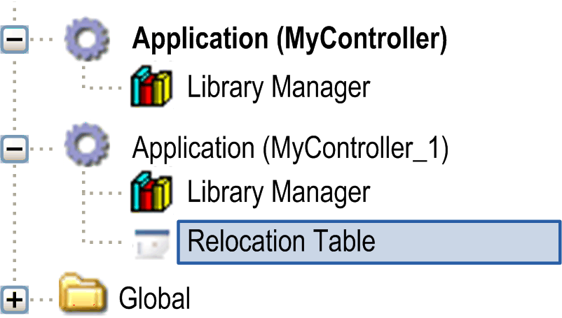
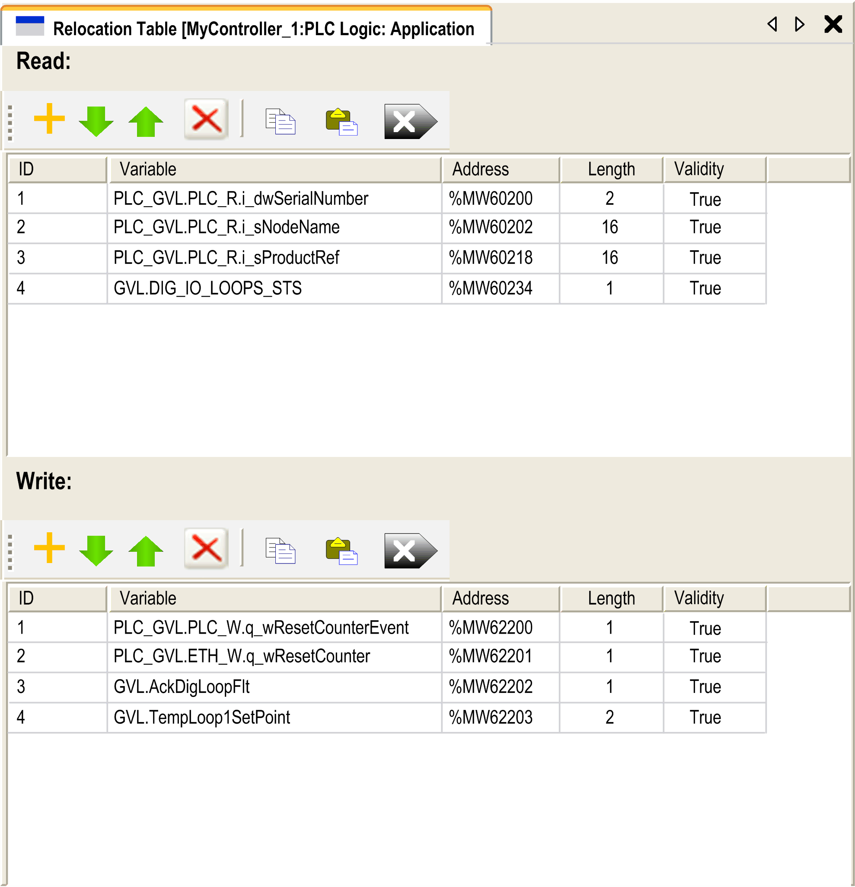

# Relocation Table

## Introduction

The Relocation Table allows you to organize data to optimize communication between the controller and other equipment by regrouping non-contiguous data into a contiguous table of located registers, accessible through Modbus.

NOTE: A relocation table is considered an object. Only one relocation table object can be added to a controller.

## Relocation Table Description

This table describes the Relocation Table organization:

| Register | Description |
| --- | --- |
| 60200...61999 | Dynamic Memory Area: Read Relocation Table |
| 62200...63999 | Dynamic Memory Area: Write Relocation Table |

For further information, refer to [*Modicon M241 Logic Controller PLCSystem –Library Guide*](../../../../../api/crossBook?lang=en-US&virtualBookName=m241sys&topicID=D_SE_0031689).

## Adding a Relocation Table

This table describes how to add a Relocation Table to your project:

| Step | Action |
| --- | --- |
| 1 | In the Applications tree tab, select the Application node. |
| 2 | Click the right mouse button. |
| 3 | Click Objects > Relocation Table....  **Result:** The Add Relocation Table window is displayed. |
| 4 | Click Add.  **Result:** The new relocation table is created and initialized.  NOTE: As a relocation table is unique for a controller, its name is **Relocation Table** and cannot be changed. |

## Relocation Table Editor

The relocation table editor allows you to organize your variables in the relocation table.

To access the relocation table editor, double-click the Relocation Table node in the Tools tree tab:

This picture describes the relocation table editor:

| Icon | Element | Description |
| --- | --- | --- |
|  | New Item | Adds an element to the list of system variables. |
|  | Move Down | Moves down the selected element of the list. |
|  | Move Up | Moves up the selected element of the list. |
|  | Delete Item | Removes the selected elements of the list. |
|  | Copy | Copies the selected elements of the list. |
|  | Paste | Pastes the elements copied. |
|  | Erase Empty Item | Removes all the elements of the list for which the "Variable" column is empty. |
| - | ID | Automatic incremental integer (not editable). |
| - | Variable | The name or the full path of a variable (editable). |
| - | Address | The address of the system area where the variable is stored (not editable). |
| - | Length | Variable length in word. |
| - | Validity | Indicates if the entered variable is valid (not editable). |

NOTE: If a variable is undefined after program modifications, the content of the cell is displayed in red, the related **Validity** cell is False, and **Address** is set to -1.

EIO0000003059.10