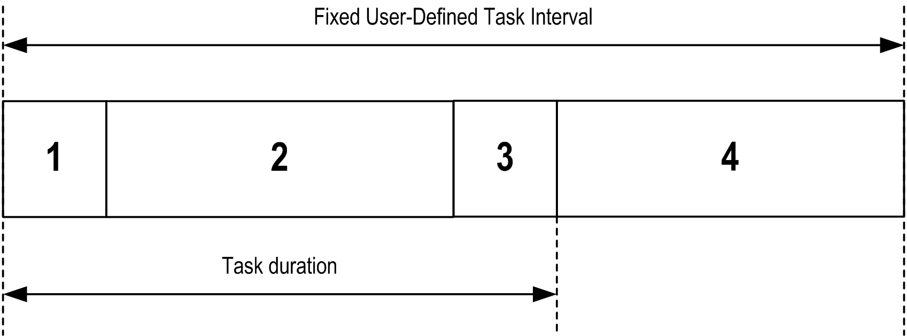
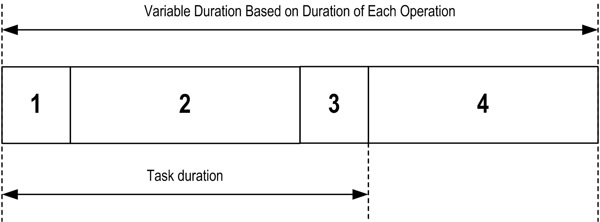

# Task Types

## Introduction

The following section describes the various task types available for your program, along with a description of the task type characteristics.

## Cyclic Task

A Cyclic task is assigned a fixed cycle time using the interval setting in the type section of the configuration subtab for that task. Each Cyclic task type executes as follows:

| 1. | **Read Inputs:** The physical input states are written to the `%I` input memory variables and other system operations are executed. |
| 2. | **Task Processing:** The user code (POU, and so on) defined in the task is processed. The `%Q` output memory variables are updated according to your application program instructions but not yet written to the physical outputs during this operation. |
| 3. | **Write Outputs:** The `%Q` output memory variables are modified with the output forcing that has been defined; however, the writing of the physical outputs depends upon the type of output and instructions used.  For more information on defining the [bus cycle task](../../../../../api/crossBook?lang=en-US&virtualBookName=SoMProg&topicID=D_SE_0031100), refer to the EcoStruxure Machine Expert Programming Guide and [PLC Settings](D-SE-0006801.html#D-SE-0006801).  For more information on I/O behavior, refer to [Controller States Detailed Description](D-SE-0008844.html#D-SE-0008844). |
| 4. | **Remaining Interval time:** The controller firmware carries out system processing and other lower priority tasks. |

NOTE: If you define too short a period for a cyclic task, it will repeat immediately after the write of the outputs and without executing other lower priority tasks or any system processing. This will affect the execution of all tasks and cause the controller to exceed the system watchdog limits, generating a system watchdog exception.

NOTE: When the task cycle time is set to a value less than 3 ms, the actual task duration should first be monitored through the Task Monitoring screen during commissioning to ensure that it is consistently lower than the configured task cycle time. If greater, the task cycle may not be respected without causing a task cycle watchdog time-out and the controller transitioning to a HALT state. To avoid this condition to a certain degree, when the task cycle time is set to a value of less than 3 ms, real limits of +1 ms are imposed if, on any given cycle, the calculated cycle time slightly exceeds the configured cycle time.

NOTE: Get and set the interval of a Cyclic Task by application using the GetCurrentTaskCycle and SetCurrentTaskCycle function. For further details, refer to [Functions Descriptions](../../../../../api/crossBook?lang=en-US&virtualBookName=tbadvlib&topicID=D_SE_0012290).

## Freewheeling Task

A Freewheeling task does not have a fixed duration. In Freewheeling mode, each task scan begins when the previous scan has been completed and after a short period of system processing. Each Freewheeling task type executes as follows:

| 1. | **Read Inputs:** The physical input states are written to the `%I` input memory variables and other system operations are executed. |
| 2. | **Task Processing:** The user code (POU, and so on) defined in the task is processed. The `%Q` output memory variables are updated according to your application program instructions but not yet written to the physical outputs during this operation. |
| 3. | **Write Outputs:** The `%Q` output memory variables are modified with the output forcing that has been defined; however, the writing of the physical outputs depends upon the type of output and instructions used.  For more information on defining the [bus cycle task](../../../../../api/crossBook?lang=en-US&virtualBookName=SoMProg&topicID=D_SE_0031100), refer to the EcoStruxure Machine Expert Programming Guide and  [PLC Settings](D-SE-0006801.html#D-SE-0006801).  For more information on I/O behavior, refer to [Controller States Detailed Description](D-SE-0008844.html#D-SE-0008844). |
| 4. | **System Processing:** The controller firmware carries out system processing and other lower priority tasks (for example: HTTP management, Ethernet management, parameters management). |

NOTE: If you want to define the task interval, refer to [Cyclic Task](#D-SE-0008842__D-SE-0008842.3).

## Event Task

This type of task is event-driven and is initiated by a program variable. It starts at the rising edge of the boolean variable associated to the trigger event unless pre-empted by a higher priority task. In that case, the Event task will start as dictated by the task priority assignments.

For example, if you have defined a variable called `my_Var` and would like to assign it to an Event, proceed as follows:

| Step | Action |
| --- | --- |
| 1 | Double-click the TASK in the Applications tree. |
| 2 | Select Event from the Type list in the Configuration tab. |
| 3 | Click the Input Assistant button  to the right of the Event field.  **Result**: The Input Assistant window appears. |
| 4 | Navigate in the tree of the Input Assistant dialog box to find and assign the `my_Var` variable. |

NOTE: When the event task is triggered at an excessive frequency, the controller will go to the HALT state (Exception).The maximum rate of events is 6 events per millisecond. If the event task is triggered at a higher frequency than this, the message 'ISR Count Exceeded' is logged in the application log page.

## External Event Task

This type of task is event-driven and is initiated by the detection of a hardware or hardware-related function event. It starts when the event occurs unless pre-empted by a higher priority task. In that case, the External Event task will start as dictated by the task priority assignments.

For example, an External event task could be associated with an HSC Stop event. To associate the HSC0\_STOP event to an External event task, select it from the External event drop-down list on the Configuration tab.

Depending on the controller, there are up to 4 types of events that can be associated with an External event task:

* Rising edge on an advanced input (`DI0`...`DI15`)
* HSC thresholds
* HSC Stop
* CAN Sync

NOTE: CAN Sync is a specific event object, depending on the CANopen manager configuration.

NOTE: The maximum frequency of events is 6 per millisecond. If the external event task is triggered at a higher frequency than this, the controller goes to the HALT state (Exception) and an “ISR Count Exceeded” message is logged on the application log page.

EIO0000003059.10