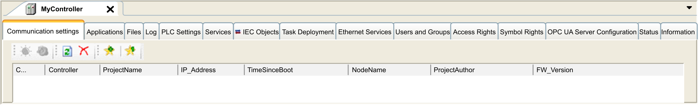

# Controller Parameters

## Controller Parameters

To open the device editor, double-click MyController in the Devices tree:

## Tabs Description

| Tab | Description | Restriction |
| --- | --- | --- |
| [**Communication Settings**](D-SE-0035606.html#D-SE-0035606) | Manages the connection between the PC and the controller:   * helping you find a controller in a network, * presenting the list of available controllers, so you can connect to the selected controller and manage the application in the controller, * helping you physically identify the controller from the device editor, * helping you change the communication settings of the controller.   The controller list is detected through NetManage or through the Active Path based on the communication settings. To access the Communication settings, click Project > Project Settings... in the menu bar.  For more information, refer to the Communication Settings in the EcoStruxure Machine Expert [Programming Guide](../../../../../api/crossBook?lang=en-US&virtualBookName=SoMProg&topicID=D_SE_0031096). | Online mode only |
| Applications | Presents the application running on the controller and allows removing the application from the controller. | Online mode only |
| [**Files**](D-SE-0004156.html#D-SE-0004156) | File management between the PC and the controller.  Only one logic controller disk at a time can be seen through this tab. When an SD card is inserted, this file displays the content of the SD card. Otherwise, this tab displays the content of the */usr* directory of the internal non-volatile memory of the controller. | Online mode only |
| Log | View the controller log file. | Online mode only |
| [**PLC settings**](D-SE-0006801.html#D-SE-0006801) | Configuration of:   * application name * I/O behavior in stop * bus cycle options | – |
| [**Services**](D-SE-0006802.html#D-SE-0006802) | Lets you configure the online services of the controller (RTC, device identification). | Online mode only |
| IEC Objects | Allows you to access to the device from the IEC application through the listed objects. Displays a monitoring view in online mode. For more information, refer to [IEC Object in CoDeSys Online Help](https://help.codesys.com/webapp/_cds_edt_device_iec_objects;product=codesys;version=3.5.16.0). | – |
| Task deployment | Displays a list of I/Os and their assignments to tasks. | After compilation only |
| Ethernet Services | The IP Routing tab allows you to configure the routes and the cross network transparency through IP Routing options.  NOTE: This tab is empty if no Ethernet connection is available in the configuration. | – |
| Users and Groups | The Users and Groups tab is provided for devices supporting online user management. It allows setting up users and access-rights groups and assigning them access rights to control the access on projects and devices in online mode.  For more details, refer to the EcoStruxure Machine Expert [Programming Guide](../../../../../api/crossBook?lang=en-US&virtualBookName=SoMProg&topicID=D_SE_0038269). | – |
| Access Rights | The Access Rights tab allows you to define the device access rights of users.  For more details, refer to the EcoStruxure Machine Expert [Programming Guide](../../../../../api/crossBook?lang=en-US&virtualBookName=SoMProg&topicID=D_SE_0083877). | – |
| Symbol Rights | Allows the Administrator to configure Users and Groups access to the symbol sets. For more information, refer to [Symbol Configuration in CoDeSys Online Help](https://help.codesys.com/webapp/_cds_symbolconfiguration;product=codesys;version=3.5.16.0). | – |
| OPC UA Server Configuration | Displays the [OPC UA Server Configuration](D-SE-0068333.html#D-SE-0068333) window. | – |
| Status | Not used. | – |
| Information | Displays general information about the device (name, description, provider, version, image). | – |

EIO0000003059.10