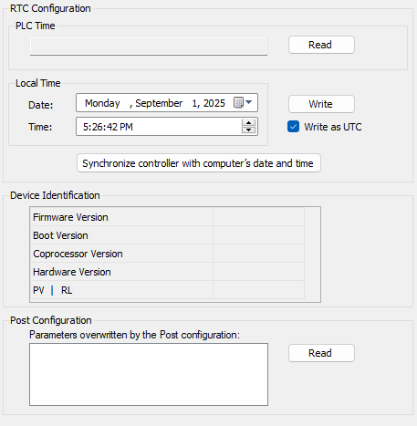

# Services

## Services Tab

The Services tab is divided in three parts:

* RTC Configuration
* Device Identification
* Post Configuration

The figure below shows the Services tab:

NOTE: To have controller information, you must be connected to the controller.

| Element | | Description |
| --- | --- | --- |
| RTC Configuration | PLC Time | Displays the date and time read from the controller when you click the Read button, with no conversion applied. This read-only field is initially empty. |
| Read | Reads the date and time saved on the controller and displays the values in the PLC Time field. |
| Local Time | Defines a date and time to send to the controller when you click the Write button. If necessary, modify the default values before clicking the Write button. A message box informs you about the result of the command. The date and time fields are initially filled with the PC settings. |
| Write | Writes the date and time defined in the Local time field to the logic controller. A message box informs you of the result of the command. Select the Write as UTC checkbox before running this command if you want to write the values in UTC format. |
| Synchronize controller with computer’s date/time | Sends the PC date and time. A message box informs you of the result of the command. Select Write as UTC before running this command if you want to use UTC format. |
| Device Identification | Firmware Version | Displays the Firmware Version of the selected controller, if connected. |
| Boot Version | Displays the Boot Version of the selected controller, if connected. |
| Coprocessor Version | Displays the Coprocessor Version of the selected controller, if connected. |
| Hardware Version | Displays the Hardware Version of the selected controller, if connected. |
| PV | RL | Displays the Product Version (PV) and the Release Level (RL) of the selected controller, if connected. |
| Post Configuration | | Displays the application parameters overwritten by the [Post configuration](D-SE-0010304.html#D-SE-0010304). |

EIO0000003059.10