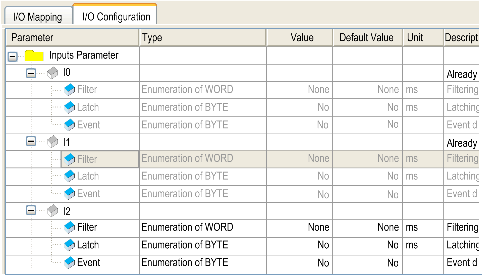
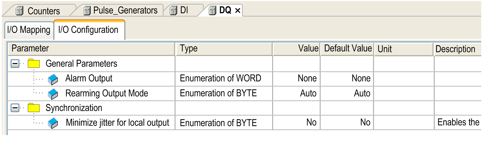

# Embedded I/Os Configuration

## Overview

The embedded I/O function allows configuration of the controller inputs and outputs.

The M241 Logic Controller provides:

| I/O Type | 24 I/O References | 40 I/O References |
| --- | --- | --- |
| TM241•24• | TM241•40• |
| Fast inputs | 8 | 8 |
| Regular inputs | 6 | 16 |
| Fast outputs | 4 | 4 |
| Regular outputs | 6 | 12 |

## Accessing the I/O Configuration Window

Follow these steps to access the I/O configuration window:

| Step | Action |
| --- | --- |
| 1 | Double-click DI (digital inputs) or DQ (digital outputs) in the Devices tree. Refer to [Devices tree](D-SE-0002051.html#D-SE-0002051__D-SE-0002051.2). |
| 2 | Select the I/O Configuration tab. |

## Configuration of Digital Inputs

This figure shows the I/O Configuration tab for digital inputs:

NOTE: For more information on the I/O Mapping tab, refer to the EcoStruxure Machine Expert [Programming Guide](../../../../../api/crossBook?lang=en-US&virtualBookName=SoMProg&topicID=D_SE_0031109).

## Digital Input Configuration Parameters

For each digital input, you can configure the following parameters:

| Parameter | Value | Description | Constraint |
| --- | --- | --- | --- |
| Filter | None  1 ms  4 ms\*  12 ms | Reduces the effect of noise on a controller input. | Available if Latch and Event are disabled.  In the other cases, this parameter is disabled and its value is None. |
| Latch | No\*  Yes | Allows incoming pulses with amplitude widths shorter than the controller scan time to be captured and recorded. | This parameter is only available for the fast inputs I0 to I7.  Available if Event disabled and Filter are disabled.  Use latch inputs in MAST task only. |
| Event | No\*  Rising edge  Falling edge  Both edges | Event detection | This parameter is only available for the fast inputs I0 to I7.  Available if Latch disabled and Filter are disabled. When Both edges is selected, and the input state is TRUE before the controller is powered on, the first falling edge is ignored. |
| Bounce | 0.000 ms  0.001 ms  0.002 ms\*  0.005 ms  0.010 ms  0.05 ms  0.1 ms  0.5 ms  1 ms  5 ms | Reduces the effect of bounce on a controller input. | Available if Latch is enabled or Event is enabled.  In the other cases, this parameter is disabled and its value is 0.002. |
| Run/Stop Input | None  I0...I13 (TM241•24• references)  I0...I23 (TM241•40• references) | The Run/Stop input can be used to run or stop the controller application. | Select one of the inputs to use as the Run/Stop input. |
| **\*** Parameter default value | | | |

NOTE: The selection is grey and inactive if the parameter is unavailable.

## Run/Stop Input

This table presents the different states:

| Input states | Result |
| --- | --- |
| State 0 | Stops the controller and ignores external Run commands. |
| A rising edge | From the STOPPED state, initiate a start-up of an application in RUNNING state, if no conflict with Run/Stop switch position. |
| State 1 | The application can be controlled by:   * The software (Run/Stop) * A hardware Run/Stop switch * Application (Controller command) * Network command (Run/Stop command)   Run/Stop command is available through the Web Server command. |

NOTE: Run/Stop input is managed even if the option **Update I/O while in stop** is not selected in [Controller Device Editor (**PLC settings** tab)](D-SE-0006801.html#D-SE-0006801).

Inputs assigned to configured expert functions cannot be configured as Run/Stop inputs.

For further details about controller states and states transitions, refer to [Controller State Diagram](D-SE-0033981.html).

| WARNING | |
| --- | --- |
|  | UNINTENDED MACHINE OR PROCESS START-UP  * Verify the state of security of your machine or process environment before applying power to the Run/Stop input. * Use the Run/Stop input to help prevent the unintentional start-up from a remote location.  Failure to follow these instructions can result in death, serious injury, or equipment damage. |

## Configuration of Digital Outputs

This figure shows the I/O Configuration tab for digital outputs:

NOTE: For more information on the I/O Mapping tab, refer to the EcoStruxure Machine Expert [Programming Guide](../../../../../api/crossBook?lang=en-US&virtualBookName=SoMProg&topicID=D_SE_0031109).

## Digital Output Configuration Parameters

This table presents the function of the different parameters:

| Parameter | Function |
| --- | --- |
| General Parameters | |
| Alarm Output | Select an output to be used as [alarm output](#D-RU-0004567__D-RU-0004567.11). |
| Rearming Output Mode | Select the [rearming output mode](#D-RU-0004567__D-RU-0004567.12). |
| Synchronization | |
| Minimize jitter for local Output | Select this option to [minimize jitter on local outputs](#D-RU-0004567__D-RU-0004567.13). |

NOTE: The selection is grey and inactive if the parameter is unavailable.

## Alarm Output

This output is set to logical 1 when the controller is in the RUNNING state and the application program is not stopped at a breakpoint.

The alarm output is set to 0 when a task is stopped at a breakpoint to signal that the controller has stopped executing the application.

The alarm output is set to 0 when a short-circuit is detected.

NOTE: Outputs assigned to configured expert functions cannot be configured as the alarm output.

## Rearming Output Mode

Fast outputs of the Modicon M241 Logic Controller use push/pull technology. In case of detected error (short-circuit or over temperature), the output is put in the default value and the condition is signaled by status bit and [PLC\_R.i\_wLocalIOStatus](../../../../../api/crossBook?lang=en-US&virtualBookName=m241sys&topicID=D_SE_0031689).

Two behaviors are possible:

* **Automatic rearming**: as soon as the detected error is corrected, the output is set again according to the current value assigned to it and the diagnostic value is reset.
* **Manual rearming**: when an error is detected, the status is memorized and the output is forced to the default value until user manually clears the status (see I/O mapping channel).

In the case of a short-circuit or current overload, the common group of outputs automatically enters into thermal protection mode (all outputs in the group are set to 0), and are then periodically rearmed (each second) to test the connection state. However, you must be aware of the effect of this rearming on the machine or process being controlled.

| WARNING | |
| --- | --- |
|  | UNINTENDED MACHINE START-UP  Inhibit the automatic rearming of outputs if this feature is an undesirable behavior for your machine or process.  Failure to follow these instructions can result in death, serious injury, or equipment damage. |

## Minimize Jitter for Local Output

This option allows the embedded I/Os to be read or set at predictable time intervals, regardless of the task duration. Minimizes jitter on outputs by delaying the write to the physical outputs until the read input operation of the next bus cycle task starts. The end time of a task is often less easy to predict than the start time.

Normal scheduling of input/ouput phases is:

When the Minimize Jitter for Local Output option is selected, the scheduling of the IN and OUT phases becomes:

EIO0000003059.10