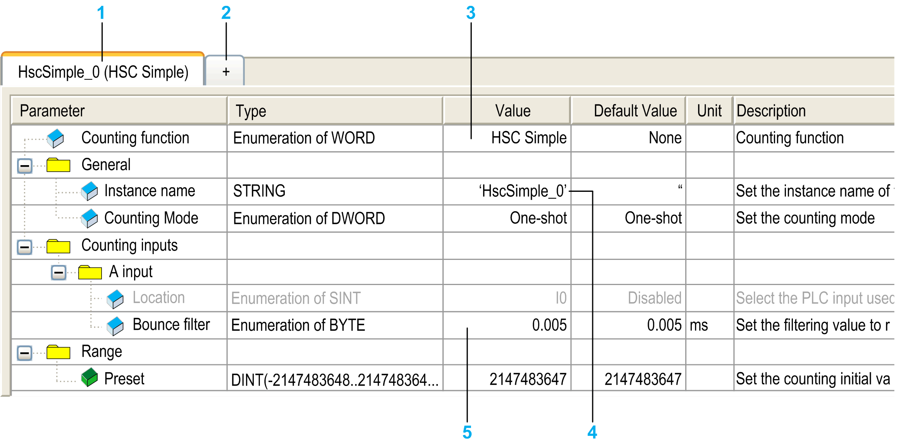

# Counting Function

## Overview

The Counting function can execute fast counts of pulses from sensors, encoders, switches, and so on, that are connected to fast inputs. The Counting function can also be connected to regular inputs, in which case the function operates at a lower frequency.

There are 2 types of embedded counting functions:

* Simple type: a [single input counter](../../../../../api/crossBook?lang=en-US&virtualBookName=m238hw&topicID=D_RU_0004538).
* Main type: a counter that uses up to [4 inputs and 2 reflex outputs](../../../../../api/crossBook?lang=en-US&virtualBookName=m238hw&topicID=D_RU_0004538).

Based on the embedded counting functions, there are 5 types of counters that you can configure in EcoStruxure Machine Expert:

* HSC Simple
* HSC Main Single Phase
* HSC Main Dual Phase
* Frequency Meter
* Period Meter

The Frequency Meter type and the Period Meter type are based on an HSC Main type.

## Accessing the Counting Function Configuration Window

Follow these steps to access the embedded counting function configuration window:

| Step | Action |
| --- | --- |
| 1 | Double-click Counters in the Devices tree.  The Counting Function window appears: |
| 2 | Double-click Value and choose the counting function type to assign. |

## Counting Function Configuration Window

The following figure shows a sample HSC configuration window:

The following table describes the areas of the Counters configuration window:

| Number | Description |
| --- | --- |
| 1 | The instance name of the function and the currently configured counting function type. |
| 2 | Click + to configure a new instance of counting function. |
| 3 | Double-click the Value column to display a list of the counter function types available. |
| 4 | Double-click the Instance name value to edit the instance name of the function.  The Instance name is automatically given by the software. The Instance name parameter is editable and allows you to define the instance name. However, whether the Instance name is software-defined or user-defined, use the same instance name as an input to the function blocks dealing with the counter, as defined in the Counters editor. |
| 5 | Configure each parameter by clicking the plus sign next to it to access its settings.  The parameters available depend on the mode used. |

For detail information on configuration parameters, refer to [M241 HSC Library Guide](../../../../../api/crossBook?lang=en-US&virtualBookName=m241hsc&topicID=D_SE_0031695).

EIO0000003059.10