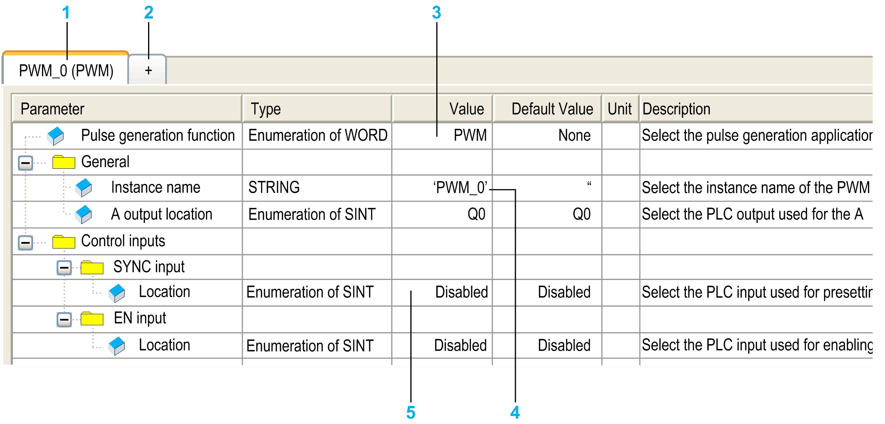

# Pulse Generators Embedded Function

## Overview

The pulse generated embedded functions available with the M241 Logic Controller are:

| PTO | The PTO (Pulse Train Output) [implements digital technology](../../../../../api/crossBook?lang=en-US&virtualBookName=m238hw&topicID=D_RU_0004540) that provides precise positioning for open loop control of motor drives. |
| PWM | The PWM (Pulse Width Modulation) function generates a programmable square wave signal on a [dedicated output](../../../../../api/crossBook?lang=en-US&virtualBookName=m238hw&topicID=D_RU_0004541)  with adjustable duty cycle and frequency. |
| FreqGen | The FreqGen (Frequency Generator) function generates a square wave signal on [dedicated output](../../../../../api/crossBook?lang=en-US&virtualBookName=m238hw&topicID=D_SE_0005662) channels with a fixed duty cycle (50%). |

## Accessing the Pulse Generators Configuration Window

Follow these steps to access the Pulse Generators configuration window:

| Step | Action |
| --- | --- |
| 1 | Double-click Pulse Generators on the Devices tree.  The Pulse Generation Function window appears: |
| 2 | Double-click Value and choose the pulse generator function type to assign. |

## Pulse Generators Configuration Window

The figure shows a sample Pulse Generators configuration window used to configure a PTO, PWM, or FreqGen function:

The following table describes the areas of the Pulse Generators configuration window:

| Number | Description |
| --- | --- |
| 1 | The instance name of the function and the currently configured pulse generator function type. |
| 2 | Click + to configure a new instance of pulse generator function. |
| 3 | Double-click the Value column to display a list of the pulse generator function types available. |
| 4 | Double-click the Instance name value to edit the instance name of the function.  The Instance name is automatically given by the software. The Instance name parameter is editable and allows you to define the instance name. However, whether the Instance name is software-defined or user-defined, use the same instance name as an input to the function blocks dealing with the counter, as defined in the Counters editor. |
| 5 | Configure each parameter by selecting the parameter value from the list to access its settings.  The parameters available depend on the type of parameter selected. |

For detailed information on configuration parameters, refer to the [M241 Logic Controller, PTO/PWM Library Guide](../../../../../api/crossBook?lang=en-US&virtualBookName=m241pto&topicID=D_SE_0031691).

EIO0000003059.10