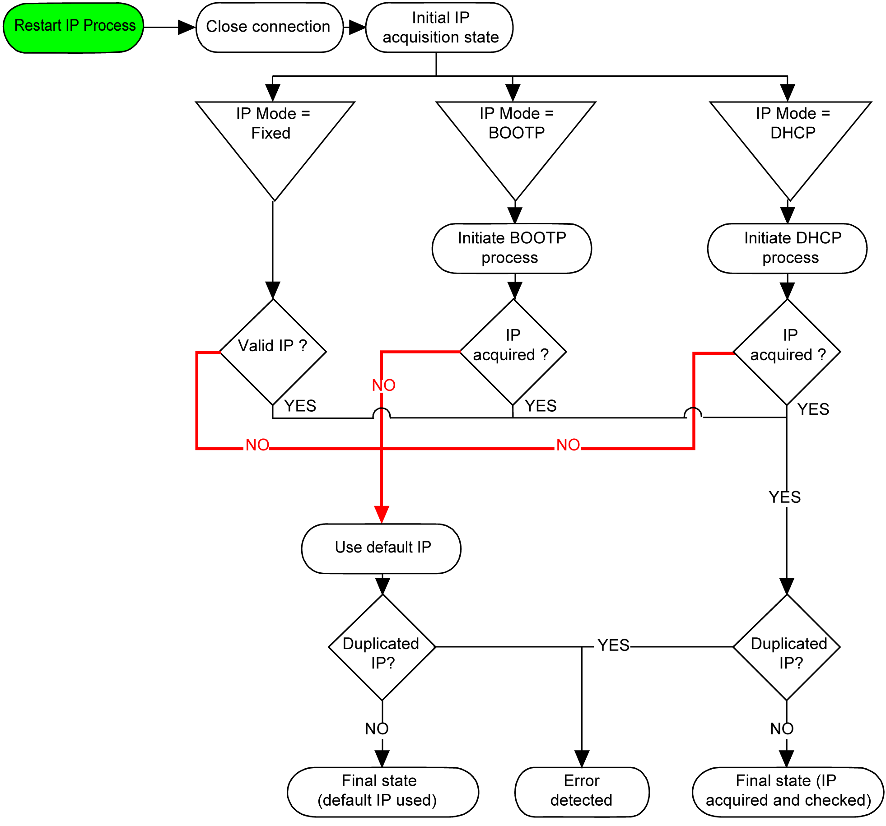
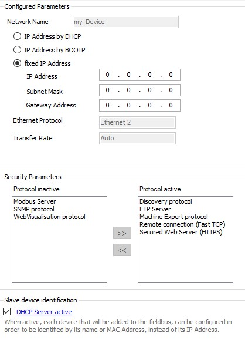

# IP Address Configuration

## Introduction

There are different ways to assign the IP address to the added Ethernet interface of the controller:

* Address assignment by DHCP server
* Address assignment by BOOTP server
* Fixed IP address
* [Post configuration file](D-SE-0010304.html#D-SE-0010304). If a post configuration file exists, this assignment method has priority over the others.

The IP address can also be changed dynamically through the:

* [Communication Settings tab](D-SE-0035606.html)
* changeIPAddress [function block](D-SE-0037016.html#D-SE-0037016)

NOTE: If the attempted addressing method is unsuccessful, the link uses a [default IP address](#D-SE-0003075__D-SE-0003075.5) derived from the MAC address.

Carefully manage the IP addresses because each device on the network requires a unique address. Having multiple devices with the same IP address can cause unintended operation of your network and associated equipment.

| WARNING | |
| --- | --- |
|  | UNINTENDED EQUIPMENT OPERATION  * Verify that there is only one master controller configured on the network or remote link. * Verify that all devices have unique addresses. * Obtain your IP address from your system administrator. * Confirm that the IP address of the device is unique before placing the system into service. * Do not assign the same IP address to any other equipment on the network. * Update the IP address after cloning any application that includes Ethernet communications to a unique address.  Failure to follow these instructions can result in death, serious injury, or equipment damage. |

NOTE: Verify that your system administrator maintains a record of assigned IP addresses on the network and subnetwork, and inform the system administrator of any configuration changes performed.

## Address Management

This diagram shows the different types of address systems for the controller:

NOTE: If a device programmed to use the DHCP or BOOTP addressing methods is unable to contact its respective server, the controller uses the default IP address. It repeats its request constantly.

The IP process restarts in the following cases:

* Controller reboot
* Ethernet cable reconnection
* Application download (if IP parameters change)
* DHCP or BOOTP server detected after a prior addressing attempt was unsuccessful.

## Ethernet Configuration

In the Devices tree, double-click Ethernet\_1:

NOTE:

* If you are in offline mode, you see the Configured Parameters window (displayed above). You can edit the parameters.
* If you are in online mode, you see the Configured Parameters and Current Settings windows (not shown). You cannot edit the parameters.

This table describes the configured parameters:

| Configured Parameters | | Description |
| --- | --- | --- |
| Network Name | | Used as device name to retrieve IP address through DHCP, maximum 15 characters. |
| IP Address by DHCP | | IP address is obtained by DHCP server. |
| IP Address by BOOTP | | IP address is obtained by BOOTP server. |
| Fixed IP Address | | IP address, Subnet Mask, and Gateway Address are defined by the user. |
| Ethernet Protocol | | Protocol type used (Ethernet 2). |
| Transfer Rate | | Speed and Duplex are in auto-negotiation mode. |

## Default IP Address

The IP address by default is 10.10.x.x.

The last two fields in the default IP address are composed of the decimal equivalent of the last two hexadecimal bytes of the MAC address of the port.

The MAC address of the port can be retrieved on the label placed on the front side of the controller.

The default subnet mask is Default Class A Subnet Mask of 255.255.0.0.

NOTE: A MAC address is written in hexadecimal format and an IP address in decimal format. Convert the MAC address to decimal format.

Example: If the MAC address is 00.80.F4.01.**80.F2**, the default IP address is 10.10.**128.242**.

## Address Classes

The IP address is linked:

* to a device (the host)
* to the network to which the device is connected

An IP address is always coded using 4 bytes.

The distribution of these bytes between the network address and the device address may vary. This distribution is defined by the address classes.

The different IP address classes are defined in this table:

| Address Class | Byte1 | | | | | Byte 2 | Byte 3 | Byte 4 |
| --- | --- | --- | --- | --- | --- | --- | --- | --- |
| Class A | 0 | Network ID | | | | Host ID | | |
| Class B | 1 | 0 | Network ID | | | | Host ID | |
| Class C | 1 | 1 | 0 | Network ID | | | | Host ID |
| Class D | 1 | 1 | 1 | 0 | Multicast Address | | | |
| Class E | 1 | 1 | 1 | 1 | 0 | Address reserved for subsequent use | | |

## Subnet Mask

The subnet mask is used to address several physical networks with a single network address. The mask is used to separate the subnetwork and the device address in the host ID.

The subnet address is obtained by retaining the bits of the IP address that correspond to the positions of the mask containing 1, and replacing the others with 0.

Conversely, the subnet address of the host device is obtained by retaining the bits of the IP address that correspond to the positions of the mask containing 0, and replacing the others with 1.

Example of a subnet address:

|  |  |  |  |  |
| --- | --- | --- | --- | --- |
| IP address | 192 (11000000) | 1 (00000001) | 17 (00010001) | 11 (00001011) |
| Subnet mask | 255 (11111111) | 255 (11111111) | 240 (11110000) | 0 (00000000) |
| Subnet address | 192 (11000000) | 1 (00000001) | 16 (00010000) | 0 (00000000) |

NOTE: The device does not communicate on its subnetwork when there is no gateway.

## Gateway Address

The gateway allows a message to be routed to a device that is not on the same network.

If there is no gateway, the gateway address is 0.0.0.0.

The gateway address can be defined on Ethernet\_1 interface or on TM4ES4 Ethernet interface. The traffic to unknown networks is sent through this gateway address, or to address configured on [IP routing table](EthernetServices-A1247E9B.html#EthernetServices-A1247E9B__IPRouting-M241).

## Security Parameters

This table describes the different security parameters:

| Security Parameters | Description | Default settings |
| --- | --- | --- |
| Discovery protocol | This parameter activates/deactivates Discovery protocol. When deactivated, Discovery requests are ignored. | Active |
| FTP Server | This parameter activates/deactivates the FTP Server of the controller. When deactivated, FTP requests are ignored. | Active |
| CoDeSys protocol | This parameter activates/deactivates the CoDeSys protocol on Ethernet interfaces. When deactivated, any programming software request is rejected, including those from the UDP or TCP connection. Therefore, no connection is possible on Ethernet from a programming PC, from an HMI target that wants to exchange variables with this controller, from an OPC server, or from Controller Assistant. | Active |
| Modbus Server | This parameter activates/deactivates the Modbus Server of the controller. When deactivated, any Modbus request to the controller is ignored. | Inactive |
| Remote connection (Fast TCP) | This parameter activates/deactivates the remote connection. When deactivated, Fast TCP requests are ignored. | Active |
| Secured Web Server (HTTPS) | This parameter activates/deactivates the Web server of the controller. When deactivated, HTTPS requests to the controller Web server are ignored. | Active |
| SNMP protocol | This parameter activates/deactivates the SNMP server of the controller. When deactivated, SNMP requests are ignored. | Inactive |
| WebVisualisation protocol | This parameter activates/deactivates the WebVisualisation pages of the controller. When deactivated, HTTP requests to the logic controller WebVisualisation protocol are ignored. | Inactive |

## Device Identification

When DHCP Server active is selected, devices added to the fieldbus can be configured to be identified by their name or MAC address, instead of their IP address. Refer to [DHCP Server](D-SE-0061164.html#D-SE-0061164).

EIO0000003059.10