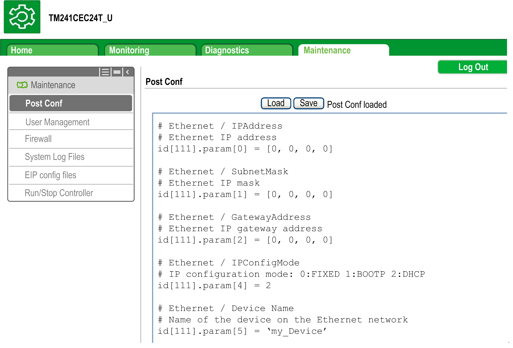
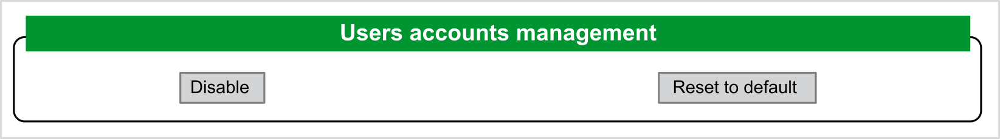
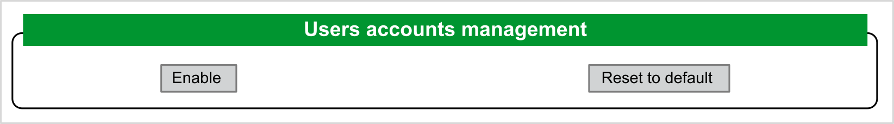
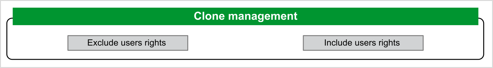
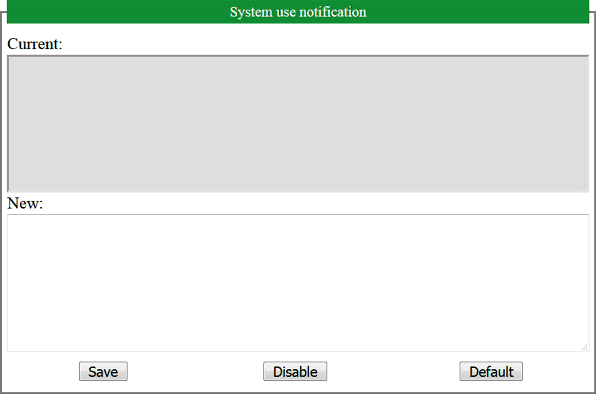
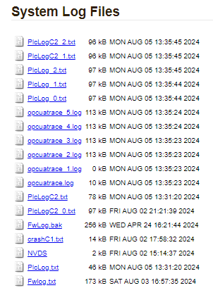
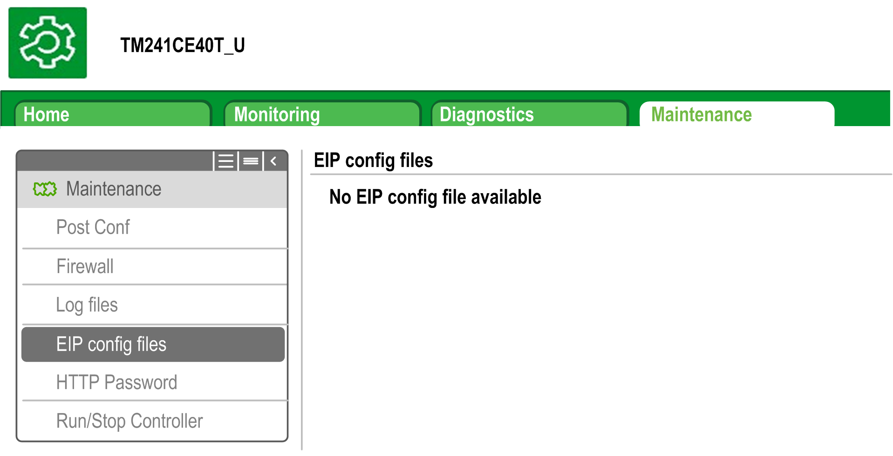
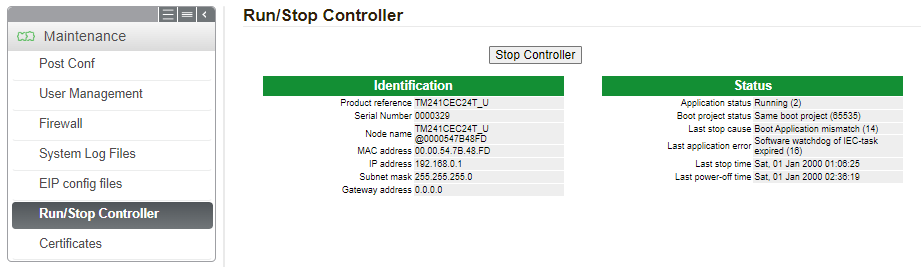
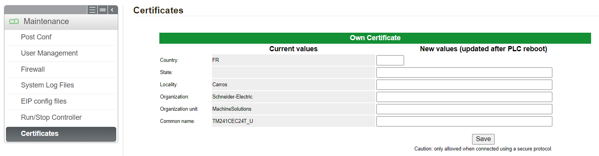

# Maintenance Menu

## Maintenance: Post Conf Submenu

The Post Conf submenu allows you to update the [post configuration file](D-SE-0010304.html#D-SE-0010304) saved on the controller:

| Step | Action |
| --- | --- |
| 1 | Click Load. |
| 2 | [Modify the parameters](D-SE-0010302.html#D-SE-0010302__D-SE-0010302.12). |
| 3 | Click Save.  NOTE: The new parameters are considered at the next [Post Configuration file reading](D-SE-0010301.html#D-SE-0010301__D-SE-0010301.3). |

## Maintenance: User Management Submenu

The User Management submenu displays a screen that allows you to access three different actions, all restricted by using secure protocol (HTTPS):

* User accounts management:

Allows you to manage user accounts management, removing passwords and returning user accounts on the controller to default settings.

Click Disable to deactivate all user rights on the controller. (Passwords are saved and are restored if you click Enable). Then, click OK on the window that appears to confirm. As a result:

* Users no longer have to set and enter a password to connect to the controller.
* FTP, HTTP, and OPC UA server connections accept anonymous user connections. See [Login and passwords table](D-SE-0095294.html#D-SE-0095294__D-SE-0095294.4).

NOTE: The Disable button is only active if the user has administrator privileges.

Click Enable to restore the previous user rights saved on the controller. Then, click OK on the window that appears to confirm. As a result, users have to enter the password previously set to connect to the controller. See [Login and passwords table](D-SE-0095294.html#D-SE-0095294__D-SE-0095294.4).

NOTE: The Enable button only appears if the user rights are disabled and the user rights backup file is available on the controller.

Click Reset to default to return all user accounts on the controller to their default setting state. Then, click OK on the window that appears to confirm.

NOTE: Connections to FTP, HTTP, and the OPC UA server are blocked until a new password is set.

* Clone management:

Allows you to control whether user rights are copied and applied to the target controller when cloning a controller with an [SD Card](D-SE-0035607.html#D-SE-0035607__D-SE-0035607.6).

Click Exclude users rights to exclude copying user rights to the target controller when cloning a controller.

NOTE: By default, the users rights are excluded.

Click Include users rights to copy user rights to the target controller when cloning a controller. A popup prompts you to confirm copying the user rights. Click OK to continue.

NOTE: The Exclude users rights and Include users rights buttons are only active if the user is connected to the controller using a secure protocol.

* System use notification:

Allows you to customize a message which is displayed at login.

## Maintenance: Firewall Submenu

The Firewall submenu allows you to modify the default [firewall configuration file](D-SE-0033306.html):

## Maintenance: System Log Files Submenu

The System Log Files submenu provides access to log files generated by the controller:

NOTE: A maximum of 4 log files can be stored for PlcLog and PlcLogC2 in the Syslog folder including the 3 backup files. A maximum of 2 and 6 log files can be stored for firmware and OPC UA trace logs respectively.

When the maximum file size is reached, previous logs are saved to backup files. When the maximum file number is reached for PlcLog, firmware and OPC UA trace logs, previous logs must be deleted in order to continue saving new diagnostic information.

## Maintenance: EIP Config Files Submenu

The file tree only appears when the Ethernet IP service is configured on the controller.

Index of `/usr`:

| File | Description |
| --- | --- |
| My Machine Controller.gz | GZIP file |
| My Machine Controller.ico | Icon file |
| My Machine Controller.eds | Electronic Data Sheet file |

## Maintenance: Run/Stop Controller Submenu

The Run/Stop Controller submenu allows you to manually stop and restart the controller:

## Maintenance: Certificates Submenu

The Certificates submenu allows you to modify the certificates owned by the controller:

EIO0000003059.10