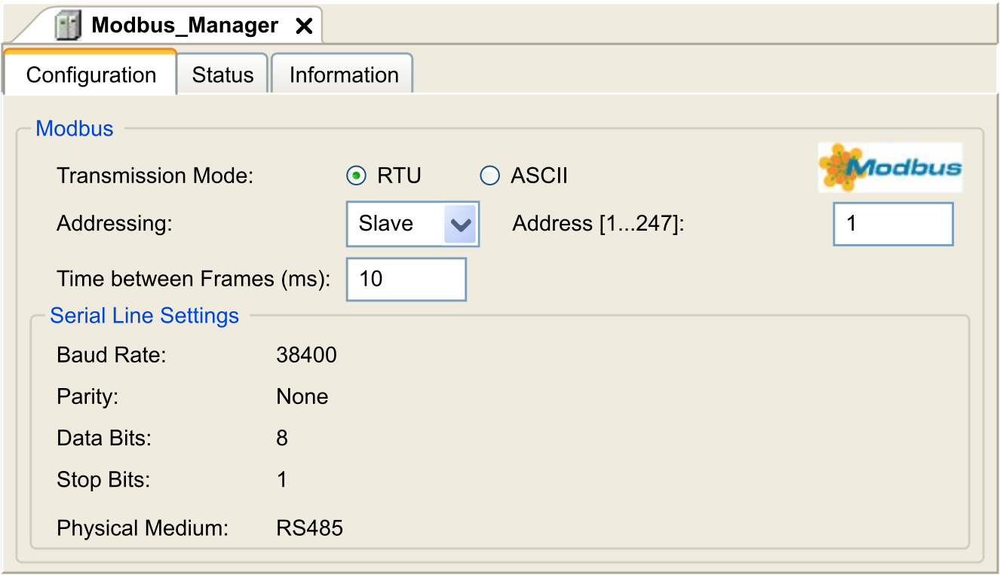
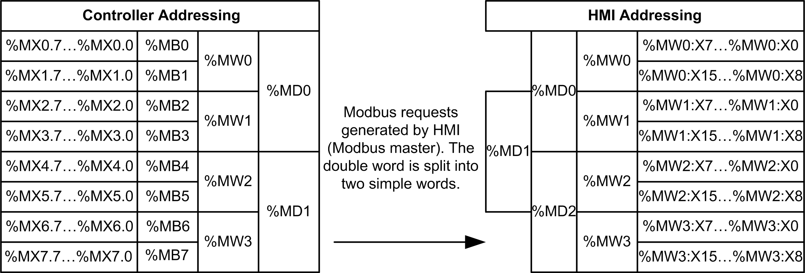

# Modbus Manager

## Introduction

The Modbus Manager is used for Modbus RTU or ASCII protocol in master or slave mode.

## Adding the Manager

To add a Modbus manager to your controller, select the Modbus Manager in the Hardware Catalog, drag it to the Devices tree, and drop it on one of the highlighted nodes.

For more information on adding a device to your project, refer to:

• Using the [Hardware Catalog](../../../../../api/crossBook?lang=en-US&virtualBookName=SoMProg&topicID=D_SE_0083368)

• Using the [Contextual Menu or Plus Button](../../../../../api/crossBook?lang=en-US&virtualBookName=SoMProg&topicID=D_SE_0083370)

## Modbus Manager Configuration

To configure the Modbus Manager of your controller, double-click Modbus Manager in the Devices tree.

The Modbus Manager configuration window is displayed as below:

Set the parameters as described in this table:

| Element | Description |
| --- | --- |
| Transmission Mode | Specify the transmission mode to use:   * RTU: uses binary coding and CRC error-checking (8 data bits) * ASCII: messages are in ASCII format, LRC error-checking (7 data bits)   Set this parameter identical for each Modbus device on the link. |
| Addressing | Specify the device type:   * Master * Slave |
| Address | Modbus address of the device, when slave is selected. |
| Time between Frames (ms) | Time to avoid bus-collision.  Set this parameter identical for each Modbus device on the link. |
| Serial Line Settings | Parameters specified in the Serial Line configuration window. |

## Modbus Master

When the controller is configured as a Modbus Master, the following function blocks are supported from the PLCCommunication Library:

* ADDM
* READ\_VAR
* SEND\_RECV\_MSG
* SINGLE\_WRITE
* WRITE\_READ\_VAR
* WRITE\_VAR

For further information, see [Function Block Descriptions](../../../../../api/crossBook?lang=en-US&virtualBookName=m2xxcom&topicID=D_SE_0002235).

## Modbus Slave

When the controller is configured as Modbus Slave, the following Modbus requests are supported:

| Function Code  Dec (Hex) | Sub-Function  Dec (Hex) | Function |
| --- | --- | --- |
| 1 (1 hex) | – | Read digital outputs (%Q) |
| 2 (2 hex) | – | Read digital inputs (%I) |
| 3 (3 hex) | – | Read multiple register (%MW) |
| 6 (6 hex) | – | Write single register (%MW) |
| 8 (8 hex) | – | Diagnostic |
| 15 (F hex) | – | Write multiple digital outputs (%Q) |
| 16 (10 hex) | – | Write multiple registers (%MW) |
| 23 (17 hex) | – | Read/write multiple registers (%MW) |
| 43 (2B hex) | 14 (E hex) | Read device identification |

This table contains the sub-function codes supported by the diagnostic Modbus request 08:

| Sub-Function Code | | Function |
| --- | --- | --- |
| **Dec** | **Hex** |
| 10 | 0A | Clears Counters and Diagnostic Register |
| 11 | 0B | Returns Bus Message Count |
| 12 | 0C | Returns Bus Communication Error Count |
| 13 | 0D | Returns Bus Exception Error Count |
| 14 | 0E | Returns Slave Message Count |
| 15 | 0F | Returns Slave No Response Count |
| 16 | 10 | Returns Slave NAK Count |
| 17 | 11 | Returns Slave Busy Count |
| 18 | 12 | Returns Bus Character Overrun Count |

This table lists the objects that can be read with a read device identification request (basic identification level):

| Object ID | Object Name | Type | Value |
| --- | --- | --- | --- |
| 00 hex | Vendor code | ASCII String | Schneider Electric |
| 01 hex | Product code | ASCII String | Controller reference  eg: TM241CE24T |
| 02 hex | Major / Minor revision | ASCII String | aa.bb.cc.dd (same as device descriptor) |

The following section describes the differences between the Modbus memory mapping of the controller and HMI Modbus mapping. If you do not program your application to recognize these differences in mapping, your controller and HMI will not communicate correctly. Thus it will be possible for incorrect values to be written to memory areas responsible for output operations.

| WARNING | |
| --- | --- |
|  | UNINTENDED EQUIPMENT OPERATION  Program your application to translate between the Modbus memory mapping used by the controller and that used by any attached HMI devices.  Failure to follow these instructions can result in death, serious injury, or equipment damage. |

When the controller and the Magelis HMI are connected via Modbus (HMI is master of Modbus requests), the data exchange uses simple word requests.

There is an overlap on simple words of the HMI memory while using double words but not for the controller memory (see following diagram). In order to have a match between the HMI memory area and the controller memory area, the ratio between double words of HMI memory and the double words of controller memory has to be 2.

The following gives examples of memory match for the double words:

* %MD2 memory area of the HMI corresponds to %MD1 memory area of the controller because the same simple words are used by the Modbus request.
* %MD20 memory area of the HMI corresponds to %MD10 memory area of the controller because the same simple words are used by the Modbus request.

The following gives examples of memory match for the bits:

* %MW0:X9 memory area of the HMI corresponds to %MX1.1 memory area of the controller because the simple words are split in 2 distinct bytes in the controller memory.

## Adding a Modem

To add a Modem to the Modbus Manager, refer to [Adding a Modem to a Manager](D-SE-0005908.html#D-SE-0005908).

EIO0000003059.10