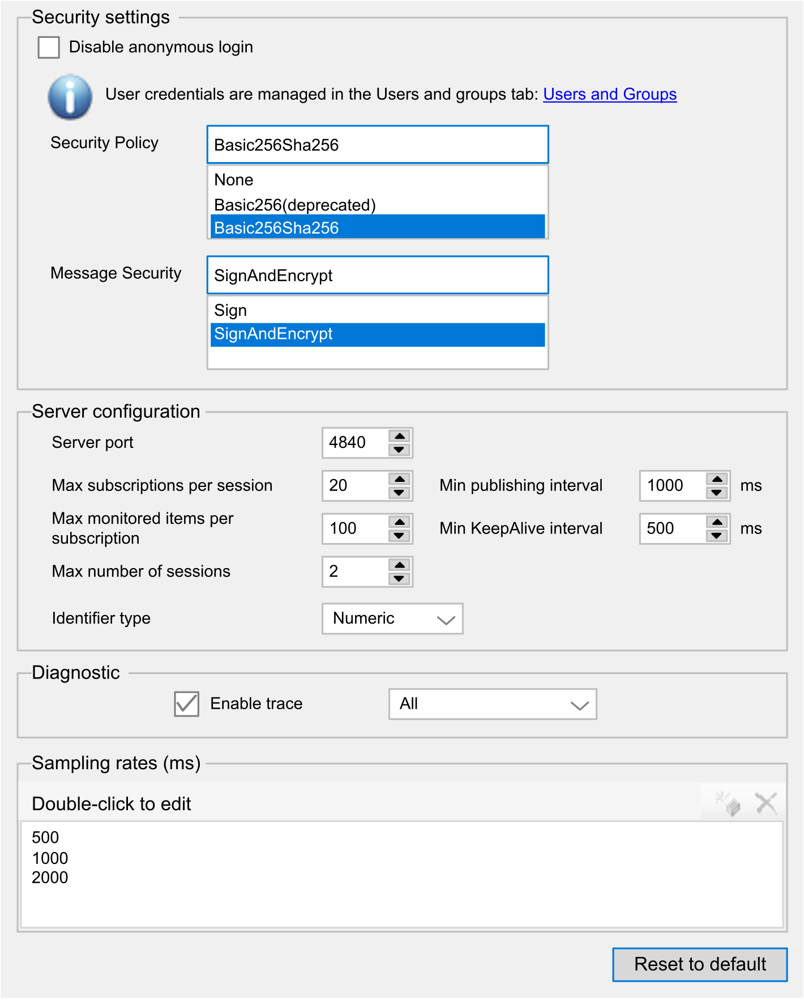
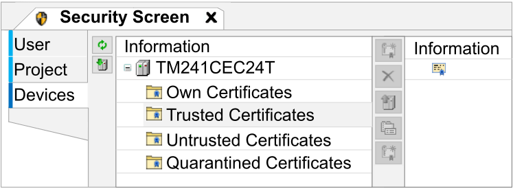

# OPC UA Server Configuration

## Introduction

The OPC UA Server Configuration window allows you to configure the OPC UA server. By default the OPC UA server is using encrypted communication with maximum security settings.

Optionally, you can customize the OPC UA server name via the post configuration. Refer to [Parameters](D-SE-0010301.html#D-SE-0010301__D-SE-0010301.3).

## Accessing the OPC UA Server Configuration Tab

To configure the OPC UA Server:

| Step | Action |
| --- | --- |
| 1 | In the Devices tree, double-click MyController. |
| 2 | Select the OPC UA Server Configuration tab. |

## OPC UA Server Configuration Tab

The following figure shows the OPC UA Server Configuration window:

## OPC UA Server Configuration Description

This table describes the OPC UA Server Configuration parameters:

Security Settings

| Parameter | Value | Default value | Description |
| --- | --- | --- | --- |
| Disable anonymous login | Enabled/ Disabled | Disabled | By default, this checkbox is cleared, meaning that OPC UA clients can connect to the server anonymously. Select this checkbox to require that clients provide a valid user name and password to connect to the OPC UA server. |
| Security Policy | None  Basic256(deprecated) (1)  Basic256Sha256 | Basic256Sha256 | This drop-down menu allows you to sign and encrypt the data you send and receive. |
| Message Security | None  Sign  SignAndEncrypt | SignAndEncrypt | The messages are related to the selected Security Policy. |
| **(1)** Security policies marked as deprecated are policies which no longer afford an acceptable level of security. | | | |

Server Configuration

| Parameter | Value | Default value | Description |
| --- | --- | --- | --- |
| Server port | 0...65535 | 4840 | The port number of the OPC UA server. OPC UA clients must append this port number to the TCP URL of the controller to connect to the OPC UA server. |
| Max. subscriptions per session | 1...100 (2) | 20 | Specify the maximum number of subscriptions allowed within each session. |
| Min. publishing interval | 200...5000 | 1000 | The publishing interval defines how frequently the OPC UA server sends notification packages to clients. Specify the minimum time that must elapse between notifications, in ms. |
| Max. monitored items per subscription | 1...1000 (2) | 100 | The maximum number of *monitored items* in each subscription that the server assembles into a notification package. |
| Min. KeepAlive interval | 500...5000 | 500 | The OPC UA server only sends notifications when the values of monitored items of data are modified. A *KeepAlive* notification is an empty notification sent by the server to inform the client that although no data has been modified, the subscription is still active. Specify the minimum interval between KeepAlive notifications, in ms. |
| Max. number of sessions | 1...4 | 2 | The maximum number of clients that can connect simultaneously to the OPC UA server. |
| Identifier type | Numeric  String | Numeric | Certain OPC UA clients require a specific format of unique symbol identifier (node ID). Select the format of the identifiers:   * Numeric values * Text strings |
| **(2)** The total count (Max. subscriptions per session x Max. monitored items per subscription) cannot exceed 1000. | | | |

Diagnostic

| Parameter | Value | Default value | Description |
| --- | --- | --- | --- |
| Enable trace | Enabled/disabled | Enabled | Select this checkbox to include OPC UA diagnostic messages in the [controller log file](../../../../../api/crossBook?lang=en-US&virtualBookName=SoMProg&topicID=D_SE_0083391). Traces are available from the Log tab or from the [System Log File](MaintenanceMenu-0B91FC4E.html#MaintenanceMenu-0B91FC4E__MaintenanceSystemLogFilesSubmenu-1D1CE3FE) of the Web server.  You can select the category of events to write to the log file:   * None * Error * Warning * System * Information * Debug * Content * All (default) |

Sampling rates (ms)

| Parameter | Value | Default value | Description |
| --- | --- | --- | --- |
| Sampling rates (ms) | 200...5000 | 500  1000  2000 | The sampling rate indicates a time interval, in milliseconds (ms). When this interval has elapsed, the server sends the notification package to the client. The sampling rate can be shorter than the publishing interval, in which case notifications are queued until the publishing interval has elapsed.  Sampling rates must be in the range 200...5000 (ms).  Up to 3 different sampling rates can be configured.  Double-click on a sampling rate to edit its value.  To add a sampling rate to the list, right-click and choose Add a new rate.  To remove a sampling rate from the list, select the value and click . |

Click Reset to default to return the configuration parameters on this window to their default values.

## Client Certificates Management Actions

The Security Screen allows you to determine which OPC UA client certificates are trusted by the OPC UA server.

To access the Security Screen, use the View > Security Screen command.

The first attempt of the client connection is unsuccessful as the certificate is quarantined. To allow the OPC UA server to accept a client certificate, proceed as follows:

NOTE: Start from step 6 if you already have the trusted certificate.

| Step | Action |
| --- | --- |
| 1 | In the Devices tab of the Security Screen, click the Refresh button  to update the list of available devices and their certificate store. |
| 2 | Select the device entry (device name) on the left side. |
| 3 | Open the Quarantined Certificates.  Quarantined certificates are listed in the table with the  symbol. |
| 4 | Click the Properties button  to show details for the selected certificate.  Inspect the certificate details. If it is trusted, proceed to the next step. |
| 5 | Upload the selected certificate from the device and save it to your PC by clicking the Upload button . |
| 6 | Open the Trusted Certificates.  Trusted certificates are listed in the table with the  symbol. (By default, no certificate is available). |
| 7 | Click the Download button  and select your trusted certificate.  **Result:** The downloaded certificate is stored and listed in the Trusted Certificates table. The OPC UA server is then able to accept the client connection with the correct Security Settings. |

EIO0000003059.10