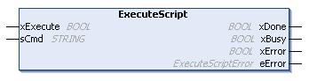

# ExecuteScript: Run Script Commands

## Function Block Description

This function block can run the following SD card script commands:

* Download
* Upload
* SetNodeName
* Delete
* Reboot
* ChangeModbusPort

For information on the required script file format, refer to [Script Files for SD Cards](../../../../../api/crossBook?lang=en-US&virtualBookName=m241prg&topicID=D_SE_0067940).

## Graphical Representation



## IL and ST Representation

To see the general representation in IL or ST language, refer to the chapter [*Function and Function Block Representation*](D-SE-0002384.html#D-SE-0002384).

## I/O Variable Description

This table describes the input variables:

| Input | Type | Comment |
| --- | --- | --- |
| xExecute | BOOL | On detection of a rising edge, starts the function block execution.  On detection of a falling edge, resets the outputs of the function block when any on-going execution terminates.  NOTE: With the falling edge, the function continues until it concludes its execution and updates its outputs. The outputs are retained for one cycle and reset. |
| sCmd | STRING | SD card script command syntax.  Simultaneous command executions are not allowed: if a command is being executed from another function block or from an SD card script then the function block queues the command and does not execute it immediately.  NOTE: An SD card script executed from an SD card is considered as being executed until the SD card has been removed. |

This table describes the output variables:

| Output | Type | Comment |
| --- | --- | --- |
| xDone | BOOL | `TRUE` indicates that the action is successfully completed. |
| xBusy | BOOL | `TRUE` indicates that the function block is running. |
| xError | BOOL | `TRUE` indicates error detection; the function block aborts the action. |
| eError | [ExecuteScriptError](D-SE-0020630.html#D-SE-0020630) | Indicates the type of the execute script detected error. |

## Example

This example describes how to execute an Upload script command:

```
VAR
EXEC_FLAG: BOOL;
ExecuteScript: ExecuteScript;
END_VAR
ExecuteScript(
xExecute:= EXEC_FLAG,
sCmd:= 'Upload "/usr/Syslog/*"',
xDone=> ,
xBusy=> ,
xError=> ,
eError=> );
```

EIO0000003065.07