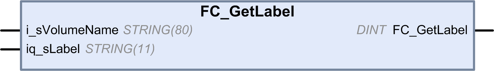

# FC\_GetLabel: Gets the Label of Memory

## Function Description

This function retrieves the label of a memory medium. If a device has no label, then an empty string is returned.

The name of the memory medium (user disk, system disk, SD card) is transferred:

* User disk = “/usr”
* System disk = “/sys”
* SD card = “/sd0”

## Graphical Representation

## IL and ST Representation

To see the general representation in IL or ST language, refer to the chapter [*Function and Function Block Representation*](D-SE-0002384.html#D-SE-0002384).

## I/O Variable Description

This table describes the input variables:

| Input | Data type | Description |
| --- | --- | --- |
| i\_sVolumeName | STRING[80] | Name of the device whose label must be accessed |
| iq\_sLabel | STRING[11] | Label of the device |

This table describes the output variables:

| Output | Data type | Description |
| --- | --- | --- |
| FC\_GetLabel | DINT | 0: The label was retrieved successfully  -1: Error when accessing the label  -318: Invalid parameter |

EIO0000003065.07