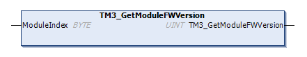

# TM3\_GetModuleFWVersion: Get TM3 Module Firmware Version

## Function Description

This function returns the firmware version of a specified TM3 module.

## Graphical Representation

## IL and ST Representation

To see the general representation in IL or ST language, refer to the chapter [*Function and Function Block Representation*](D-SE-0002384.html#D-SE-0002384).

## I/O Variable Description

The following table describes the input variables:

| Input | Type | Comment |
| --- | --- | --- |
| ModuleIndex | BYTE | Index of the module (0 for the first expansion, 1 for the second, and so on). |

The following table describes the output variable:

| Output | Type | Comment |
| --- | --- | --- |
| TM3\_GetModuleFWVersion | UINT | Returns the firmware version of the module, or `FFFF hex` if the information cannot be read.  For example, `001A hex` indicates firmware version 26. |

EIO0000003065.07