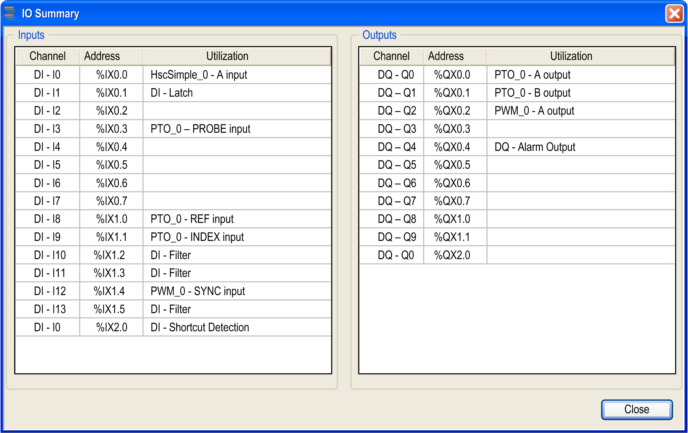

# Embedded Expert I/O Assignment

## I/O Assignment

The following regular or fast I/Os can be configured for use by expert functions:

|  | 24 I/O References | | 40 I/O References | |
| --- | --- | --- | --- | --- |
| TM241•24T, TM241•24U | TM241•24R | TM241•40T, TM241•40U | TM241•40R |
| Inputs | 8 fast inputs (I0...I7)  6 regular inputs (I8...I13) | | 8 fast inputs (I0...I7)  8 regular inputs (I8...I15) | |
| Outputs | 4 fast outputs (Q0...Q3)  4 regular outputs (Q4...Q7) | 4 fast outputs (Q0...Q3) | 4 fast outputs (Q0...Q3)  4 regular outputs (Q4...Q7) | 4 fast outputs (Q0...Q3) |

When an I/O has been assigned to an expert function, it is no longer available for selection with other expert functions.

NOTE: All I/Os are by default disabled in the configuration window.

The following table shows the I/Os that can be configured for expert functions:

| Expert Function | Name | Input (Fast or Regular) | Output (Fast or Regular) |
| --- | --- | --- | --- |
| HSC Simple | Input | M |  |
| HSC Main | Input A | M |  |
| Input B/EN | C |  |
| SYNC | C |  |
| CAP | C |  |
| Reflex 0 |  | C |
| Reflex 1 |  | C |
| Frequency Meter/Period Meter | Input A | M |  |
| EN | C |  |
| PWM/FreqGen | Output A |  | M |
| SYNC | C |  |
| EN | C |  |
| PTO | Output A/CW/Pulse |  | M |
| Output B/CCW/Dir |  | C |
| REF (Origin) | C |  |
| INDEX (Proximity) | C |  |
| PROBE | C |  |
| **M** Mandatory  **C** Optionally configurable | | | |

## Using Regular I/O with Expert Functions

Expert function I/O within regular I/O:

* Inputs can be read through standard memory variables even if configured as expert functions.
* All I/Os that are not used by expert functions can be used as regular I/Os.
* An I/O can only be used by one expert function; once configured, the I/O is no longer available for other expert functions.
* If no more fast I/Os are available, a regular I/O can be configured instead. In this case, however, the maximum frequency of the expert function is limited to 1 kHz.
* You cannot configure an input in an expert function and use it as a Run/Stop, Event, or Latch input at a same time.
* An output cannot be configured in an expert function if it has already been configured as an alarm.
* Short-circuit management still applies on all outputs. Status of outputs are available. For more information, refer to [Output Management](../../../../../api/crossBook?lang=en-US&virtualBookName=m241hw&topicID=D_SE_0025722).
* When inputs are used in expert functions (PTO, HSC,…), the integrator filter is replaced by an [anti-bounce filter](D-SE-0003769.html#D-SE-0003769__D-SE-0003769.3). The filter value is configured in the configuration window.

For more details, refer to [Embedded Functions Configuration](../../../../../api/crossBook?lang=en-US&virtualBookName=m241prg&topicID=D_SE_0032721).

## I/O Summary

The IO Summary window displays the I/Os used by the expert functions.

To display the IO Summary window:

| Step | Action |
| --- | --- |
| 1 | In the Devices tree tab, right-click the MyController node and choose IO Summary. |

Example of IO Summary window:

EIO0000003071.01

© 2019

Schneider Electric.

All rights reserved.