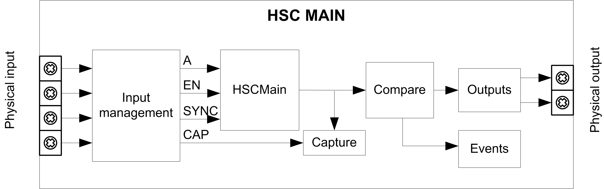

# Synopsis Diagram

## Synopsis Diagram

This diagram provides an overview of the Main type in One-shot mode:

A is the counting input of the counter.

EN is the enable input of the counter.

SYNC is the synchronization input of the counter.

CAP is the capture input of the counter.

## Optional Function

In addition to the One-shot mode, the Main type can provide the following functions:

* [Preset function](D-SE-0007189.html#D-SE-0007189)
* [Enable function](D-SE-0006709.html#D-SE-0006709)
* [Capture function](D-SE-0006698.html#D-SE-0006698)
* [Comparison function](D-SE-0006695.html#D-SE-0006695)

EIO0000003071.01

© 2019

Schneider Electric.

All rights reserved.