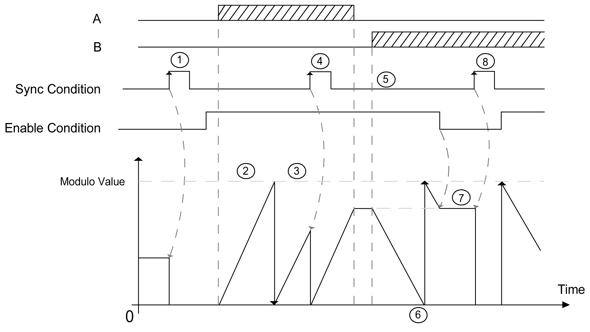
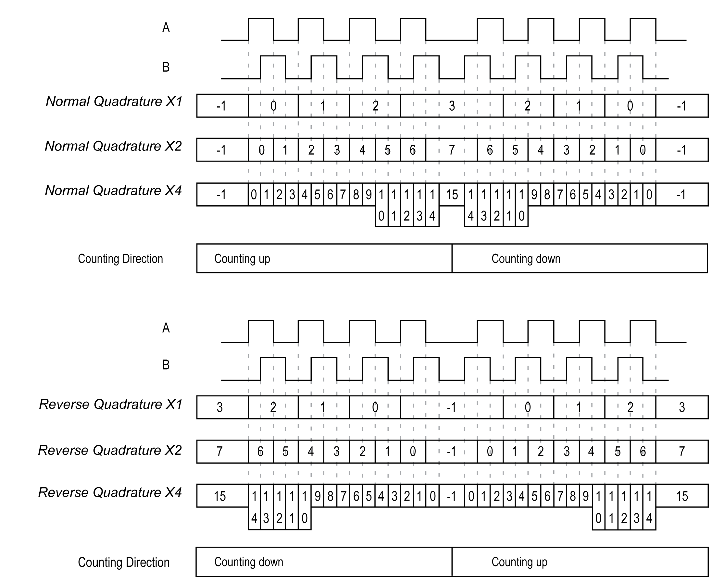

# Modulo-loop Mode Principle Description

## Overview

The Modulo-loop mode can be used for repeated actions on a series of moving objects, such as packaging and labeling applications.

## Principle

On a rising edge of the [Sync condition](D-SE-0007189.html#D-SE-0007189), the counter is activated and the current value is reset to 0.

When counting is [enabled](D-SE-0006709.html#D-SE-0006709):

| Incrementing direction: | the counter increments until it reaches the modulo value -1. At the next pulse, the counter is reset to 0, a modulo flag is set to 1, and the counting continues. |
| Decrementing direction: | the counter decrements until it reaches 0. At the next pulse, the counter is set to the modulo value, a modulo flag is set to 1, and the counting continues. |

## Input Modes

This table shows the 8 types of input modes available:

| Input Mode | Comment |
| --- | --- |
| A = Up, B = Down | default mode  The counter increments on A and decrements on B. |
| A = Impulse, B = Direction | If there is a rising edge on A and B is true, then the counter decrements.  If there is a rising edge on A and B is false, then the counter increments. |
| Normal Quadrature X1 | A physical encoder always provides 2 signals 90° shift that first allows the counter to count pulses and detect direction:   * X1: 1 count by Encoder cycle * X2: 2 counts by Encoder cycle * X4: 4 counts by Encoder cycle |
| Normal Quadrature X2 |
| Normal Quadrature X4 |
| Reverse Quadrature X1 |
| Reverse Quadrature X2 |
| Reverse Quadrature X4 |

## Up Down Principle Diagram

| Stage | Action |
| --- | --- |
| 1 | On the rising edge of Sync condition, the current value is reset to 0 and the counter is activated. |
| 2 | When Enable condition = 1, each pulses on A increments the counter value. |
| 3 | When the counter reaches the (modulo-1) value, the counter loops to 0 at the next pulse and the counting continues. `Modulo_Flag` is set to 1. |
| 4 | On the rising edge of Sync condition, the current counter value is reset to 0. |
| 5 | When Enable condition = 1, each pulse on B decrements the counter. |
| 6 | When the counter reaches 0, the counter loops to (modulo-1) at the next pulse and the counting continues. |
| 7 | When Enable condition = 0, the pulses on the inputs are ignored. |
| 8 | On the rising edge of Sync condition, the current counter value is reset to 0. |

NOTE: Enable and Sync conditions depends on configuration. These are described in the [Enable](D-SE-0006709.html#D-SE-0006709) and [Preset](D-SE-0007189.html#D-SE-0007189) function.

## Quadrature Principle Diagram

The encoder signal is counted according to the input mode selected, as shown below:

EIO0000003071.01

© 2019

Schneider Electric.

All rights reserved.