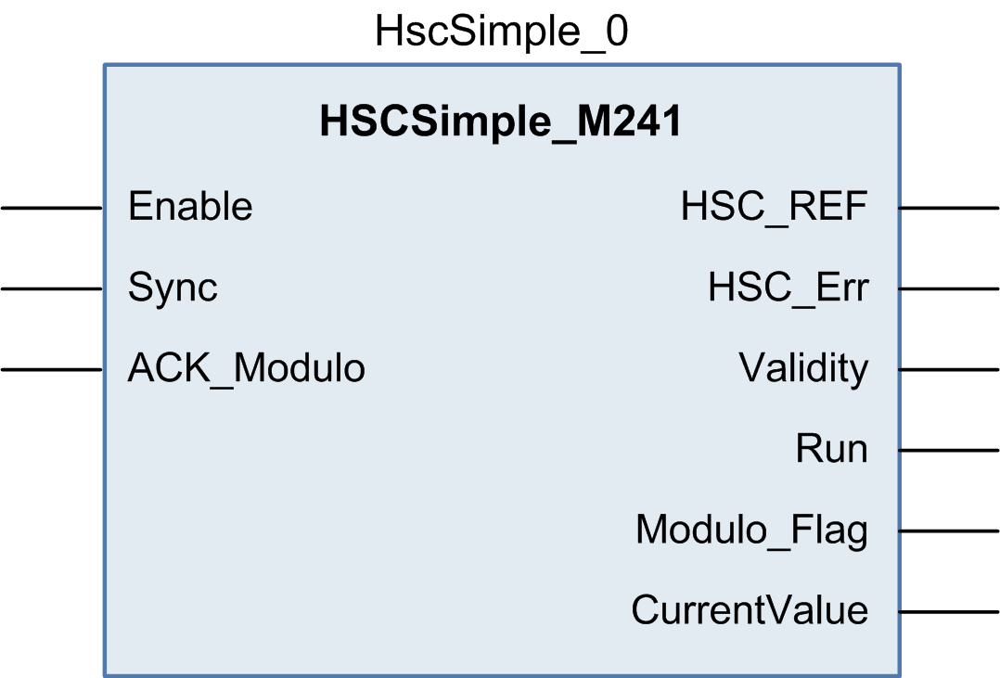

# Programming the Simple Type

## Overview

A Simple type is always managed by an [HSCSimple\_M241](D-SE-0007084.html#D-SE-0007084) function block.

NOTE: At build time, an error is detected if the `HSCSimple_M241` function block is used to manage a different HSC type.

## Adding a HSCSimple Function Block

| Step | Description |
| --- | --- |
| 1 | Select the Libraries tab in the Software Catalog and click Libraries.  Select Controller > M241 > M241 HSC > HSC > HSCSimple\_M241 in the list, drag-and-drop the item onto the POU window. |
| 2 | Type the Simple type instance name (defined in configuration) or select the function block instance by clicking:  Using the input assistant, the HSC instance can be selected at the following path: <MyController> > Counters. |

## I/O Variables Usage

The tables below describe how the different pins of the function block are used in Modulo-loop mode.

This table describes the input variables:

| Input | Type | Comment |
| --- | --- | --- |
| `Enable` | `BOOL` | `TRUE` = authorizes changes to the current counter value. |
| `Sync` | `BOOL` | On rising edge, resets and starts the counter. |
| `ACK_Modulo` | `BOOL` | On rising edge, resets `Modulo_Flag`. |

This table describes the output variables:

| Output | Type | Comment |
| --- | --- | --- |
| `HSC_REF` | `EXPERT_REF` | Reference to the HSC.  To be used as input of the Administrative function blocks. |
| `HSC_Err` | `BOOL` | `TRUE` = indicates that an error was detected.  Use the `EXPERTGetDiag` function block to get more information about this detected error. |
| `Validity` | `BOOL` | `TRUE` = indicates that the output values on the function block are valid. |
| `Run` | `BOOL` | Not relevant |
| `Modulo_Flag` | `BOOL` | Set to `TRUE` when the counter rolls over the `Modulo` value. |
| `CurrentValue` | `DWORD` | Current value of the counter. |

EIO0000003071.01

© 2019

Schneider Electric.

All rights reserved.