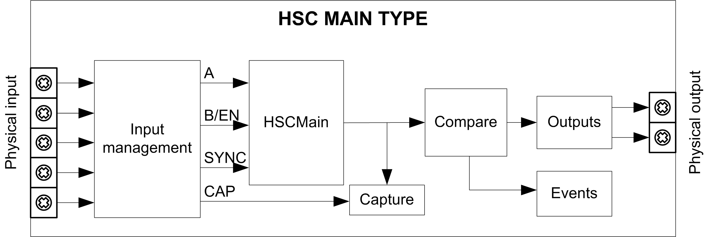

# Synopsis Diagram

## Synopsis Diagram

This diagram provides an overview of the Main type in Modulo-loop mode:

A and B are the counting inputs of the counter.

EN not configurable when B input is used.

SYNC is the synchronization input of the counter.

CAP is the capture input of the counter.

## Optional Functions

In addition to the Modulo-loop mode, the Main type can provide the following functions:

* [Enable function](D-SE-0006709.html#D-SE-0006709)
* [Capture function](D-SE-0006698.html#D-SE-0006698)
* [Comparison function](D-SE-0006695.html#D-SE-0006695)

NOTE: The Preset value is 0 and cannot be modified.

EIO0000003071.01

© 2019

Schneider Electric.

All rights reserved.