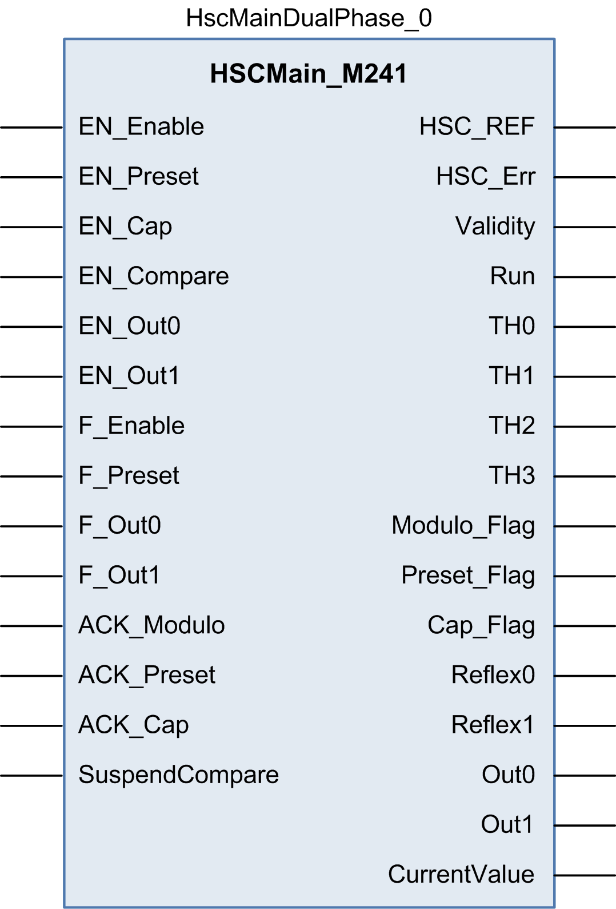

# Programming the Main Type

## Overview

The Main type is always managed by an `HSCMain_M241` function block.

NOTE: At build time, an error is detected if the `HSCMain_M241` function block is used to manage a different HSC type.

## Adding the HSCMain Function Block

| Step | Description |
| --- | --- |
| 1 | Select the Libraries tab in the Software Catalog and click Libraries.  Select Controller > M241 > M241 HSC > HSC > HSCMain\_M241 in the list, drag-and-drop the item onto the POU window. |
| 2 | Type the Main type instance name (defined in configuration) or select the function block instance by clicking:  Using the input assistant, the HSC instance can be selected at the following path: <MyController> > Counters. |

## I/O Variables Usage

The tables below describe how the different pins of the function block are used in Modulo-loop mode.

This table describes the input variables:

| Input | Type | Description |
| --- | --- | --- |
| `EN_Enable` | `BOOL` | When EN input is configured: if `TRUE`, authorizes the counter enable via the [Enable input](D-SE-0006709.html#D-SE-0006709). |
| `EN_Preset` | `BOOL` | When SYNC input is configured: if `TRUE`, authorizes the counter Preset via the [Sync input](D-SE-0007189.html#D-SE-0007189). |
| `EN_Cap` | `BOOL` | When CAP input is configured: if `TRUE`, enables the Capture input. |
| `EN_Compare` | `BOOL` | `TRUE` = enables the [comparison function](D-SE-0006695.html#D-SE-0006695) using Threshold 0, 1, 2, 3:   * basic comparison (`TH0`, `TH1`, `TH2`, `TH3` output bits) * reflex (`Reflex0`, `Reflex1` output bits) * events (to trigger external tasks on threshold crossing) |
| `EN_Out0` | `BOOL` | `TRUE` = enables physical output `Out_R0` to echo the `Reflex0` value (if configured). |
| `EN_Out1` | `BOOL` | `TRUE` = enables physical output `Out_R1` to echo the `Reflex1` value (if configured). |
| `F_Enable` | `BOOL` | `TRUE` = authorizes changes to the current counter value. |
| `F_Preset` | `BOOL` | On rising edge, resets, and starts the counter. |
| `F_Out0` | `BOOL` | `TRUE` = forces `Out_R0` to 1 (if `Reflex0` is configured). |
| `F_Out1` | `BOOL` | `TRUE` = forces `Out_R1` to 1 (if `Reflex1` is configured). |
| `ACK_Modulo` | `BOOL` | On rising edge, resets `Modulo_Flag`. |
| `ACK_Preset` | `BOOL` | On rising edge, resets `Preset_Flag`. |
| `ACK_Cap` | `BOOL` | On rising edge, resets `Cap_Flag`. |
| `SuspendCompare` | `BOOL` | `TRUE` = compare results are suspended:   * `TH0`, `TH1`, `TH2`, `TH3` , `Reflex0`, `Reflex1`, `Out0`, `Out1` output bits of the block maintain their last value. * Physical Outputs 0, 1 maintain their last value. * Events are masked.   NOTE: `EN_Compare`,  `EN_ReflexO,` `EN_Reflex1,` `F_Out0`, `F_Out1` remain operational while `SuspendCompare` is set. |

This table describes the output variables:

| Output | Type | Comment |
| --- | --- | --- |
| `HSC_REF` | `EXPERT_REF` | Reference to the HSC.  To be used as input of Administrative function blocks. |
| `HSC_Err` | `BOOL` | `TRUE` = indicates that an error was detected.  Use the `EXPERTGetDiag` function block to get more information about this detected error. |
| `Validity` | `BOOL` | `TRUE` = indicates that output values on the function block are valid. |
| `Run` | `BOOL` | `TRUE` = counter is running.  The Run bit switches to 0 when CurrentValue reaches 0.  A synchronization is needed to restart the counter. |
| `TH0` | `BOOL` | [Set to 1 when CurrentValue > Threshold 0](D-SE-0006695.html#D-SE-0006695). |
| `TH1` | `BOOL` | [Set to 1 when CurrentValue > Threshold 1](D-SE-0006695.html#D-SE-0006695). |
| `TH2` | `BOOL` | [Set to 1 when CurrentValue > Threshold 2](D-SE-0006695.html#D-SE-0006695). |
| `TH3` | `BOOL` | [Set to 1 when CurrentValue > Threshold 3](D-SE-0006695.html#D-SE-0006695). |
| `Modulo_Flag` | `BOOL` | Set to 1 when the counter roll overs the modulo or 0. |
| `Preset_Flag` | `BOOL` | Set to 1 by the [preset of the counter](D-SE-0007189.html#D-SE-0007189). |
| `Cap_Flag` | `BOOL` | Set to 1 when a new capture value is stored in the [Capture register](D-SE-0006721.html#D-SE-0006721).  This flag must be reset before a new capture can occur. |
| `Reflex0` | `BOOL` | [State of Reflex0](D-SE-0006712.html#D-SE-0006712__D-SE-0006712.8).  Only active when EN\_Compare is set. |
| `Reflex1` | `BOOL` | [State of Reflex1](D-SE-0006712.html#D-SE-0006712__D-SE-0006712.8).  Only active when EN\_Compare is set. |
| `Out0` | `BOOL` | State of physical output `Out_R0` (if `Reflex0` is configured). |
| `Out1` | `BOOL` | State of physical output `Out_R1` (if `Reflex1` is configured). |
| `CurrentValue` | `DINT` | Current value of the counter. |

EIO0000003071.01

© 2019

Schneider Electric.

All rights reserved.