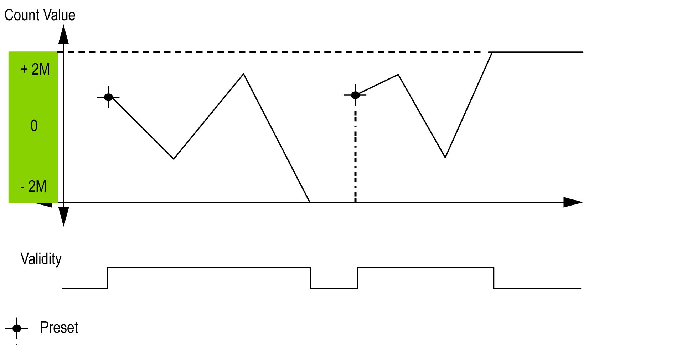

# Limits Management

## Overview

When the counter limit is reached, the counter can have 2 behaviors depending on configuration:

* Lock on limits
* Rollover

## Lock on Limits

In the case of an overflow or underflow counter, the current counter value is maintained at the limit value, the validity bit goes to 0, and the `Error` bit indicates that this detected error until the counter is preset again.

2M value is given as:

* +2M = 2 (exp 31) -1
* -2M = -2 (exp 31)

## Rollover

In the case of overflow or underflow of the counter, the current counter value goes automatically to the opposite limit value.

`Modulo_Flag` output is set to 1.

EIO0000003071.01

© 2019

Schneider Electric.

All rights reserved.